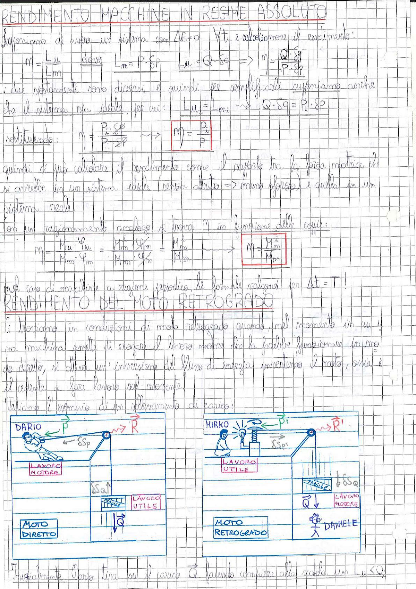

# Page 114 - Rendimento Macchine in Regime Assoluto / Rendimento del Moto Retrogrado

## Rendimento Macchine in Regime Assoluto

Supponiamo di avere un sistema con $\Delta E = 0$ $\forall t$, e calcoliamone il rendimento:

$$\eta = \frac{L_u}{L_m} \quad \text{dove} \quad L_m = P \cdot \delta P \quad L_u = Q \cdot \delta q \quad \Rightarrow \quad \eta = \frac{Q \cdot \delta q}{P \cdot \delta P}$$

I due spostamenti sono diversi e quindi per semplificarli supponiamo anche che il sistema sia ideale, per cui:

$$L_u = L_m: \quad \longrightarrow \quad Q \cdot \delta q = P_i \cdot \delta P$$

sostituendo:

$$\eta = \frac{P_i \cdot \delta P}{P \cdot \delta P} \quad \longrightarrow \quad \boxed{\eta = \frac{P_i}{P}}$$

Quindi si può considerare il rendimento come il rapporto tra la forza motrice che si avrebbe in un sistema ideale (senza attrito → meno forza) e quella in un sistema reale.

Con un ragionamento analogo si trova $\eta$ in funzione delle coppie:

$$\eta = \frac{M_u \cdot \varphi_u}{M_m \cdot \varphi_m} = \frac{M_u^i \cdot \varphi_m}{M_m \cdot \varphi_m} = \frac{M_u^i}{M_m} \quad \longrightarrow \quad \boxed{\eta = \frac{M_{in}^i}{M_m}}$$

Nel caso di macchine a regime periodico, le formule valgono per $\Delta t = T$!

## Rendimento del Moto Retrogrado

Si trovano in condizioni di moto retrogrado quando, nel momento in cui una macchina smette di erogare il lavoro motore che la farebbe funzionare in modo diretto, si attiva un'inversione del flusso di energia invertendo il moto, ossia è il cedente a fare lavoro sul movente.

Vediamo l'esempio di un sollevamento di carico:

> 
> Diagramma: Schema di un sistema di sollevamento carico con puleggia. A sinistra: "MOTO DIRETTO" - Dario tira la fune con forza $\vec{P}$ (lavoro motore), spostamento $\delta S_P$, sollevando il carico $\vec{Q}$ con spostamento $\delta S_Q$ (lavoro utile), con resistenza $\vec{R}$. A destra: "MOTO RETROGRADO" - Mirko tiene la fune con forza $\vec{P'}$ (lavoro utile), spostamento $\delta S_{P'}$, mentre il carico $\vec{Q}$ scende con spostamento $\delta S_Q$ (lavoro motore), con resistenza $\vec{R'}$. Daniele è il carico che scende.

Inizialmente Dario tira su il carico $\vec{Q}$ facendo compiere alla fune uno $L_u < 0$,

