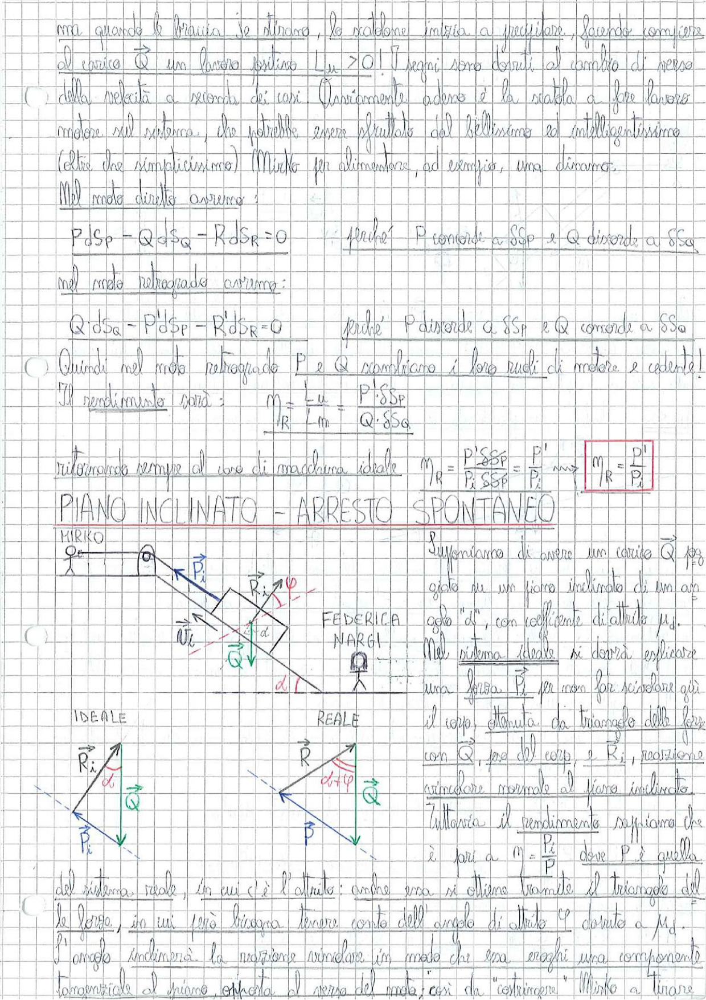

# Page 115 - Moto Retrogrado e Piano Inclinato (Arresto Spontaneo)

ma quando le braccia le tirano, lo scaldone inizia a precipitare, facendo compiere al carico $\vec{Q}$ un lavoro positivo $L_u > 0$. I segni sono dovuti al cambio di verso della velocità a seconda dei casi. Ovviamente adesso è la staffa a fare lavoro motore sul sistema, che potrebbe essere sfruttato dal bellissimo ed intelligentissimo (oltre che semplicissimo) Mirko per alimentare, ad esempio, una dinamo.

## Moto diretto

Nel moto diretto avremo:

$$P \, dS_P - Q \, dS_Q - R \, dS_R = 0$$

perché P concorde a $SS_P$ e Q discorde a $SS_Q$

## Moto retrogrado

Nel moto retrogrado avremo:

$$Q \, dS_Q - P' dS_P - R' dS_R = 0$$

perché P discorde a $SS_P$ e Q concorde a $SS_Q$

Quindi nel moto retrogrado P e Q cambiano i loro ruoli di motore e cedente.

Il rendimento sarà:

$$\eta_R = \frac{L_u}{L_m} = \frac{P' \cdot SS_P}{Q \cdot SS_Q}$$

ritornando sempre al caso di macchina ideale:

$$\eta_R = \frac{P' \cdot SS_P}{P_i \cdot SS_P} = \frac{P'}{P_i}$$

$$\boxed{\eta_R = \frac{P'}{P_i}}$$

---

## PIANO INCLINATO – ARRESTO SPONTANEO

> 
> Diagramma: Schema di un piano inclinato con corpo appoggiato, angolo d'inclinazione α. Caso ideale (a sinistra) con forze $\vec{P_i}$, $\vec{Q}$, $\vec{R_i}$ e caso reale (a destra) con forze $\vec{P}$, $\vec{Q}$, $\vec{R}$ e angolo di attrito φ. Triangoli delle forze per entrambi i casi.

Supponiamo di avere un corpo $\vec{Q}$ appoggiato su un piano inclinato di un angolo "α", con coefficiente di attrito $\mu_d$.

Nel sistema ideale si dovrà esplicare una forza $\vec{P_i}$ per non far scivolare giù il corpo, ottenuta da triangolo delle forze con $\vec{Q}$, forza del corpo, e $\vec{R_i}$, reazione vincolare normale al piano inclinato.

Tuttavia il rendimento sappiamo che è pari a $\eta = \frac{P_i}{P}$ dove P è quella del sistema reale, in cui c'è l'attrito: anche essa si ottiene tramite il triangolo delle forze, in cui però bisogna tenere conto dell'angolo di attrito $\varphi$ dovuto a $\mu_d$. L'angolo inclinerà la reazione vincolare in modo che essa esaghi una componente tangenziale al piano opposta al verso del moto; così da "costringere" Mirko a tirare
