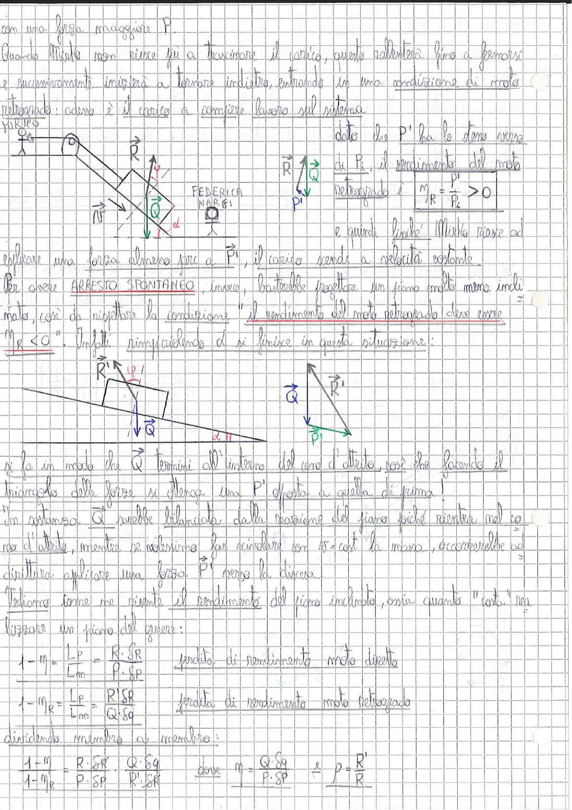

# Page 116 - Arresto spontaneo e rendimento del moto retrogrado (piano inclinato)

con una forza maggiore $P$.

Quando Mirko non riesce più a trascinare il carico, questo rallenterà fino a fermarsi e successivamente inizierà a tornare indietro, entrando in una condizione di **moto retrogrado**: adesso è il carico a compiere lavoro sul sistema.

> 
> Diagramma: Piano inclinato con carico $\vec{Q}$ trascinato, forze $\vec{N}$, $\vec{R}$ e triangolo delle forze con $\vec{R}$, $\vec{Q}$, $P'$ per il moto retrogrado

Dato che $P'$ ha lo stesso verso di $P_i$, il rendimento del moto retrogrado è:

$$\boxed{\eta_R = \frac{P'}{P_i} > 0}$$

e quindi finché Mirko riesce ad applicare una forza almeno pari a $P'$, il carico scende a velocità costante.

Per avere **ARRESTO SPONTANEO**, invece, basterebbe progettare un piano molto meno inclinato, così da rispettare la condizione: "il rendimento del moto retrogrado deve essere $\eta_R < 0$". Infatti rimpiccolendo $\alpha$ si finisce in questa situazione:

> 
> Diagramma: Piano inclinato con angolo $\alpha$ piccolo, cono d'attrito con $\vec{Q}$ che termina all'interno del cono; triangolo delle forze con $\vec{Q}$, $\vec{R}'$ e $P'$ opposta alla direzione precedente

Si fa in modo che $\vec{Q}$ termini all'interno del cono d'attrito, così che facendo il triangolo delle forze si ottiene una $P'$ opposta a quella di prima!

In sostanza $\vec{Q}$ sarebbe bilanciata dalla reazione del piano poiché rientra nel cono d'attrito, mentre se volessimo far scivolare con $\delta P = \text{cost}$ la massa, occorrerebbe addirittura applicare una forza $P'$ verso la discesa.

Vediamo come ne risente il rendimento del piano inclinato, ossia quanto "costa" realizzare un piano del genere:

$$1 - \eta = \frac{L_p}{L_m} = \frac{R \cdot \delta R}{P \cdot \delta P} \qquad \text{perdita di rendimento moto diretto}$$

$$1 - \eta_R = \frac{L_p}{L_m} = \frac{R' \cdot \delta R}{Q \cdot \delta q} \qquad \text{perdita di rendimento moto retrogrado}$$

dividendo membro a membro:

$$\boxed{\frac{1 - \eta}{1 - \eta_R} = \frac{R \cdot \delta R}{P \cdot \delta P} \cdot \frac{Q \cdot \delta q}{R' \cdot \delta R}} \qquad \text{dove} \quad \eta = \frac{Q \cdot \delta q}{P \cdot \delta P} \quad e \quad \rho = \frac{R'}{R}$$
