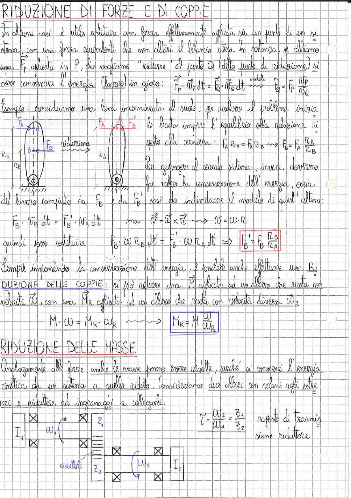

# Page 118 - Riduzione di Forze, Coppie e Masse

## RIDUZIONE DI FORZE E DI COPPIE

In alcuni casi è utile sostituire una forza effettivamente applicata su un punto di un sistema, con una forza equivalente che non alteri il bilancio stesso. In sostanza, se abbiamo una $F_P$ applicata in P, che vogliamo "ridurre" al punto Q (detto punto di riduzione) si deve conservare l'energia (lavoro) in gioco:

$$\vec{F}_P \cdot \vec{v}_P \, dt = \vec{F}_Q \cdot \vec{v}_Q \, dt \quad \longrightarrow \quad \boxed{F_Q = F_P \frac{v_P}{v_Q}}$$

**Esempio:** consideriamo una leva incernierata al suolo: per risolvere il problema inizia

> 
> Diagramma: Leva incernierata al suolo con forze $F_A$ e $F_B$ applicate ai bracci $r_A$ e $r_B$, e riduzione della forza al punto A con $F'_B$

le basta imporre l'equilibrio alla rotazione rispetto alla cerniera:

$$F_A \, r_A = F_B \, r_B \quad \longrightarrow \quad F_B = F_A \frac{r_A}{r_B}$$

Per giungere al secondo sistema, invece, dovremo far valere la conservazione dell'energia, ossia del lavoro compiuto da $F_B$ e da $F'_B$, così da individuare il modulo di quest'ultima:

$$F_B \cdot v_B \, dt = F'_B \cdot v_A \, dt \qquad \text{ma} \quad \vec{v} = \vec{\omega} \times \vec{r} \quad \longrightarrow \quad v = \omega \cdot r$$

quindi posso sostituire:

$$F_B \cdot \omega \, r_B \, \cancel{dt} = F'_B \cdot \omega \, r_A \, \cancel{dt} \quad \Rightarrow \quad \boxed{F'_B = F_B \frac{r_B}{r_A}}$$

Sempre imponendo la conservazione dell'energia, è possibile anche effettuare una **RIDUZIONE DELLE COPPIE**: si può ridurre una $M$ applicata ad un albero che ruota con velocità $\omega$, con una $M_R$ applicata ad un albero che ruota con velocità diversa $\omega_R$

$$M \cdot \omega = M_R \cdot \omega_R \quad \longrightarrow \quad \boxed{M_R = M \frac{\omega}{\omega_R}}$$

## RIDUZIONE DELLE MASSE

Analogamente alle forze, anche le masse possono essere ridotte, purché si conservi l'energia cinetica da un sistema a quello ridotto. Consideriamo due alberi con volani agli estremi e riduttore ad ingranaggi a collegarli:

> 
> Diagramma: Due alberi con volani $I_1$ e $I_2$ collegati tramite riduttore ad ingranaggi con ruote dentate $z_1$ e $z_2$, velocità angolari $\omega_1$ e $\omega_2$

$$\tau = \frac{\omega_2}{\omega_1} = \frac{z_1}{z_2} \qquad \text{rapporto di trasmissione riduttore}$$
