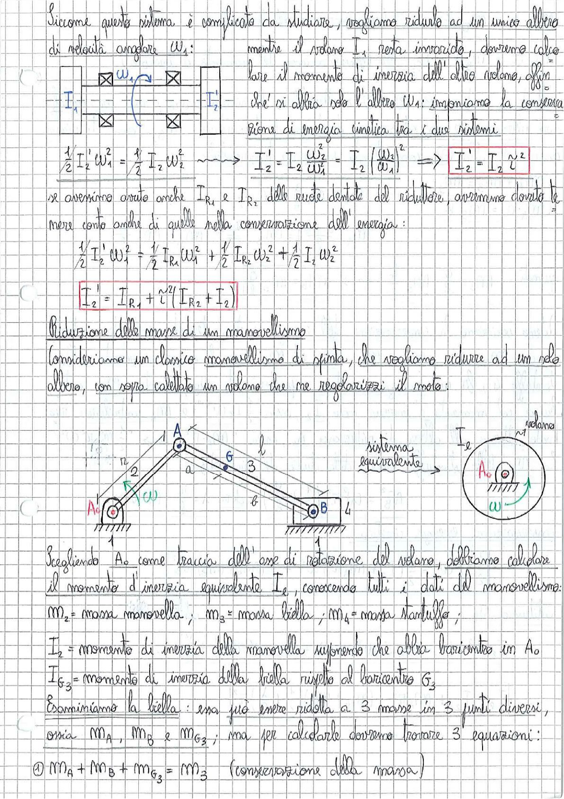

# Page 119 - Riduzione delle masse di un manovellismo

Siccome questo sistema è complicato da studiare, vogliamo ridurlo ad un unico albero di velocità angolare $\omega_1$: mentre il volano $I_1$ resta invariato, dovremo calcolare il momento di inerzia dell'altro volano, affinché si altri solo l'albero $\omega_1$: imponiamo la conservazione di energia cinetica tra i due sistemi.

> 
> Diagramma: schema di due alberi con volani $I_1$ e $I_2$ collegati da un riduttore

$$\frac{1}{2} I_2' \omega_1^2 = \frac{1}{2} I_2 \omega_2^2 \quad \longrightarrow \quad I_2' = I_2 \frac{\omega_2^2}{\omega_1^2} = I_2 \left(\frac{\omega_2}{\omega_1}\right)^2 \quad \Rightarrow \quad \boxed{I_2' = I_2 \tau^2}$$

Se avessimo avuto anche $I_{R_1}$ e $I_{R_2}$ delle ruote dentate del riduttore, avremmo dovuto tenere conto anche di quelle nella conservazione dell'energia:

$$\frac{1}{2} I_2' \omega_1^2 = \frac{1}{2} I_{R_1} \omega_1^2 + \frac{1}{2} I_{R_2} \omega_2^2 + \frac{1}{2} I_2 \omega_2^2$$

$$\boxed{I_2' = I_{R_1} + \tau^2 (I_{R_2} + I_2)}$$

## Riduzione delle masse di un manovellismo

Consideriamo un classico manovellismo di spinta, che vogliamo ridurre ad un solo albero, con sopra calettato un volano che ne regolarizzi il moto:

> 
> Diagramma: manovellismo di spinta con manovella (2), biella (3), pistone (4), telaio (1), punto $A_0$ sull'asse di rotazione, punto $A$ sulla manovella, punto $G$ baricentro biella, punto $B$ sul pistone. A destra: sistema equivalente con volano su asse $A_0$ con velocità angolare $\omega$

Scegliendo $A_0$ come traccia dell'asse di rotazione del volano, dobbiamo calcolare il momento d'inerzia equivalente $I_e$, conoscendo tutti i dati del manovellismo:

- $m_2$ = massa manovella; $m_3$ = massa biella; $m_4$ = massa stantuffo;
- $I_2$ = momento di inerzia della manovella supponendo che abbia baricentro in $A_0$
- $I_{G_3}$ = momento di inerzia della biella rispetto al baricentro $G_3$

Esaminiamo la biella: essa può essere ridotta a 3 masse in 3 punti diversi, ossia $m_A$, $m_B$ e $m_{G_3}$; ma per calcolarle dovremo trovare 3 equazioni:

$$① \quad m_A + m_B + m_{G_3} = m_3 \quad \text{(conservazione della massa)}$$
