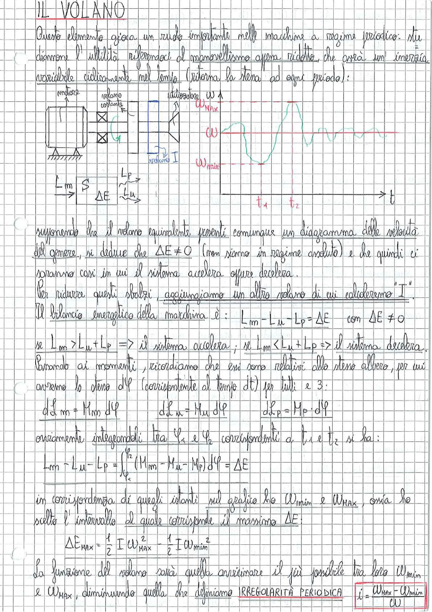

# Page 121 - Il Volano

## IL VOLANO

Questo elemento gioca un ruolo importante nelle macchine a regime periodico: studiamone l'utilità riferendoci al manovellismo opera ridotto, che avrà un'inerzia variabile ciclicamente nel tempo (ritorna la stessa ad ogni periodo):

> 
> Diagramma: Schema di una macchina con motore, volano costante e utilizzatore. A destra, grafico della velocità angolare $\omega$ nel tempo $t$, che oscilla tra $\omega_{MAX}$ e $\omega_{min}$. In basso a sinistra: schema con $L_m$, $S$, $\Delta E$, $L_p$, $L_u$.

Supponendo che il volano equivalente presenti comunque un diagramma delle velocità del genere, si deduce che $\Delta E \neq 0$ (non siamo in regime assoluto) e che quindi ci saranno casi in cui il sistema accelera oppure decelera.

Per ridurre questi sbalzi, aggiungiamo un altro volano di cui calcoleremo $I$.

Il bilancio energetico della macchina è:

$$L_m - L_u - L_p = \Delta E \quad \text{con } \Delta E \neq 0$$

Se $L_m > L_u + L_p$ $\Rightarrow$ il sistema accelera; se $L_m < L_u + L_p$ $\Rightarrow$ il sistema decelera.

Passando ai momenti, ricordiamo che essi sono relativi allo stesso albero, per cui avremo lo stesso $d\varphi$ (corrispondente al tempo $dt$) per tutti e 3:

$$dL_m = M_m \, d\varphi \qquad dL_u = M_u \, d\varphi \qquad dL_p = M_p \cdot d\varphi$$

ovviamente integrandoli tra $\varphi_1$ e $\varphi_2$ corrispondenti a $t_1$ e $t_2$ si ha:

$$L_m - L_u - L_p = \int_{\varphi_1}^{\varphi_2} (M_m - M_u - M_p) \, d\varphi = \Delta E$$

in corrispondenza di quegli istanti sul grafico ho $\omega_{min}$ e $\omega_{MAX}$, ossia ho scelto l'intervallo al quale corrisponde il massimo $\Delta E$:

$$\Delta E_{MAX} = \frac{1}{2} I \omega_{MAX}^2 - \frac{1}{2} I \omega_{min}^2$$

La funzione del volano sarà quella di avvicinare il più possibile tra loro $\omega_{min}$ e $\omega_{MAX}$, diminuendo quella che definiamo **IRREGOLARITÀ PERIODICA**:

$$\boxed{i = \frac{\omega_{MAX} - \omega_{min}}{\omega}}$$
