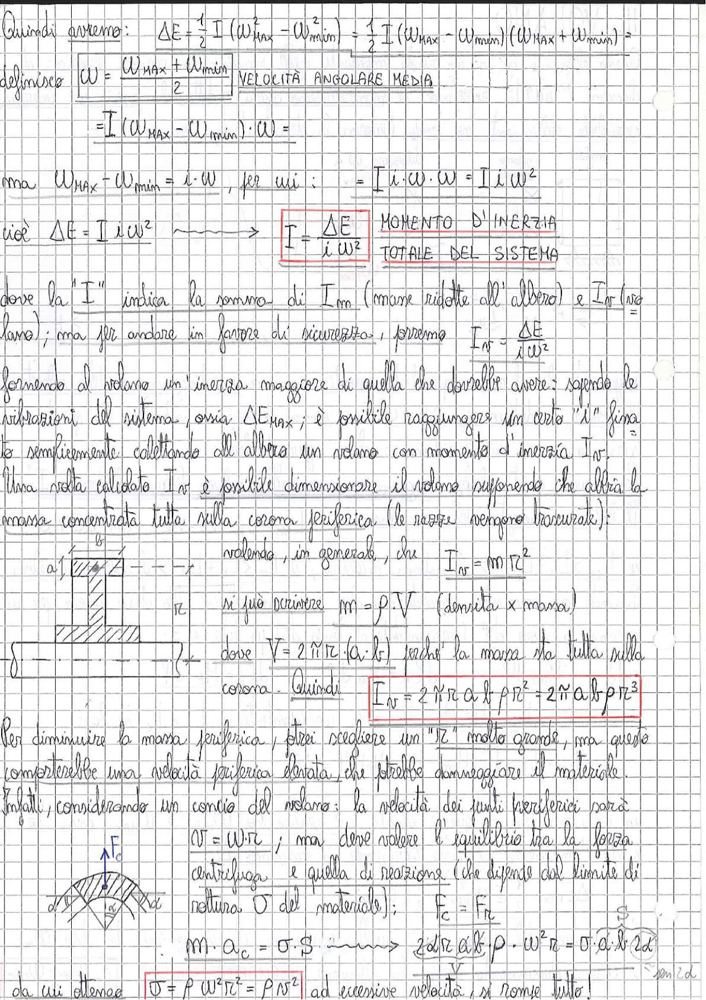

# Page 122 - Dimensionamento del volano (momento d'inerzia e velocità periferica)

Quindi avremo:

$$\Delta E = \frac{1}{2} I (\omega_{MAX}^2 - \omega_{min}^2) = \frac{1}{2} I (\omega_{MAX} - \omega_{min})(\omega_{MAX} + \omega_{min}) =$$

definisco:

$$\boxed{\omega = \frac{\omega_{MAX} + \omega_{min}}{2}} \qquad \text{VELOCITÀ ANGOLARE MEDIA}$$

$$= I (\omega_{MAX} - \omega_{min}) \cdot \omega =$$

ma $\omega_{MAX} - \omega_{min} = i \cdot \omega$, per cui:

$$= I \cdot i \cdot \omega \cdot \omega = I \cdot i \cdot \omega^2$$

cioè $\Delta E = I \cdot i \cdot \omega^2 \longrightarrow$

$$\boxed{I = \frac{\Delta E}{i \cdot \omega^2}} \qquad \text{MOMENTO D'INERZIA TOTALE DEL SISTEMA}$$

dove la "I" indica la somma di $I_m$ (masse ridotte all'albero) e $I_V$ (volano); ma per andare in favore di sicurezza, porremo

$$I_V = \frac{\Delta E}{i \cdot \omega^2}$$

fornendo al volano un'inerzia maggiore di quella che dovrebbe avere: sapendo le vibrazioni del sistema, ossia $\Delta E_{MAX}$; è possibile raggiungere un certo "i" fissato semplicemente calettando all'albero un volano con momento d'inerzia $I_V$.

Una volta calcolato $I_V$ è possibile dimensionare il volano supponendo che abbia la massa concentrata tutta sulla corona periferica (le razze vengono trascurate);

> 
> Diagramma: sezione trasversale del volano con corona periferica di dimensioni a (larghezza assiale) e b (spessore radiale), e raggio r. Vista frontale (a) e vista laterale (b) della corona.

volendo, in generale, che:

$$I_V = m \cdot r^2$$

si può scrivere $m = \rho \cdot V$ (densità × massa)

dove $V = 2\pi r \cdot (a \cdot b)$ perché la massa sta tutta sulla corona.

Quindi:

$$\boxed{I_V = 2\pi r \cdot a \cdot b \cdot \rho \cdot r^2 = 2\pi \cdot a \cdot b \cdot \rho \cdot r^3}$$

Per diminuire la massa periferica, direi scegliere un "r" molto grande, ma questo comporterebbe una velocità periferica elevata, che potrebbe danneggiare il materiale.

Infatti, considerando un concio del volano: la velocità dei punti periferici sarà

$$v = \omega \cdot r$$

; ma deve valere l'equilibrio tra la forza centrifuga e quella di reazione (che dipende dal limite di rottura $\sigma$ del materiale):

$$F_c = F_R$$

> 
> Diagramma: concio elementare del volano con forza centrifuga $F_c$ agente verso l'esterno e reazioni $F_R$ sulle sezioni laterali, con angolo $d\alpha$.

$$m \cdot a_c = \sigma \cdot S \longrightarrow 2d\alpha \cdot a \cdot b \cdot \rho \cdot \omega^2 r = \sigma \cdot a \cdot b \cdot 2d\alpha$$

da cui si ottiene:

$$\boxed{\sigma = \rho \cdot \omega^2 \cdot r^2 = \rho \cdot v^2}$$

ad eccessive velocità, si rompe tutto.
