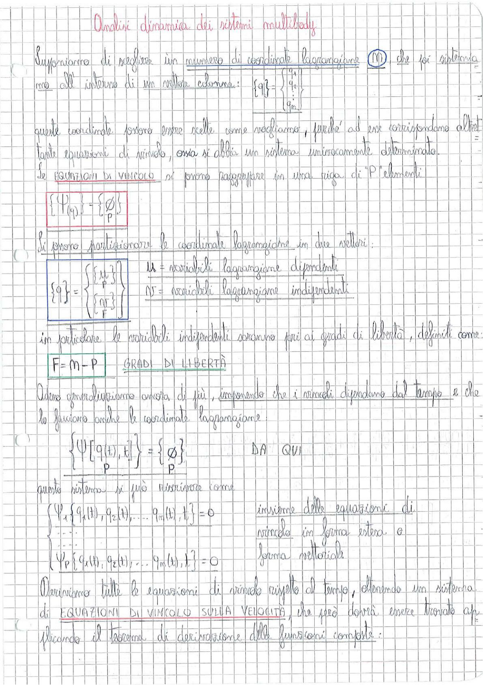

# Page 123 - Analisi dinamica dei sistemi multibody

## Coordinate lagrangiane e vincoli

Supponiamo di scegliere un numero di coordinate lagrangiane $M$ che poi sistemiamo all'interno di un vettore colonna:

$$\{q\} = \begin{Bmatrix} q_1 \\ q_2 \\ \vdots \\ q_m \end{Bmatrix}$$

Queste coordinate possono essere scelte come vogliamo, purché ad esse corrispondano altrettante equazioni di vincolo, ossia si abbia un sistema univocamente determinato.

Le **equazioni di vincolo** si possono raggruppare in una riga di $P$ elementi:

$$\boxed{\{\Psi_{(q)}\}_P = \{\emptyset\}_P}$$

## Partizionamento delle coordinate lagrangiane

Si possono partizionare le coordinate lagrangiane in due vettori:

$$\boxed{\{q\} = \begin{Bmatrix} \{u\} \\ \hdashline \{v\} \end{Bmatrix}_F}$$

dove:
- $u$ = variabili lagrangiane **dipendenti**
- $v$ = variabili lagrangiane **indipendenti**

In particolare le variabili indipendenti saranno pari ai gradi di libertà, definiti come:

$$\boxed{F = M - P} \quad \text{GRADI DI LIBERTÀ}$$

## Generalizzazione con vincoli dipendenti dal tempo

Ulteriore generalizzazione ancora di più, imponendo che i vincoli dipendano dal tempo e che lo facciano anche le coordinate lagrangiane:

$$\{\Psi[q(t), t]\}_P = \{\emptyset\}_P \quad \textcolor{red}{\text{DA QUI}}$$

Questo sistema si può riscrivere come:

$$\begin{cases} \Psi_1\{q_1(t), q_2(t), \ldots, q_m(t), t\} = 0 \\ \vdots \\ \Psi_P\{q_1(t), q_2(t), \ldots, q_m(t), t\} = 0 \end{cases}$$

insieme delle equazioni di vincolo in forma estesa e forma vettoriale.

## Equazioni di vincolo sulla velocità

Deriviamo tutte le equazioni di vincolo rispetto al tempo, ottenendo un sistema di **EQUAZIONI DI VINCOLO SULLA VELOCITÀ**, che può/dovrà essere trovato applicando il teorema di derivazione delle funzioni composte.

> 
> Diagramma: Pagina di appunti con formule relative all'analisi dinamica dei sistemi multibody, partizionamento delle coordinate lagrangiane e derivazione delle equazioni di vincolo
