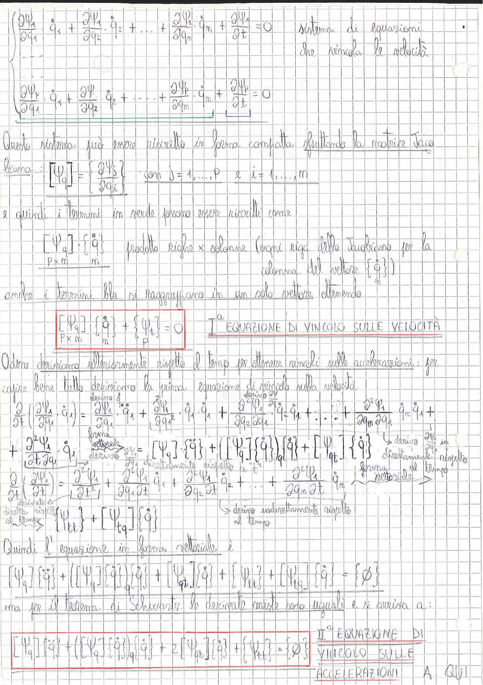

# Page 124 - Equazioni di Vincolo sulle Velocità e Accelerazioni

$$\begin{cases} \dfrac{\partial \Psi_1}{\partial q_1} \dot{q}_1 + \dfrac{\partial \Psi_1}{\partial q_2} \dot{q}_2 + \ldots + \dfrac{\partial \Psi_1}{\partial q_m} \dot{q}_m + \dfrac{\partial \Psi_1}{\partial t} = 0 \\ \\ \dfrac{\partial \Psi_P}{\partial q_1} \dot{q}_1 + \dfrac{\partial \Psi_P}{\partial q_2} \dot{q}_2 + \ldots + \dfrac{\partial \Psi_P}{\partial q_m} \dot{q}_m + \dfrac{\partial \Psi_P}{\partial t} = 0 \end{cases} \quad \text{sistema di equazioni che vincola le velocità}$$

Questo sistema può essere riscritto in forma compatta sfruttando la matrice Jacobiana:

$$[\Psi_q] = \left\{ \frac{\partial \Psi_j}{\partial q_i} \right\} \quad \text{con } j = 1, \ldots, P \quad \text{e} \quad i = 1, \ldots, m$$

e quindi i termini in verde possono essere riscritti come

$$\underbrace{[\Psi_q]}_{P \times m} \cdot \underbrace{\{\dot{q}\}}_{m} \quad \text{prodotto righe} \times \text{colonne (ogni riga della Jacobiana per la colonna del vettore } \{\dot{q}\}\text{)}$$

anche i termini blu si raggruppano in un solo vettore ottenendo

$$\boxed{\underbrace{[\Psi_q]}_{P \times m} \{\dot{q}\}_{m} + \{\Psi_t\}_{P} = 0} \qquad \text{I}^a \text{ EQUAZIONE DI VINCOLO SULLE VELOCITÀ}$$

Adesso deriviamo ulteriormente rispetto al tempo per ottenere vincoli sulle accelerazioni: per capire bene tutto deriviamo la prima equazione di vincolo sulla velocità

$$\frac{\partial}{\partial t}\left(\frac{\partial \Psi_1}{\partial q_i} \dot{q}_i\right) = \frac{\partial^2 \Psi_1}{\partial q_1} \ddot{q}_1 + \frac{\partial^2 \Psi_1}{\partial q_1^2} \dot{q}_1 \dot{q}_1 + \frac{\partial^2 \Psi_1}{\partial q_2 \partial q_1} \dot{q}_2 \dot{q}_1 + \ldots + \frac{\partial^2 \Psi_1}{\partial q_m \partial q_1} \dot{q}_m \dot{q}_1 +$$

$$+ \frac{\partial^2 \Psi_1}{\partial t \partial q_1} \dot{q}_1 \underbrace{\longrightarrow}_{\text{forma vettoriale}} = [\Psi_q]\{\ddot{q}\} + ([\Psi_q]\{\dot{q}\})\{\dot{q}\} + [\Psi_{qt}]\{\dot{q}\} \quad \underbrace{\text{derivo } \frac{\partial \Psi}{\partial q} \text{ direttamente rispetto al tempo}}_{}$$

$$\frac{\partial}{\partial t}\left(\frac{\partial \Psi_1}{\partial t}\right) = \frac{\partial^2 \Psi_1}{\partial t^2} + \frac{\partial^2 \Psi_1}{\partial q_1 \partial t} \dot{q}_1 + \frac{\partial^2 \Psi_1}{\partial q_2 \partial t} \dot{q}_2 + \ldots + \frac{\partial^2 \Psi_1}{\partial q_m \partial t} \dot{q}_m \underbrace{\longrightarrow}_{\text{forma vettoriale}}$$

$$\underbrace{\text{derivata diretta rispetto al tempo}}_{}  \longrightarrow \{\Psi_{tt}\} + [\Psi_{tq}]\{\dot{q}\} \quad \underbrace{\text{derivo indirettamente rispetto al tempo}}_{}$$

Quindi l'equazione in forma vettoriale è

$$[\Psi_q]\{\ddot{q}\} + ([\Psi_q]\{\dot{q}\})\{\dot{q}\} + [\Psi_{qt}]\{\dot{q}\} + \{\Psi_{tt}\} + [\Psi_{tq}]\{\dot{q}\} = \{0\}$$

ma per il teorema di Schwartz le derivate miste sono uguali e si arriva a:

$$\boxed{[\Psi_q]\{\ddot{q}\} + ([\Psi_q]\{\dot{q}\})\{\dot{q}\} + 2[\Psi_{qt}]\{\dot{q}\} + \{\Psi_{tt}\} = \{0\}} \qquad \text{II}^a \text{ EQUAZIONE DI VINCOLO SULLE ACCELERAZIONI}$$

> 
> Diagramma: Pagina di appunti con derivazione delle equazioni di vincolo sulle velocità e sulle accelerazioni in forma matriciale, con evidenziazione in rosso delle formule principali (I equazione di vincolo sulle velocità e II equazione di vincolo sulle accelerazioni).
