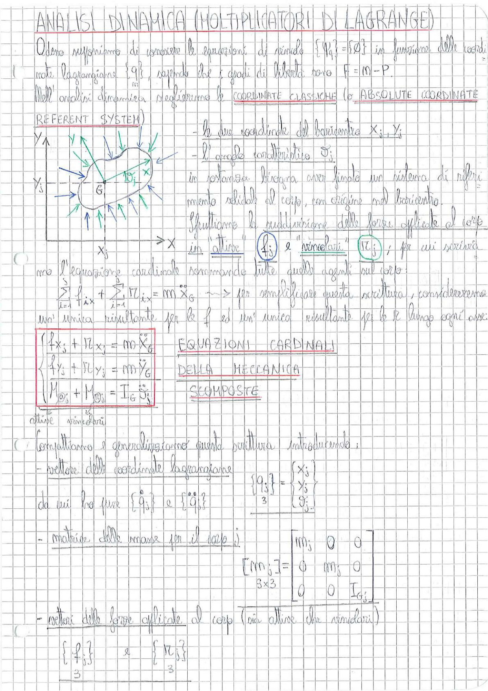

# Page 127 - Analisi Dinamica (Moltiplicatori di Lagrange)

## ANALISI DINAMICA (MOLTIPLICATORI DI LAGRANGE)

Adesso supponiamo di conoscere le equazioni di vincolo $\{\dot{q}\} = [S\dot{\Phi}]$ in funzione delle coordinate Lagrangiane $\{q\}$, sapendo che i gradi di libertà sono $F = M - P$.

Nell'analisi dinamica necessitiamo le **COORDINATE CLASSICHE** (o **ABSOLUTE COORDINATE REFERENT SYSTEM**).

> 
> Diagramma: sistema di riferimento assoluto (X, Y) con corpo rigido j, baricentro $G_j$, angolo $\vartheta_j$, e forze applicate (attive e vincolari) rappresentate da frecce.

- le due coordinate del baricentro $x_j$, $y_j$
- l'angolo caratteristico $\vartheta_j$

In sostanza bisogna avere fisso un sistema di riferimento solidale al corpo, con origine nel baricentro.

Sfruttiamo la suddivisione delle forze applicate al corpo in "attive" $\{f_j\}$ e "vincolari" $\{r_j\}$; per cui scriveremo l'equazione cardinale sommando tutte quelle agenti sul corpo:

$$\sum_{i=1}^{3} f_{ix} + \sum_{j=1}^{3} r_{ix} = m \ddot{x}_G \quad \longrightarrow \quad \text{per semplificare questa scrittura, considereremo}$$

un'unica risultante per le $f$ ed un'unica risultante per le $r$ lungo ogni asse:

$$\boxed{\begin{cases} f_{x_j} + r_{x_j} = m_j \ddot{x}_G \\ f_{y_j} + r_{y_j} = m_j \ddot{y}_G \\ M_{\vartheta_j} + M_{\vartheta_j} = I_{G_j} \ddot{\vartheta}_j \end{cases}}$$

**EQUAZIONI CARDINALI DELLA MECCANICA SCOMPOSTE**

(attive + vincolari)

---

Compattiamo e generalizziamo questa scrittura introducendo:

- **vettore delle coordinate lagrangiane**

$$\{q_j\}_3 = \begin{Bmatrix} x_j \\ y_j \\ \vartheta_j \end{Bmatrix}$$

da cui ho pure $\{\dot{q}_j\}$ e $\{\ddot{q}_j\}$

- **matrice delle masse per il corpo j**

$$[m_j]_{3 \times 3} = \begin{bmatrix} m_j & 0 & 0 \\ 0 & m_j & 0 \\ 0 & 0 & I_{G_j} \end{bmatrix}$$

- **vettori delle forze applicate al corpo** (sia attive che vincolari)

$$\{f_j\}_3 \qquad \text{e} \qquad \{r_j\}_3$$
