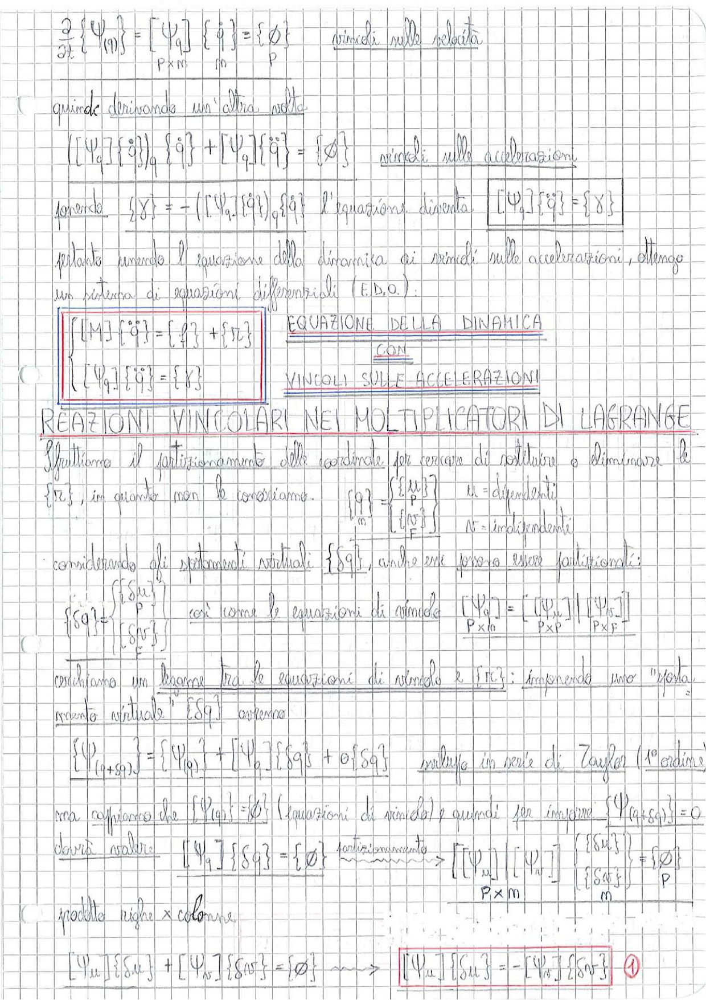

# Page 129 - Reazioni Vincolari nei Moltiplicatori di Lagrange

## Vincoli sulle velocità

$$\frac{\partial}{\partial t}\{\Psi(q)\} = [\Psi_q] \{\dot{q}\} = \{\phi\} \qquad \text{vincoli sulle velocità}$$

$$\underset{P \times m}{[\Psi_q]} \underset{m}{\{\dot{q}\}} = \underset{P}{\{\phi\}}$$

## Vincoli sulle accelerazioni

Quindi derivando un'altra volta:

$$([\Psi_q]\{\dot{q}\})_q \{\dot{q}\} + [\Psi_q]\{\ddot{q}\} = \{\phi\} \qquad \text{vincoli sulle accelerazioni}$$

Ponendo $\{\chi\} = -([\Psi_q]\{\dot{q}\})_q\{\dot{q}\}$ l'equazione diventa:

$$\boxed{[\Psi_q]\{\ddot{q}\} = \{\chi\}}$$

Pertanto unendo l'equazione della dinamica ai vincoli sulle accelerazioni, ottengo un sistema di equazioni differenziali (E.D.O.):

$$\boxed{\begin{cases} [M]\{\ddot{q}\} = \{A\} + \{r_c\} \\ [\Psi_q]\{\ddot{q}\} = \{\chi\} \end{cases}}$$

**EQUAZIONE DELLA DINAMICA CON VINCOLI SULLE ACCELERAZIONI**

---

## Reazioni Vincolari nei Moltiplicatori di Lagrange

Sfruttiamo il partizionamento delle coordinate per cercare di sostituire o eliminare le $\{r_c\}$, in quanto non le conosciamo.

$$\{q\} = \begin{Bmatrix} \{u\} \\ \{v\} \end{Bmatrix}_m \qquad u = \text{dipendenti}$$
$$\qquad \qquad \qquad \qquad \qquad v = \text{indipendenti}$$

Considerando gli spostamenti virtuali $\{\delta q\}$, anche essi possono essere partizionati:

$$\{\delta q\} = \begin{Bmatrix} \{\delta u\} \\ \{\delta v\} \end{Bmatrix} \qquad \text{così come le equazioni di vincolo} \quad [\Psi_q] = \underset{P \times m}{[[\Psi_u] \underset{P \times P}{|} [\Psi_v]]}_{P \times F}$$

Cerchiamo un legame tra le equazioni di vincolo e $\{r_c\}$: imponendo uno "spostamento virtuale" $\{\delta q\}$ otteniamo:

$$\{\Psi_{q+\delta q}\} = \{\Psi_q\} + [\Psi_q]\{\delta q\} + o\{\delta q\} \qquad \text{incluso in serie di Taylor (1° ordine)}$$

ma sappiamo che $\{\Psi(q)\} = \{\phi\}$ (equazioni di vincolo) e quindi per imporre $\{\Psi(q+\delta q)\} = 0$

dovrà valere:

$$[\Psi_q]\{\delta q\} = \{\phi\} \xrightarrow{\text{partizionamento}} [[\Psi_u] | [\Psi_v]] \underset{P \times m}{\begin{Bmatrix} \{\delta u\} \\ \{\delta v\} \end{Bmatrix}}_m = \{\phi\}_P$$

prodotto righe × colonne:

$$[\Psi_u]\{\delta u\} + [\Psi_v]\{\delta v\} = \{\phi\} \longrightarrow \boxed{[\Psi_u]\{\delta u\} = -[\Psi_v]\{\delta v\}} \quad \textcircled{1}$$

> 
> Diagramma: Pagina di appunti con derivazione delle equazioni della dinamica con vincoli sulle accelerazioni e introduzione delle reazioni vincolari tramite moltiplicatori di Lagrange, con partizionamento delle coordinate in dipendenti e indipendenti.
