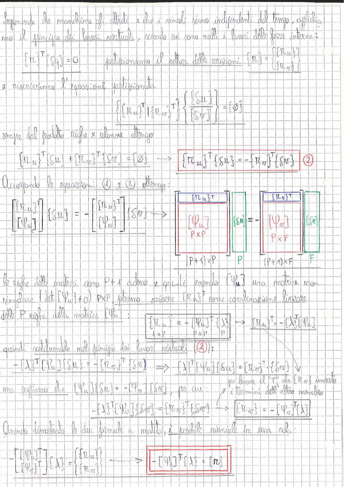

# Page 130 - Principio dei Lavori Virtuali e Matrici Partizionate

Supponendo che manchino gli attriti e che i vincoli siano indipendenti dal tempo, applichiamo il principio dei lavori virtuali, vedendo cui sono nulli i lavori delle forze interne:

$$\{\pi\}^T \{\delta q\} = 0$$

Partizioniamo il vettore delle reazioni:

$$\{\pi\} = \begin{Bmatrix} \{\pi_u\} \\ \{\pi_{\sigma r}\} \end{Bmatrix}$$

e riscriviamo l'equazione partizionata:

$$\{\{\pi_u\}^T | \{\pi_{\sigma r}\}^T\} \cdot \begin{Bmatrix} \{\delta u\} \\ \{\delta \sigma r\} \end{Bmatrix} = \{\phi\}$$

sempre dal prodotto righe × colonne ottengo:

$$\{\pi_u\}^T \{\delta u\} + \{\pi_{\sigma r}\}^T \{\delta \sigma r\} = \{\phi\} \quad \longrightarrow \quad \boxed{\{\pi_u\}^T \{\delta u\} = -\{\pi_{\sigma r}\}^T \{\delta \sigma r\}} \quad (2)$$

Accoppiando le equazioni (1) e (2) ottengo:

$$\begin{bmatrix} \{\pi_u\}^T \\ [\Psi_u] \end{bmatrix} \{\delta u\} = - \begin{bmatrix} \{\pi_{\sigma r}\}^T \\ [\Psi_{\sigma r}] \end{bmatrix} \{\delta \sigma r\} \quad \Rightarrow$$

> 
> Diagramma: Schema delle dimensioni delle matrici partizionate — matrice $(P+1) \times P$ con $\{\pi_u\}^T$ e $[\Psi_u]_{P \times P}$ moltiplicata per $\{\delta u\}_P$, uguale a meno la matrice $(P+1) \times F$ con $\{\pi_{\sigma r}\}^T$ e $[\Psi_{\sigma r}]_{P \times F}$ moltiplicata per $\{\delta \sigma r\}_F$

Le righe delle matrici sono $P+1$ adesso e quindi essendo $[\Psi_u]$ una matrice non singolare (cioè $\det[\Psi_u] \neq 0$) $P \times P$ potremo scrivere $\{\pi_u\}^T$ come combinazione lineare delle $P$ righe della matrice $[\Psi_u]$:

$$\boxed{\{\pi_u\}^T = -[\Psi_u]^T \{\lambda\}^T \quad \longrightarrow \quad \{\pi_u\}^T = -\{\lambda\}^T [\Psi_u]}$$

$$\underbrace{\quad}_{1 \times P} \quad \underbrace{\quad}_{P \times P} \quad \underbrace{\quad}_{P}$$

quindi sostituendo nel principio dei lavori virtuali $(2)$:

$$-\{\lambda\}^T [\Psi_u] \{\delta u\} = -\{\pi_{\sigma r}\}^T \{\delta \sigma r\} \quad \Rightarrow \quad \{\lambda\}^T [\Psi_u] \{\delta u\} = \{\pi_{\sigma r}\}^T \cdot \{\delta \sigma r\} \quad \checkmark$$

ma sappiamo che $[\Psi_u]\{\delta u\} = -[\Psi_{\sigma r}]\{\delta \sigma r\}$, per cui:

$$-\{\lambda\}^T [\Psi_{\sigma r}] \{\delta \sigma r\} = \{\pi_{\sigma r}\}^T \{\delta \sigma r\} \quad \longrightarrow \quad \{\pi_{\sigma r}\} = -[\Psi_{\sigma r}]^T \{\lambda\}$$

(si può levare il $T$ da $\{\pi_{\sigma r}\}$ invertendo i termini dell'altro membro)

Avendo dimostrato le due formule a matita, è possibile riunirle in una sola:

$$-\begin{bmatrix} [\Psi_u]^T \\ [\Psi_{\sigma r}]^T \end{bmatrix} \{\lambda\} = \begin{Bmatrix} \{\pi_u\} \\ \{\pi_{\sigma r}\} \end{Bmatrix} \quad \Rightarrow \quad \boxed{-[\Psi_a]^T \{\lambda\} = \{\pi\}}$$
