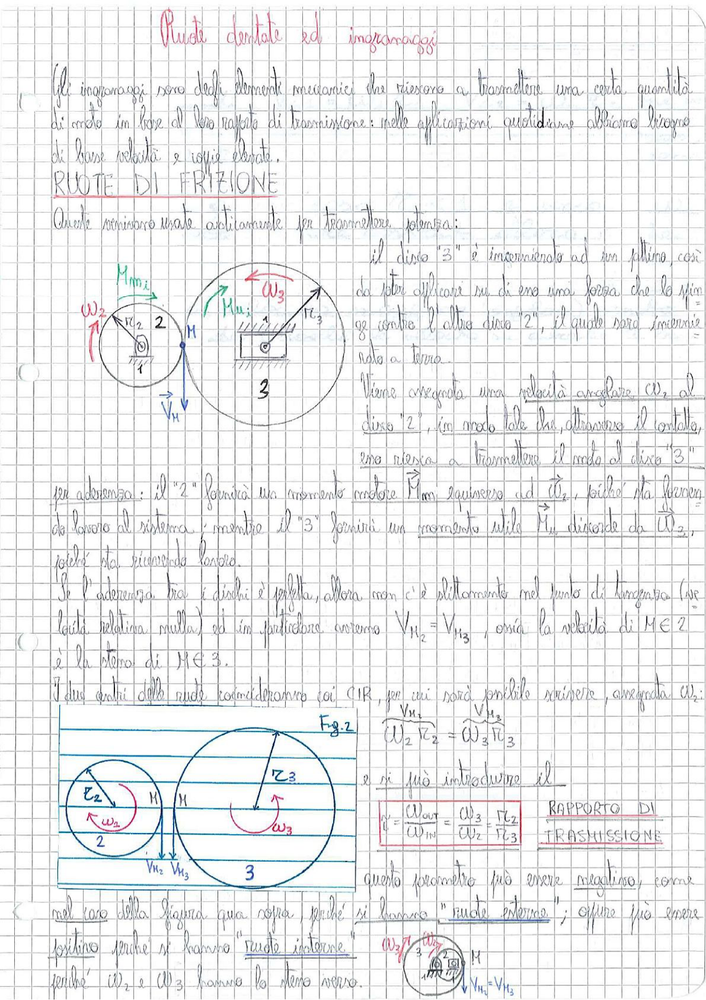

# Page 135 - Ruote dentate ed ingranaggi

## Ruote dentate ed ingranaggi

Gli ingranaggi sono degli elementi meccanici che riescono a trasmettere una certa quantità di moto in base al loro rapporto di trasmissione: nelle applicazioni quotidiane abbiamo bisogno di basse velocità e coppie elevate.

## RUOTE DI FRIZIONE

Queste venivano usate esclusivamente per trasmettere potenza:

> 
> Diagramma: Due dischi circolari (disco 2 e disco 3) a contatto nel punto M. Il disco 2 ha raggio $r_2$, velocità angolare $\omega_2$ e momento motore $M_{m_2}$. Il disco 3 ha raggio $r_3$, velocità angolare $\omega_3$ e momento resistente $M_{u_3}$. Il punto di contatto M ha velocità $\vec{V}_M$ verso il basso.

Il disco "3" è interconnesso ad un puttino, così da poter applicare su di esso una forza che lo spinga contro l'altro disco "2", il quale sarà interconnesso a terra.

Viene assegnata una velocità angolare $\omega_2$ al disco "2", in modo tale che, attraverso il contatto, esso riesca a trasmettere il moto al disco "3" per aderenza: il "2" fornirà un momento motore $M_m$ equiverso ad $\vec{\omega}_2$, poiché sta fornendo lavoro al sistema; mentre il "3" fornirà un momento utile $M_u$ discorde da $\vec{\omega}_3$, poiché sta ricevendo lavoro.

Se l'aderenza tra i dischi è perfetta, allora non c'è slittamento nel punto di tangenza (velocità relativa nulla) ed in particolare avremo:

$$V_{M_2} = V_{M_3}$$

ossia la velocità di $M \in 2$ è la stessa di $M \in 3$.

I due centri delle ruote coincideranno coi CIR, per cui sarà possibile scrivere, assegnata $\omega_2$:

> 
> Diagramma: Seconda figura (Fig. 2) con i due dischi 2 e 3 a contatto esterno nel punto M, con raggi $r_2$ e $r_3$, velocità angolari $\omega_2$ e $\omega_3$, e le velocità $V_{M_2}$ e $V_{M_3}$ indicate nel punto di contatto.

$$\overset{V_{M_2}}{\omega_2 \, r_2} = \overset{V_{M_3}}{\omega_3 \, r_3}$$

e si può introdurre il

$$\boxed{\tau = \frac{\omega_{out}}{\omega_{in}} = \frac{\omega_3}{\omega_2} = \frac{r_2}{r_3} \qquad \text{RAPPORTO DI TRASMISSIONE}}$$

Questo parametro può essere negativo, come nel caso della figura qua sopra, perché si hanno "ruote esterne"; oppure può essere positivo perché si hanno "ruote interne", perché $\omega_2$ e $\omega_3$ hanno lo stesso verso.

> 
> Diagramma: Piccolo schema nell'angolo in basso a destra che mostra due ruote interne (una dentro l'altra) con $\omega_3$, $\omega_2$ e il punto di contatto M dove $V_{M_2} = V_{M_3}$.
