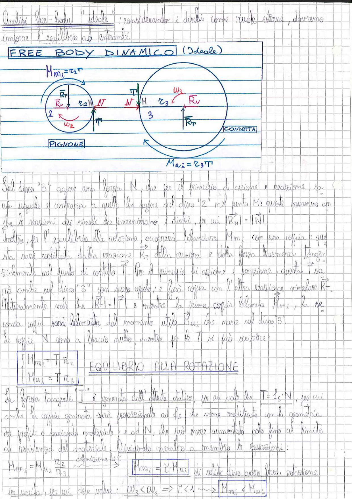

# Page 136 - Free Body Dinamico (Ideale) - Ingranaggi

Analisi free-body "ideale": considerando i dischi come ruote esterne, dovremo imporre l'equilibrio ad entrambi.

## FREE BODY DINAMICO (Ideale)

> 
> Diagramma: Schema free body dinamico di un ingranaggio con pignone (disco 2) e ruota condotta (disco 3). Il disco 2 ha raggio $r_2$, velocità angolare $\omega_2$, momento motore $M_{m_2} = r_2 \cdot T$, forze $\vec{R}_T$, $\vec{R}_N$ e forza $\vec{N}$ al punto di contatto. Il disco 3 ha raggio $r_3$, velocità angolare $\omega_3$, momento $M_{u_2} = r_3 \cdot T$, forze $\vec{R}_N$ e $\vec{R}_T$ e forza tangenziale $\vec{T}$ al punto di contatto M.

$$M_{m_2} = r_2 \cdot T$$

$$M_{u_2} = r_3 \cdot T$$

---

Sul disco "3" agisce una forza $\vec{N}$, che per il principio di azione e reazione, sarà uguale e contraria a quella che agisce sul disco "2" nel punto M; queste saranno anche le reazioni dei vincoli che interconnettono i dischi, per cui $|\vec{R}_N| = |\vec{N}|$.

Inoltre, per l'equilibrio alla rotazione, occorrerà bilanciare $M_{m_2}$ con una coppia: questa sarà costituita dalla reazione $\vec{R}_T$ della cerniera e dalla forza tangenziale tangente esercitata nel punto di contatto $\vec{T}$. Per il principio di azione e reazione, questa $\vec{T}$ sarà anche sul disco "3" con verso opposto, e farà coppia con l'altra reazione vincolare $\vec{R}_T$.

Naturalmente vale che $|\vec{R}_T| = |\vec{T}|$ e mentre la prima coppia bilancia $M_{m_2}$, la seconda coppia sarà bilanciata dal momento utile $\vec{R}_N$ che nasce sul disco "3".

Le coppie $\vec{N}$ sono a braccio nullo, mentre per le $\vec{T}$ si può scrivere:

## EQUILIBRIO ALLA ROTAZIONE

$$\boxed{\begin{cases} M_{m_2} = T \cdot r_2 \\ M_{u_2} = T \cdot r_3 \end{cases}}$$

La forza tangente "$T$" è generata dall'attrito statico, per cui vale che $T = f_s \cdot N$, per cui anche la coppia generata sarà proporzionale ad $f_s$, che viene modificato con la geometria dei profili e variando materiale; e ad $N$, che può invece aumentare solo fino al limite di resistenza del materiale.

Dividendo membro a membro le equazioni:

$$M_{m_2} = M_{u_2} \frac{r_2}{r_3} \quad \xrightarrow{\text{definizione di } \tau} \quad \boxed{M_{m_2} = \tau \cdot M_{u_2}}$$

di solito deve essere la ruota in uscita, per cui deve valere:

$$\omega_3 < \omega_2 \Rightarrow \tau < 1 \leadsto M_{m_2} < M_{u_2}$$
