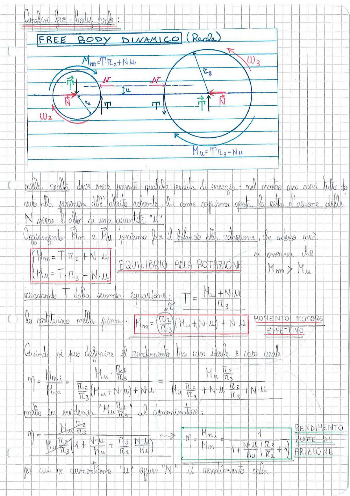

# Page 137 - Free Body Dinamico Reale (Ruote di Frizione)

## Analisi free-body reale:

### FREE BODY DINAMICO (Reale)

> 
> Diagramma: Free body dinamico reale di due ruote di frizione in contatto. La ruota motrice (sinistra, raggio $r_2$, velocità angolare $\omega_2$) e la ruota condotta (destra, raggio $r_3$, velocità angolare $\omega_3$) sono rappresentate con le forze normali $N$ al contatto, la forza tangenziale $T$, e lo spostamento $\mu$ della retta d'azione di $N$ dovuto all'attrito volvente. Sono indicati i momenti: $M_m = T \cdot r_2 + N \cdot \mu$ sulla ruota motrice e $M_u = T \cdot r_3 - N \cdot \mu$ sulla ruota condotta.

---

Nella realtà deve essere presente qualche perdita di energia: nel nostro caso sarà tutto dovuto alla presenza dell'attrito volvente, che come sappiamo sposta la retta d'azione della $N$ verso l'asse di una quantità "$\mu$".

Aggiungendo $M_m$ e $M_u$ possiamo fare il bilancio alla rotazione, che adesso sarà:

$$\boxed{\begin{cases} M_m = T \cdot r_2 + N \cdot \mu \\ M_u = T \cdot r_3 - N \cdot \mu \end{cases}}$$

**EQUILIBRIO ALLA ROTAZIONE**

Si osserva che $M_m > M_u$.

Ricavando $T$ dalla seconda equazione:

$$T = \frac{M_u + N \cdot \mu}{r_3}$$

Lo sostituisco nella prima:

$$\boxed{M_m = \frac{r_2}{r_3}(M_u + N \cdot \mu) + N \cdot \mu}$$

**MOMENTO MOTORE EFFETTIVO**

---

Quindi si può definire il **rendimento** tra caso ideale e caso reale:

$$\eta = \frac{M_{m,i}}{M_m} = \frac{M_u \cdot \frac{r_2}{r_3}}{\frac{r_2}{r_3}(M_u + N \cdot \mu) + N \cdot \mu} = \frac{M_u \cdot \frac{r_2}{r_3}}{M_u \cdot \frac{r_2}{r_3} + N \cdot \mu \cdot \frac{r_2}{r_3} + N \cdot \mu}$$

Metto in evidenza "$M_u \cdot \frac{r_2}{r_3}$" al denominatore:

$$\eta = \frac{M_u \cdot \frac{r_2}{r_3}}{M_u \cdot \frac{r_2}{r_3}\left(1 + \frac{N \cdot \mu}{M_u} + \frac{r_3}{r_2} \cdot \frac{N \cdot \mu}{M_u}\right)}$$

$$\boxed{\eta = \frac{M_{m,i}}{M_m} = \frac{1}{1 + \frac{N \cdot \mu}{M_u}\left(\frac{r_3}{r_2} + 1\right)}}$$

**RENDIMENTO RUOTE DI FRIZIONE**

Per cui se aumentiamo "$\mu$" oppure "$N$" il rendimento cala.
