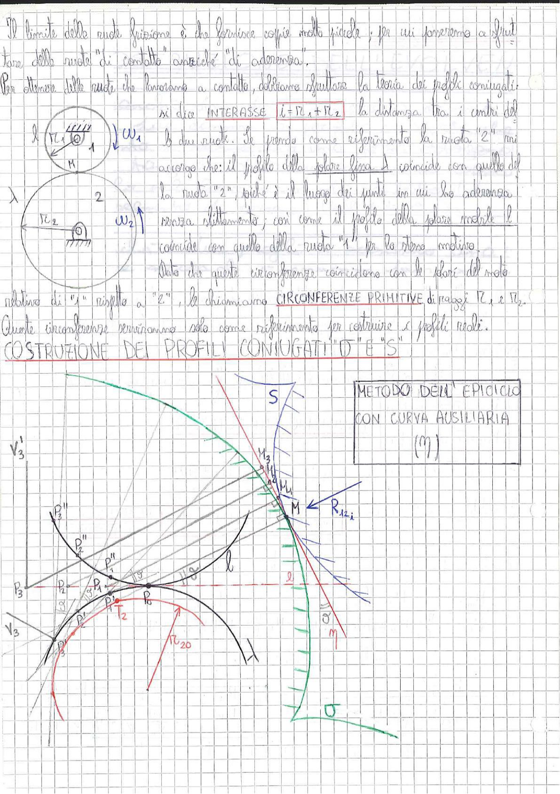

# Page 138 - Circonferenze Primitive e Costruzione dei Profili Coniugati

Il limite delle ruote frizione è che fornisce coppie molto piccole; per cui passeremo a sfruttare delle ruote "di contatto" anziché "di aderenza".

Per ottenere delle ruote che lavorano a contatto, dobbiamo sfruttare la teoria dei profili coniugati:

si dice **INTERASSE**

$$\boxed{i = R_1 + R_2}$$

la distanza tra i centri delle due ruote. Se prendo come riferimento la ruota "2" mi accorgo che: il profilo della polare fissa $\lambda$ coincide con quello della ruota "2", poiché è il luogo dei punti in cui ho aderenza senza slittamento; così come il profilo della polare mobile $l$ coincide con quello della ruota "1" per lo stesso motivo.

Dato che queste circonferenze coincidono con le polari del moto relativo di "1" rispetto a "2", le chiamiamo **CIRCONFERENZE PRIMITIVE** di raggi $R_1$ e $R_2$.

Queste circonferenze serviranno solo come riferimento per costruire i profili reali.

> 
> Diagramma: Schema di due ruote dentate accoppiate con raggi $R_1$ e $R_2$, velocità angolari $\omega_1$ e $\omega_2$, polare fissa $\lambda$ e polare mobile $l$, con punto di contatto $M$.

---

## COSTRUZIONE DEI PROFILI CONIUGATI "D" E "S"

### METODO DELL'EPICICLO CON CURVA AUSILIARIA ($\eta$)

> 
> Diagramma: Costruzione geometrica del metodo dell'epiciclo con curva ausiliaria $\eta$. Si vedono: le circonferenze primitive di raggio $R_1$ (ruota 1) e $R_2$ (ruota 2, con centro $O$), il punto di contatto $P_0$ sulla retta dei centri, la curva ausiliaria $\eta$ (in verde), la retta $S$ tangente, il punto $M$ con il raggio di curvatura $R_{12_i}$, e i punti $P_1, P_2, P_3$ con le loro proiezioni $P_1'', P_2'', P_3''$ sulle rispettive ruote. Si nota anche il centro $T_2$ e il raggio $R_{20}$ della ruota 2. La costruzione mostra come i punti della curva ausiliaria vengono riportati sui profili coniugati "D" e "S" delle due ruote, con le linee grigie che indicano le posizioni successive durante la rotazione. Sono indicati anche i punti $V_3$, $V_3'$ e la retta $m$ con punto $a'$.
