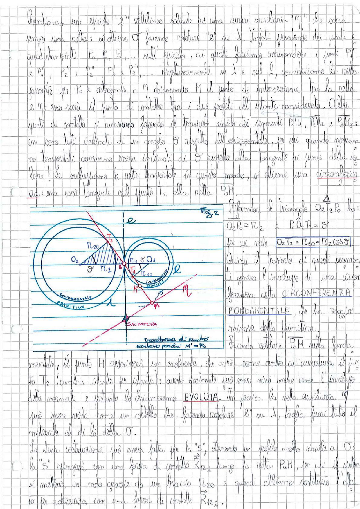

# Page 139 - Circonferenza Fondamentale ed Evoluta

Prendiamo un epiciclo "$\ell$" rettilineo solidale ad una curva ausiliaria "$M$", che sarà sempre una retta; si ottiene $\sigma$ facendo rotolare "$\ell$" su $\lambda$. Infatti prendendo dei punti $P_0, P_1, P_2, \ldots$ equidistanziati sull'epiciclo, ai quali facciamo corrispondere i punti $P'_0$ e $P'_1$, $P'_2$ e $P''_1$, $P''_2$, $P'_3$ e $P_3$, $\ldots$ rispettivamente su $\ell$ e sull $\ell$, consideriamo la retta passante per $P_0$ e diagonale a $M$ chiamando $M$ il punto di intersezione tra la retta $\ell$ e $M$: esso sarà il punto di contatto tra i due profili all'istante considerato. Altri punti di contatto si ricavano facendo il trasporto rigido dei segmenti $P_1M_1$, $P_2M_2$ e $P_3M_3$: essi sono tutti inclinati di un angolo $\vartheta$ rispetto all'orizzontale, per cui quando occorrerà trasportarli dovranno essere inclinati di $\vartheta$ rispetto alla tangente ai punti della polara! Se sviluppiamo le rette trasportate in questo modo, si ottiene una circonferenza.

Da: essa sarà tangente nel punto $T_2$ alla nella P.d.M.

> 
> Diagramma: Fig. 2 — Due ruote dentate in ingranamento con cerchi primitivi (fondamentale e primitiva), punto di contatto, centri $O_1$ e $O_2$, raggi $r_1$, $r_2$, $r_{10}$, $r_{20}$, retta d'azione con angolo $\vartheta$, punto di saldatura e traiettoria di moto (scorciato perché $M' = P_0$).

Riferendosi al triangolo $\overset{\Delta}{O_2 T_2 P_0}$ ho:

$$O_2 P_0 = r_2 \quad e \quad \widehat{P_0 O_2 T_2} = \vartheta$$

per cui vale:

$$\boxed{O_2 T_2 = r_{20} = r_2 \cos \vartheta}$$

Quindi il trasporto di questi segmenti genera l'inviluppo di una circonferenza della **CIRCONFERENZA FONDAMENTALE**, che ha raggio minore della primitiva.

Facendo rotolare P.d.M sulla fondamentale, il punto $M$ descriverà un'evolvente, che avrà come centro di curvatura il punto $T_2$ (compra istante per istante): questo evolvente può essere visto anche come l'inviluppo delle normali e pertanto lo chiameremo **EVOLUTA**. In pratica la retta ausiliaria $M$ può essere vista come un coltello che, facendo rotolare "$\ell$" su $\lambda$, taglia fuori tutto il materiale al di là della $\sigma$.

La stessa costruzione può essere fatta per la "$S$", ottenendo un profilo avente simile a $\sigma$; la "$S$" rimpiazzerà con una forza di contatto $\vec{R}_{12}$ lungo la retta P.d.M, per cui il sistema si metterà in moto opposto da un braccio $r_{20}$ e quindi otterremo sostituito l'altro la $\ell\ell$ aderenza con una forza di contatto $\vec{R}_{12}$.
