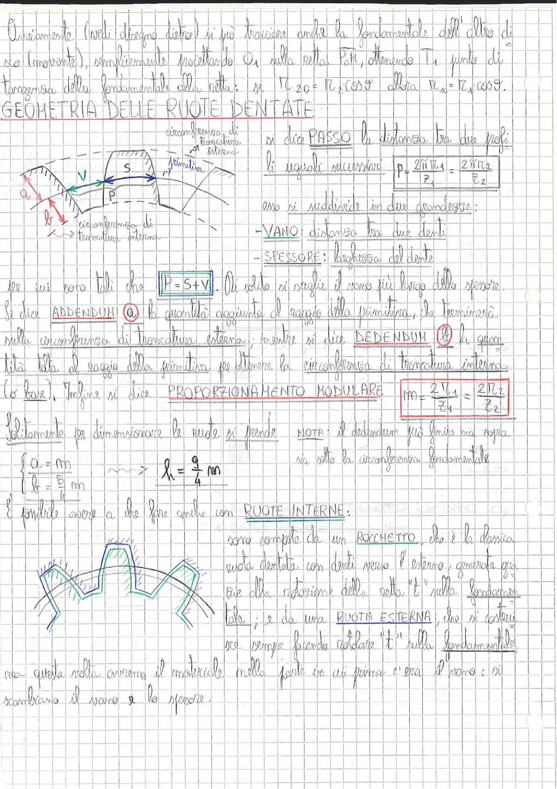

# Page 140 - Geometria delle Ruote Dentate

Ovviamente (vedi disegno dietro) si può tracciare anche la fondamentale dell'altro disco (movente), semplicemente proiettando $O_1$ sulla retta $t_0 t_1$, ottenendo $T_1$ punto di tangenza della fondamentale alla retta. Se $r_{c_{2O}} = r_{c_2} \cos\vartheta$ allora $r_{c_{1O}} = r_{c_1} \cos\vartheta$.

## GEOMETRIA DELLE RUOTE DENTATE

> 
> Diagramma: Sezione di una ruota dentata con indicazione della circonferenza di troncatura esterna, della primitiva, della circonferenza di troncatura interna, e delle grandezze caratteristiche: addendum (a), dedendum (b), spessore (S), vano (V) e passo (P).

Si dice **PASSO** la distanza tra due profili uguali successivi:

$$\boxed{P = \frac{2\pi r_{c_1}}{z_1} = \frac{2\pi r_{c_2}}{z_2}}$$

Esso si suddivide in due grandezze:

- **VANO**: distanza tra due denti
- **SPESSORE**: larghezza del dente

tra cui sono tali che $\boxed{P = S + V}$. Di solito si sceglie il vano più largo dello spessore.

Si dice **ADDENDUM** ($a$) la quantità aggiunta al raggio della primitiva, che terminerà sulla circonferenza di troncatura esterna; mentre si dice **DEDENDUM** ($b$) la quantità tolta al raggio della primitiva per ottenere la circonferenza di troncatura interna (o base).

Infine si dice **PROPORZIONAMENTO MODULARE**:

$$\boxed{m = \frac{2r_{c_1}}{z_1} = \frac{2r_{c_2}}{z_2}}$$

Solitamente per dimensionare le ruote si prende:

$$\begin{cases} a = mn \\ b = \frac{10}{8} mn \end{cases} \quad \longrightarrow \quad h = \frac{9}{4} mn$$

**NOTA**: il dedendum può finire più sopra sia sotto la circonferenza fondamentale.

---

È possibile avere a che fare anche con **RUOTE INTERNE**:

> 
> Diagramma: Rappresentazione di un ingranamento interno con rocchetto (ruota dentata con denti verso l'esterno) e ruota esterna (corona interna con denti rivolti verso l'interno).

Sono composte da un **ROCCHETTO**, che è la classica ruota dentata con denti verso l'esterno, generata grazie alla rotazione della retta "t" sulla fondamentale; e da una **RUOTA ESTERNA**, che si costruisce sempre facendo rotolare "t" sulla fondamentale, ma questa volta avremo il materiale nella parte in cui prima c'era il vano: si scambiano il vano e lo spessore.
