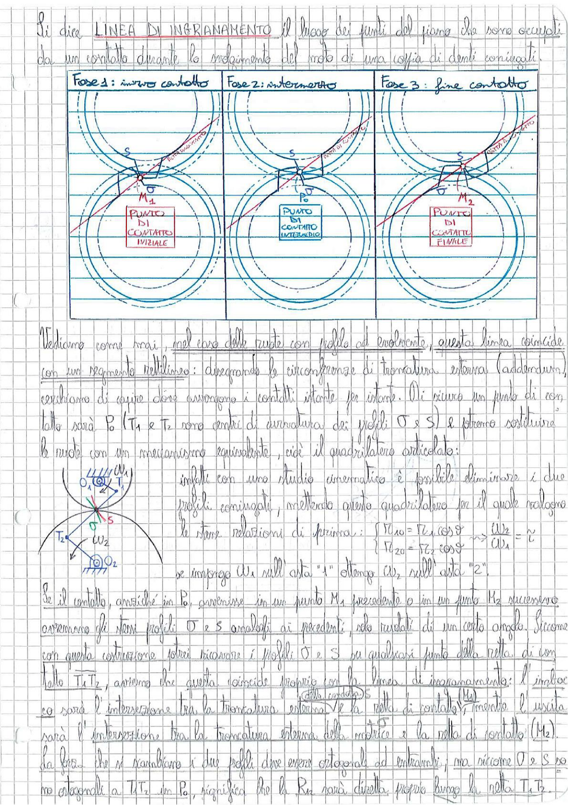

# Page 141 - Linea di Ingranamento

Si dice **LINEA DI INGRANAMENTO** il luogo dei punti del piano che sono occupati da un contatto durante lo svolgimento del moto di una coppia di denti coniugati.

> 
> Diagramma: Tre fasi dell'ingranamento di una coppia di denti coniugati con profilo ad evolvente. Fase 1: inizio contatto (punto $M_1$, punto di contatto iniziale). Fase 2: intermedio (punto $P_0$, punto di contatto intermedio). Fase 3: fine contatto (punto $M_2$, punto di contatto finale). Si vedono le circonferenze di base, i profili $\sigma$ e $S$, e la retta di contatto.

---

Vediamo come mai, nel caso delle ruote con profilo ad evolvente, questa linea coincide con un segmento rettilineo: disegnando le circonferenze di troncatura esterna (addendum), cerchiamo di capire dove avvengono i contatti istante per istante. Ci siamo un punto di contatto sarà $P_0$ ($T_1$ e $T_2$ sono centri di curvatura dei profili $\sigma$ e $S$) e potremo sostituire le ruote con un meccanismo equivalente, cioè il quadrilatero articolato:

> 
> Diagramma: Schema del quadrilatero articolato equivalente con centri $O_1$, $O_2$, punti $T_1$, $T_2$, punto di contatto $S$, e velocità angolari $\omega_1$ e $\omega_2$.

Infatti con uno studio cinematico è possibile dimostrare i due profili coniugati, mettendo questo quadrilatero per il quale valgono le stesse relazioni di prima:

$$\begin{cases} T_{1,0} = T_{1} \cos \vartheta \\ T_{2,0} = T_{2} \cos \vartheta \end{cases} \implies \frac{\omega_2}{\omega_1} = \tau$$

se impongo $\omega_1$ sull'asta "1" ottengo $\omega_2$ sull'asta "2".

Se il contatto, anziché in $P_0$, avvenisse in un punto $M_1$ precedente o in un punto $M_2$ successivo, avremmo gli stessi profili $\sigma$ e $S$ analoghi ai precedenti, solo ruotati di un certo angolo. Siccome con questa costruzione potrei ricavare i profili $\sigma$ e $S$ per qualsiasi punto della retta di contatto $T_1 T_2$, avremo che questa coincide proprio con la linea di ingranamento: l'imbocco sarà l'intersezione tra la troncatura esterna della ruota (addendum) e la retta di contatto, mentre l'uscita sarà l'intersezione tra la troncatura esterna della matrice e la retta di contatto ($M_2$).

La forza che si scambiano i due profili deve essere ortogonale ad entrambi; ma siccome $\sigma$ e $S$ sono ortogonali a $T_1 T_2$ in $P_0$, significa che la $R_n$ sarà diretta proprio lungo la retta $T_1 T_2$.
