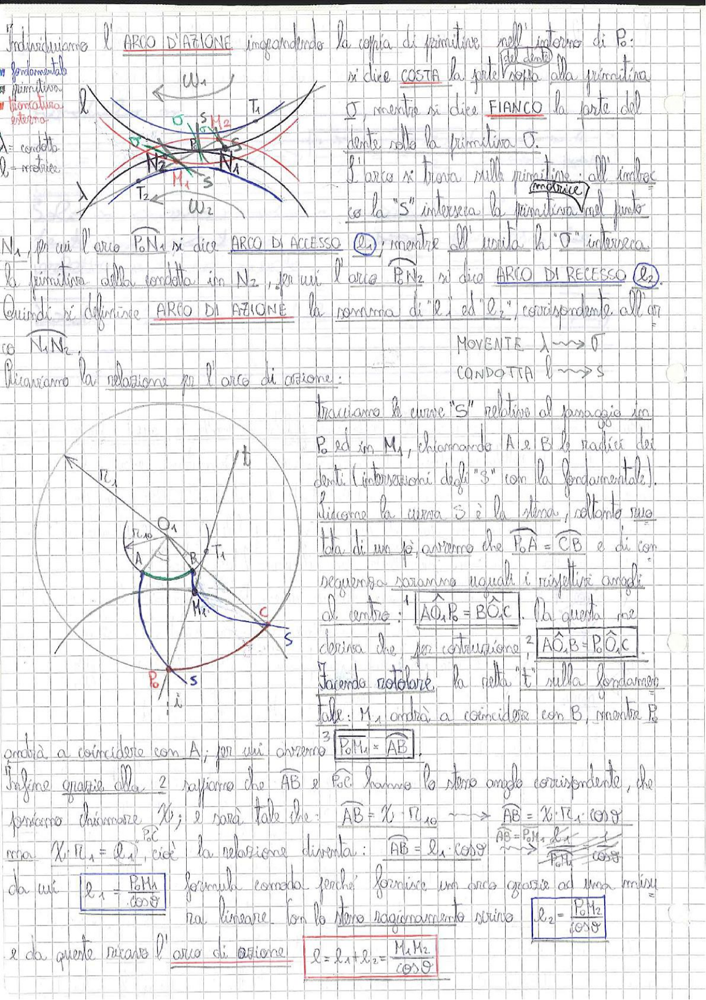

# Page 142 - Arco di Azione negli Ingranaggi

## Definizioni

Individuiamo l'**ARCO D'AZIONE** impegnando la coppia di primitive nell'intorno di $P_0$:

**Legenda:**
- *fondamentale*
- *primitiva*
- *troncatura esterna*
- $\ell_1$ = condotta
- $\ell_2$ = motrice

Si dice **COSTA** la parte sopra alla primitiva, mentre si dice **FIANCO** la parte del dente sotto la primitiva.

L'arco si trova sulla primitiva; all'imbocco la "S" interseca la primitiva nel punto $N_1$, per cui l'arco $\overline{P_0 N_1}$ si dice **ARCO DI ACCESSO** ($\ell_1$), mentre all'uscita la "S" interseca la primitiva della condotta in $N_2$, per cui l'arco $\overline{P_0 N_2}$ si dice **ARCO DI RECESSO** ($\ell_2$).

Quindi si definisce **ARCO DI AZIONE** la somma di "$\ell_1$" ed "$\ell_2$", corrispondente all'arco $\overline{N_1 N_2}$.

$$\text{MOVENTE: } \lambda \longrightarrow O$$

$$\text{CONDOTTA: } l \longrightarrow S$$

Ricaviamo la relazione per l'arco di azione:

> 
> Diagramma: Schema superiore con due ruote dentate ingrananti, con primitive $\omega_1$ e $\omega_2$, punti $N_1$, $N_2$, $P_0$, $T_1$, $T_2$, curve "S" e linea d'azione. Schema inferiore con costruzione geometrica per il calcolo dell'arco di azione, mostrante i centri $O_1$ e $M_2$, i punti $A$, $B$, $C$, $P_0$, $M_1$ e le curve "S" relative al passaggio.

Tracciamo le curve "S" relative al passaggio in $P_0$ ed in $M_1$, chiamando $A$ e $B$ le radici dei denti (intersezioni degli "S" con la fondamentale).

Siccome la curva S è la stessa, soltanto spostata di un po', avremo che $\overline{P_0 A} = \overline{CB}$ e di conseguenza saranno uguali i rispettivi angoli al centro:

$$\boxed{A\hat{O}_1 P_0 = B\hat{O}_1 C}$$

Da questa ne deriva che, per costruzione:

$$\boxed{A\hat{O}_1 B = P_0\hat{O}_1 C}$$

Facendo rotolare la palla "t" sulla fondamentale tale: $M_1$ andrà a coincidere con $B$, mentre $P_0$ andrà a coincidere con $A$; per cui avremo:

$$\boxed{P_0 M_1 = AB}$$

Infine grazie alla 2 sappiamo che $AB$ e $P_0C$ hanno lo stesso angolo corrispondente, che possiamo chiamare $\chi$; $\ell$ sarà tale che:

$$AB = \chi \cdot r_{1,10} \longrightarrow AB = \chi \cdot r_1 \cdot \cos\vartheta$$

ma $\chi \cdot r_1 = \ell_1$, cioè la relazione diventa:

$$AB = \ell_1 \cos\vartheta \longrightarrow \frac{AB = P_0 M_1 \cdot \ell_1}{P_0 M_1} \cdot \frac{1}{\cos\vartheta}$$

da cui:

$$\boxed{\ell_1 = \frac{P_0 M_1}{\cos\vartheta}}$$

formula comoda perché fornisce un arco grazie ad una misura lineare. Con lo stesso ragionamento si ricava:

$$\boxed{\ell_2 = \frac{P_0 M_2}{\cos\vartheta}}$$

e da queste ricavo l'arco di azione:

$$\boxed{\ell = \ell_1 + \ell_2 = \frac{M_1 M_2}{\cos\vartheta}}$$
