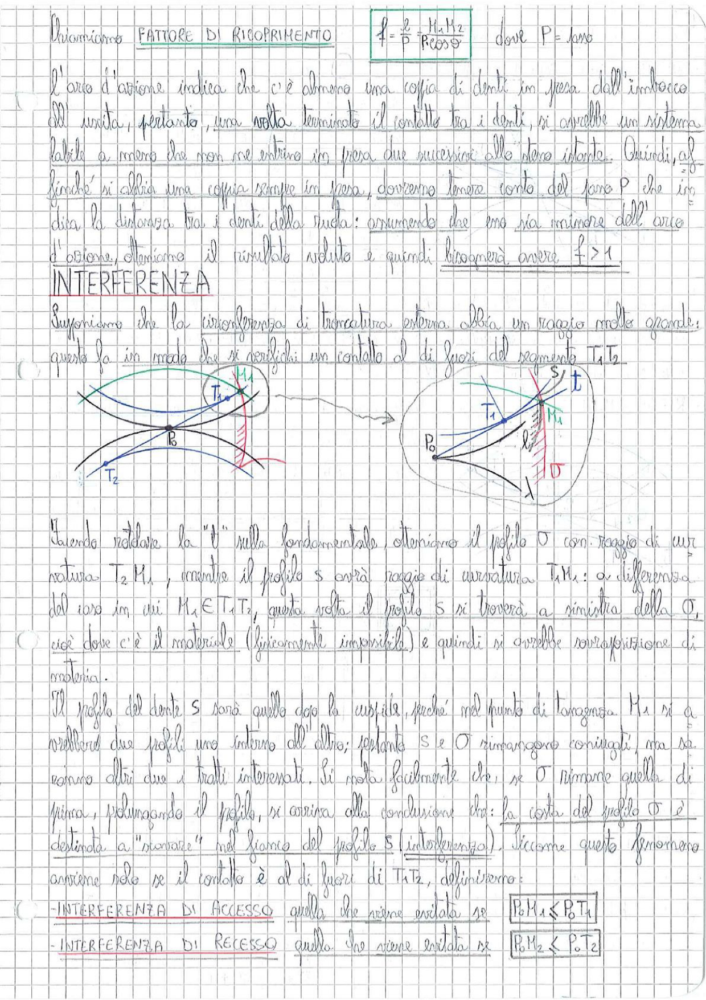

# Page 143 - Fattore di Ricoprimento e Interferenza

## Fattore di Ricoprimento

Chiamiamo **FATTORE DI RICOPRIMENTO**:

$$\boxed{f = \frac{\ell}{P} = \frac{M_1 M_2}{P \cos \vartheta}}$$

dove $P = \text{passo}$

L'arco d'azione indica che c'è almeno una coppia di denti in presa dall'imbocco all'uscita, pertanto, una volta terminato il contatto tra i denti, si avrebbe un sistema labile a meno che non ne entrino in presa due successive allo stesso istante. Quindi, affinché si abbia una coppia sempre in presa, dovremo tenere conto del passo P che indica la distanza tra i denti della ruota: assumendo che esso sia minore dell'arco d'azione, otteniamo il risultato voluto e quindi bisognerà avere $f > 1$.

## INTERFERENZA

Supponiamo che la circonferenza di troncatura esterna abbia un raggio molto grande: questo fa in modo che si verifichi un contatto al di fuori del segmento $T_1 T_2$.

> 
> Diagramma: Schema dell'ingranamento con interferenza. A sinistra: configurazione con circonferenza di troncatura esterna di grande raggio, con punti $T_1$, $T_2$, $P_0$, $M_1$ e le relative circonferenze. A destra: dettaglio del contatto con profili $S$ e $O$, punto $P_0$, tangente $t$, e angolo $\lambda$ che mostra la sovrapposizione dei profili oltre il segmento $T_1 T_2$.

Facendo rotolare la "1" nella fondamentale, otteniamo il profilo $O$ con raggio di curvatura $T_2 M_1$, mentre il profilo $S$ avrà raggio di curvatura $T_1 M_1$: a differenza del caso in cui $M_1 \in T_1 T_2$, questa volta il profilo $S$ si troverà a sinistra della $O$, cioè dove c'è il materiale (fisicamente impossibile) e quindi si avrebbe sovrapposizione di materia.

Il profilo del dente $S$ sarà quello dato la cuspide, perché nel punto di tangenza $M_1$ si avrebbero due profili uno interno all'altro; pertanto $S$ e $O$ rimangono coniugati, ma se esistono altri due i tratti interferenti. Si nota facilmente che, se $O$ rimane quella di prima, prolungando il profilo, si arriva alla conclusione che: la costa del profilo $O$ è destinata a "scavare" nel fianco del profilo $S$ (interferenza). Siccome questo fenomeno avviene solo se il contatto è al di fuori di $T_1 T_2$, definiremo:

- **INTERFERENZA DI ACCESSO** quella che viene evitata se: $\boxed{P_0 M_1 \leq P_0 T_1}$
- **INTERFERENZA DI RECESSO** quella che viene evitata se: $\boxed{P_0 M_2 \leq P_0 T_2}$
