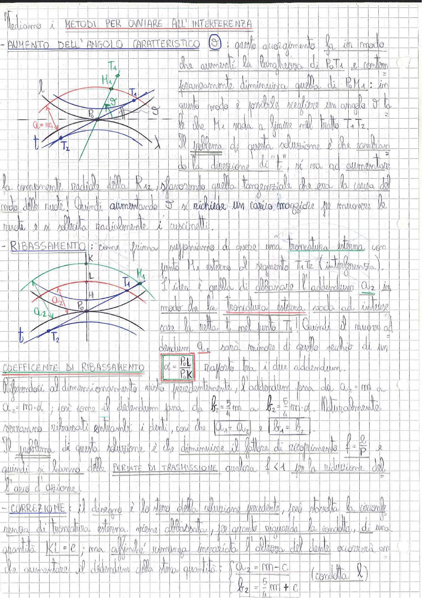

# Page 144 - Metodi per ovviare all'interferenza

Vediamo i **METODI PER OVVIARE ALL'INTERFERENZA**

## - AUMENTO DELL'ANGOLO CARATTERISTICO $\vartheta$

Questo accorgimento fa in modo che aumenti la lunghezza di $\overline{P_0 T_1}$ e contemporaneamente diminuisca quella di $\overline{P_0 M_1}$: in questo modo è possibile scegliere un angolo $\vartheta$ tale che $M_1$ vada a finire nel tratto $\overline{T_1 T_2}$.

> 
> Diagramma: rappresentazione dell'ingranamento con angolo caratteristico $\vartheta$ aumentato, mostrante i punti $T_1$, $T_2$, $M_1$, $P_0$ e la retta d'azione $t$ con angolo $\alpha = m$

Il problema di questa soluzione è che cambiando la direzione di "$t$", si va ad aumentare la componente radiale della $R_{12}$, sfavorendo quella tangenziale che era la causa del moto delle ruote! Quindi aumentando $\vartheta$ si richiede un carico maggiore per muovere le ruote e si sollecita radialmente i cuscinetti.

## - RIBASSAMENTO

Come prima supponiamo di avere una troncatura esterna con punto $K_1$ esterno al segmento $\overline{T_1 T_2}$ (interferenza).

> 
> Diagramma: ingranamento con troncatura esterna, punti $K$, $L$, $M_1$, $T_1$, $T_2$, $P_0$, $H$ e centri $O_1$, $O_2$; si mostra l'addendum $a_2$ abbassato e la retta $t$

L'idea è quella di abbassare l'addendum $a_2$ in modo che la troncatura esterna vada ad intersecare la retta $t$ nel punto $T_1$! Quindi il nuovo addendum $a_2$ sarà minore di quello vecchio di un

$$\boxed{d = \frac{P_0 L}{P_0 K}}$$

**COEFFICIENTE DI RIBASSAMENTO** $\quad d = \dfrac{P_0 L}{P_0 K} \quad$ rapporto tra i due addendum.

Riferendosi al dimensionamento visto precedentemente, l'addendum passa da $a_2 = m$ a $a_2 = m \cdot d$ ; così come il dedendum passa da $b_2 = \dfrac{5}{4} m$ a $b_2 = \dfrac{5}{4} m \cdot d$. Naturalmente verranno ribassati entrambi i denti, così che $a_1 = a_2$ e $b_1 = b_2$.

Il problema di questa soluzione è che diminuisce il fattore di ricoprimento $\varepsilon = \dfrac{\ell}{p}$ e quindi si hanno delle **PERDITE DI TRASMISSIONE** qualora $\varepsilon < 1$ per la riduzione dell'arco d'azione.

## - CORREZIONE

Il disegno è lo stesso della soluzione precedente, però stavolta la circonferenza di troncatura esterna viene abbassata, per quanto riguarda la condotta, di una quantità $\overline{KL} = c$ ; ma affinché rimanga invariata l'altezza del dente occorrerà anche aumentare il dedendum della stessa quantità:

$$\begin{cases} a_2 = m - c \\ b_2 = \dfrac{5}{4} m + c \end{cases} \quad \text{(condotta 2)}$$
