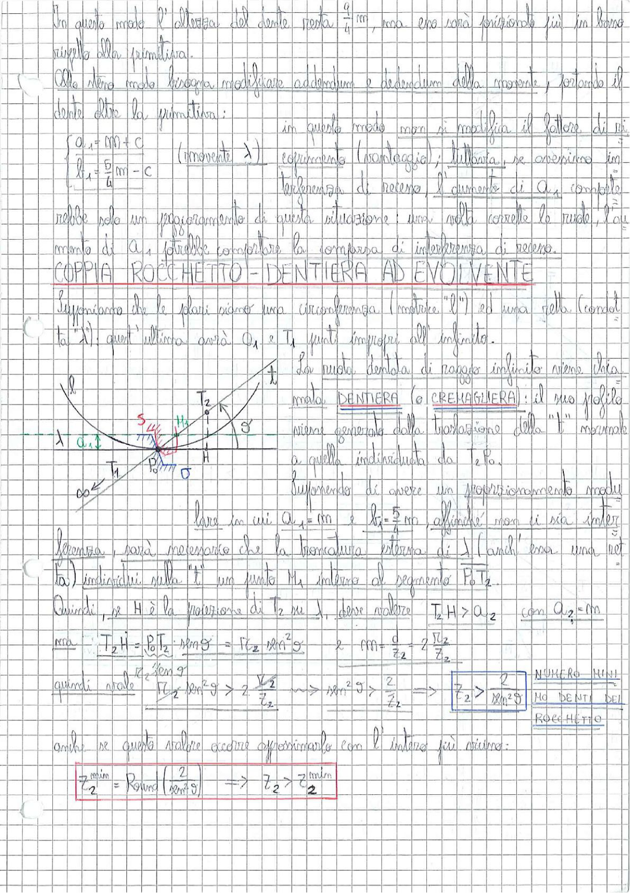

# Page 145 - Coppia Rocchetto-Dentiera ad Evolvente

In questo modo l'altezza del dente resta $\frac{a}{z} m$, ma essa sarà funzionale più in basso rispetto alla primitiva.

Allo stesso modo bisogna modificare addendum e dedendum della movente, portando il dente oltre la primitiva:

$$\begin{cases} a_1 = m + c \\ b_1 = \frac{5}{4} m - c \end{cases} \quad \text{(movente } \lambda\text{)}$$

In questo modo non si modifica il fattore di ricoprimento (vantaggio); tuttavia, se avvicino interferenza di recesso, l'aumento di $a_1$ comporta solamente solo un peggioramento di questa situazione: una sola corregge la ruota, l'aumento di $a_1$ potrebbe comportare la comparsa di interferenza di recesso.

---

## COPPIA ROCCHETTO - DENTIERA AD EVOLVENTE

Supponiamo che le flori siano una circonferenza (motrice "$l$") ed una retta (condotta "$\lambda$"); quest'ultima avrà $O_1$ e $T_1$ posti all'infinito.

La ruota dentata di raggio infinito viene chiamata **DENTIERA** (o **CREMAGLIERA**): il suo profilo viene generato dalla traslazione della "t" normale a quella individuata da $T_2 P_0$.

> 
> Diagramma: Schema della coppia rocchetto-dentiera ad evolvente, con la circonferenza di raggio $R$ (rocchetto), la retta $\lambda$ (dentiera), i punti $T_1$, $T_2$, $P_0$, $H$, $O'$, il segmento di contatto $S$ e l'angolo di pressione $\vartheta$

Supponendo di avere un proporzionamento modulare in cui $a_1 = m$ e $R_2 = \frac{5}{4} m$, affinché non ci sia interferenza, sarà necessario che la troncatura esterna di $\lambda$ (anch'essa una retta $P_0$) individui sulla "t" un punto $M_1$ interno al segmento $\overline{P_0 T_2}$.

Quindi, se $H$ è la proiezione di $T_2$ su $\lambda$, deve valere $\quad T_2 H > a_2 \quad$ con $a_2 = m$

ma: $\quad \overline{T_2 H} = \overline{P_0 T_2} \cdot \sin \vartheta' = r_2 \sin^2 \vartheta \quad \rightarrow \quad r m = \frac{a}{z_2} = 2 \frac{\pi}{z_2}$

$$\overline{T_2 H} = r_2 \sin^2 \vartheta$$

quindi vale $\quad r_2 \sin^2 \vartheta > 2 \cdot \frac{z_2}{z_2} \quad \longrightarrow \quad \sin^2 \vartheta > \frac{2}{z_2} \quad \Longrightarrow$

$$\boxed{\frac{2}{z_2} > \frac{2}{\sin^2 \vartheta}}$$

**NUMERO MINIMO DENTI DEL ROCCHETTO**

anche se questo valore occorre approssimarlo con l'intero più vicino:

$$\boxed{z_2^{min} = \text{Round}\left(\frac{2}{\sin^2 \vartheta}\right)} \quad \Longrightarrow \quad z_2 > z_2^{min}$$
