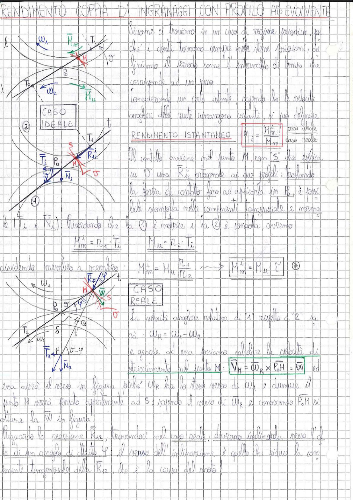

# Page 146 - Rendimento Coppia di Ingranaggi con Profilo ad Evolvente

## Caso Ideale

> 
> Diagramma: Due ruote dentate ingrananti con centri $P_0$ e relativi raggi, con indicazione delle velocità angolari $\omega_1$ e $\omega_2$, punto di contatto $M$, retta d'azione $t$, forze $\vec{T}_i$ e $\vec{N}_i$, reazione $\vec{R}_{12}$ ortogonale ai profili. Caso ideale (①②) e caso reale con angolo d'attrito $\varphi$.

Siccome ci troviamo in un caso di regime periodico, poiché i denti tornano sempre nelle stesse posizioni, definiamo il periodo come l'intervallo di tempo che corrisponde ad un giro.

Considerando un certo istante, sapendo che le velocità angolari delle ruote rimarranno costanti, si può definire il

### Rendimento Istantaneo

$$\boxed{\eta_i = \frac{M_{m}^i}{M_{Mu}}} \quad \frac{\text{caso ideale}}{\text{caso reale}}$$

Il contatto avviene nel punto $M$, con $S$ che esplica su $\sigma$ una $\vec{R}_{12}$ ortogonale ai due profili: traslandola la forza di contatto fino ad applicarla in $P_0$, è possibile scomporla nelle componenti tangenziale e normale ($\vec{T}_i$ e $\vec{N}_i$). Ricordando che la ① è motrice e la ② è condotta, avremo:

$$M_{m}^i = r_{c_1} \cdot T_i \qquad M_{Mu} = r_{c_2} \cdot T_i$$

dividendo membro a membro:

$$M_{m}^i = M_u \cdot \frac{r_{c_1}}{r_{c_2}} \qquad \longrightarrow \qquad \boxed{M_m^i = M_u \cdot \tau} \quad (*)$$

## Caso Reale

La velocità angolare relativa di "1" rispetto a "2" sarà:

$$\omega_R = \omega_1 - \omega_2$$

e grazie ad essa possiamo calcolare la velocità di strisciamento nel punto $M$:

$$\boxed{\vec{V}_M = \vec{\omega}_R \times \overline{P_0 M} = \vec{W}}$$

ed essa avrà il verso in figura poiché $\omega_R$ ha lo stesso verso di $\omega_1$ e dunque il punto $M$ verrà spinto esternamente ad $S$: sapendo il verso di $\omega_R$ e conoscendo $\overline{P_0 M}$ si ottiene la $\vec{W}$ in figura.

Riguardo la reazione $\vec{R}_{12}$, trovandoci nel caso reale, dovremo inclinarla verso l'alto di un angolo di attrito $\varphi$: il verso dell'inclinazione è quello che riduce la componente tangenziale della $\vec{R}_{12}$, che è la causa del moto!
