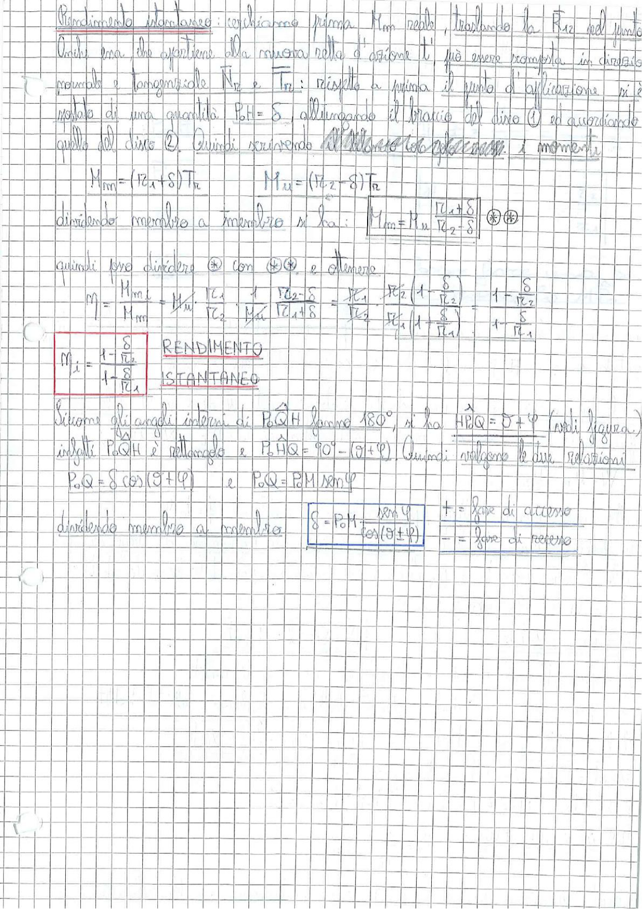

# Page 147 - Rendimento Istantaneo

## Rendimento istantaneo

Cerchiamo prima $M_m$ reale, traslando la $R_{12}$ nel punto. Ossia essa, che appartiene alla ruvora retta d'azione "t", può essere composta in direzione normale e tangenziale $\vec{N_{12}}$ e $\vec{T_{12}}$: rispetto a prima il punto di applicazione vi è quello di una grandezza $P_0H = S$, allungando il braccio del dino ① ed accorciando quello del disco ②. Quindi scrivendo all'equilibrio alla rotazione i momenti:

$$M_m = (r_{c_1} + S) T_{12} \qquad M_u = (r_{c_2} - S) T_{12}$$

dividendo membro a membro si ha:

$$\boxed{M_m = M_u \frac{r_{c_1} + S}{r_{c_2} - S}} \quad \textcircled{*}\textcircled{*}$$

quindi per dividere ① con ①② e ottenere:

$$\eta = \frac{M_{m_i}}{M_m} = \frac{M_u}{M_u} \cdot \frac{r_{c_1}}{r_{c_2}} \cdot \frac{1}{M_u} \cdot \frac{r_{c_2} - S}{r_{c_1} + S} = \frac{r_{c_1}}{r_{c_2}} \cdot \frac{r_{c_2}\left(1 - \frac{S}{r_{c_2}}\right)}{r_{c_1}\left(1 + \frac{S}{r_{c_1}}\right)} = \frac{1 - \frac{S}{r_{c_2}}}{1 + \frac{S}{r_{c_1}}}$$

$$\boxed{\eta_i = \frac{1 - \frac{S}{r_{c_2}}}{1 + \frac{S}{r_{c_1}}}} \quad \text{RENDIMENTO ISTANTANEO}$$

## Calcolo di S

Siccome gli angoli interni di $P_0QH$ hanno $180°$, si ha $\widehat{HP_0Q} = \vartheta + \varphi$ (vedi figura), infatti $P_0QH$ è rettangolo e $P_0HQ = 90° - (\vartheta + \varphi)$. Quindi valgono le due relazioni:

$$P_0Q = S \cos(\vartheta + \varphi) \qquad e \qquad P_0Q = P_0M \sin\varphi$$

dividendo membro a membro:

$$\boxed{S = P_0M \frac{\sin\varphi}{\cos(\vartheta + \varphi)}} \quad \begin{cases} + = \text{fore di accesso} \\ - = \text{fore di recesso} \end{cases}$$

> 
> Diagramma: Derivazione del rendimento istantaneo di una coppia di ruote dentate con calcolo dello scorrimento S tramite relazioni geometriche nel triangolo P₀QH
