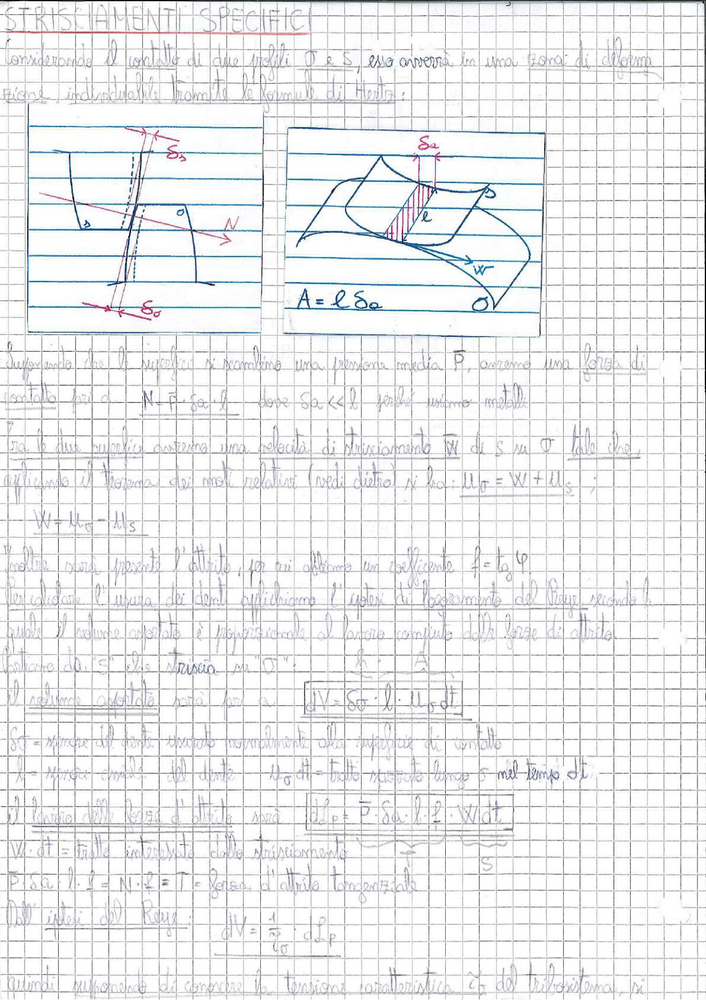

# Page 148 - Strisciamenti Specifici

## STRISCIAMENTI SPECIFICI

Considerando il contatto di due profili $O$ e $S$, esso avverrà in una zona di deformazione, individuabile tramite le formule di Hertz.

> 
> Diagramma: A sinistra: sezione trasversale della zona di contatto tra due profili, con indicazione della semi-larghezza $\delta_b$ della zona di contatto, la normale $N$ e la larghezza $\varepsilon_0$. A destra: vista tridimensionale dell'area di contatto rettangolare $A = l \cdot \delta_a$, con indicazione della velocità di strisciamento $W$ e del punto $O$.

Supponendo che le superfici si scambino una pressione media $\bar{P}$, avremo una forza di contatto pari a:

$$N = \bar{P} \cdot \delta_a \cdot l \qquad \text{dove } \delta_a \ll l \text{ poiché stesso metallo}$$

Tra le due superfici avremo una velocità di strisciamento $\vec{W}$ di $S$ su $O$ tale che, applicando il teorema dei moti relativi (vedi dietro) si ha: $\vec{u}_P = \vec{W} + \vec{u}_S$ ;

$$W = u_O - u_S$$

Inoltre sarà presente l'attrito, per cui abbiamo un coefficiente $f = \tan \varphi$.

Per calcolare l'usura dei denti applichiamo l'ipotesi di loggiamento del Reye, secondo la quale il volume asportato è proporzionale al lavoro compiuto dalla forza di attrito fattore da "$S$" che striscia su "$O$".

Il volume asportato sarà pari a:

$$\boxed{dV = \delta_a \cdot l \cdot u_O \cdot dt}$$

$\delta_T$ = spessore del dente asportato normalmente alla superficie di contatto

$l$ = larghezza assiale del dente; $\quad u_O \cdot dt$ = tratto strisciato lungo $S$ nel tempo $dt$

Il lavoro della forza d'attrito sarà:

$$\boxed{dL_P = \bar{P} \cdot \delta_a \cdot l \cdot f \cdot W \cdot dt}$$

$W \cdot dt$ = tratto interessato dallo strisciamento $\longrightarrow S$

$\bar{P} \cdot \delta_a \cdot l \cdot f = N \cdot f = T$ = forza d'attrito tangenziale

Dall'ipotesi del Reye:

$$dV = \frac{1}{c_O} \cdot dL_P$$

Quindi supponendo di conoscere la tensione caratteristica $c_O$ del tribosistema si
