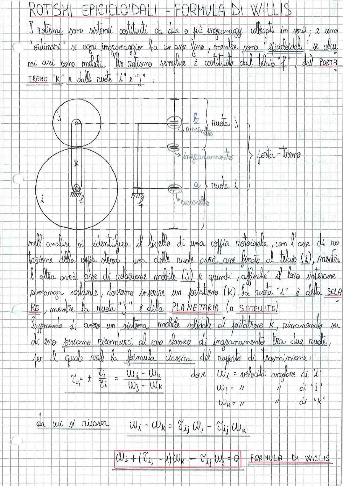

# Page 151 - Rotismi Epicicloidali - Formula di Willis

## ROTISMI EPICICLOIDALI - FORMULA DI WILLIS

I rotismi sono sistemi costituiti da due o più ingranaggi collegati in serie; e sono "ordinari" se ogni ingranaggio ha un asse fisso, mentre sono "epicicloidali" se alcuni assi sono mobili. Un rotismo semplice è costituito dal telaio "f", dal PORTA TRENO "k" e dalle ruote "i" e "j":

> 
> Diagramma: Schema di un rotismo epicicloidale con ruota solare "i" (in basso), satellite "j" (in alto), porta-treno "k" e relativi cuscinetti e ingranamento. Si vedono gli assi di rotazione, i cuscinetti (indicati con tratteggio) e la zona di ingranamento tra le due ruote. Le lettere "a" e "b" indicano rispettivamente la ruota i e la ruota j.

Nell'analisi si identifica il livello di una coppia rotoidale, con l'asse di rotazione della coppia stessa: una delle ruote avrà asse fisso al telaio (i), mentre l'altra avrà asse di rotazione mobile (j) e quindi, affinché il loro interasse rimanga costante, dovremo inserire un portatreno (K). La ruota "i" è detta **SOLARE**, mentre la ruota "j" è detta **PLANETARIA** (o **SATELLITE**).

Supponendo di avere un sistema mobile solidale al portatreno k, rimanendo su di esso possiamo ricondurci al caso classico di ingranamento tra due ruote, per il quale vale la formula classica del rapporto di trasmissione:

$$\tilde{\tau}_{ij} = \pm \frac{z_j}{z_i} = \frac{\omega_i - \omega_k}{\omega_j - \omega_k}$$

dove:
- $\omega_i$ = velocità angolare di "i"
- $\omega_j$ = velocità angolare di "j"
- $\omega_k$ = velocità angolare di "k"

Da cui si ricava:

$$\omega_i - \omega_k = \tilde{\tau}_{ij} \, \omega_j - \tilde{\tau}_{ij} \, \omega_k$$

$$\boxed{\omega_i + (\tilde{\tau}_{ij} - 1)\omega_k - \tilde{\tau}_{ij} \, \omega_j = 0} \quad \text{FORMULA DI WILLIS}$$
