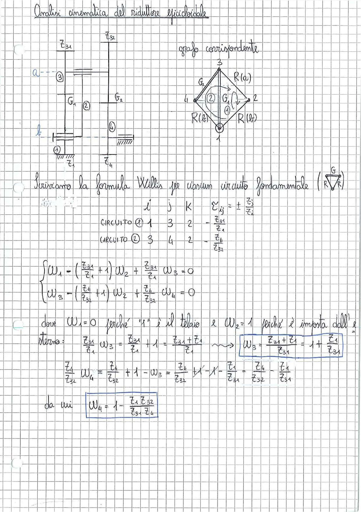

# Page 153 - Analisi cinematica del riduttore epicicloidale

## Analisi cinematica del riduttore epicicloidale

> 
> Diagramma: Schema del riduttore epicicloidale con ruote dentate ($z_{31}$, $z_{32}$, $z_1$, $z_4$), ingranaggi $G_1$, $G_2$, e relativo grafo corrispondente con nodi 1, 2, 3, 4 collegati da rami $R(a)$, $R(b)$ e ingranaggi $G_1$, $G_2$.

Lo schema mostra:
- Albero $a$ collegato alla ruota 3 con $z_{31}$ e $z_{32}$ denti
- Ingranaggio $G_1$ (circuito ①) tra ruote 1 e 3
- Ingranaggio $G_2$ (circuito ②) tra ruote 3 e 4
- Albero $b$ collegato al telaio (ruota 1, fissata a terra)
- Ruota 4 collegata a $z_4$

**Grafo corrispondente:** nodi 1, 2, 3, 4 con rami $R(a)$ e $R(b)$ e ingranaggi $G_1$, $G_2$.

---

Scriviamo la formula di Willis per ciascun circuito fondamentale $\left(\begin{smallmatrix} G \\ R \sqrt{R} \end{smallmatrix}\right)$:

$$\tau_{ij} = \pm \frac{z_j}{z_i}$$

| | $i$ | $j$ | $K$ | $\tau_{ij}$ |
|---|---|---|---|---|
| CIRCUITO ① | 1 | 3 | 2 | $-\dfrac{z_{31}}{z_1}$ |
| CIRCUITO ② | 3 | 4 | 2 | $-\dfrac{z_4}{z_{32}}$ |

---

Sistema di equazioni di Willis:

$$\begin{cases} \omega_1 - \left(\dfrac{z_{31}}{z_1} + 1\right)\omega_2 + \dfrac{z_{31}}{z_1}\, \omega_3 = 0 \\\\ \omega_3 - \left(\dfrac{z_4}{z_{32}} + 1\right)\omega_2 + \dfrac{z_4}{z_{32}}\, \omega_4 = 0 \end{cases}$$

---

dove $\omega_1 = 0$ perché "1" è il telaio e $\omega_2 = 1$ perché è imposta dall'esterno.

**Iterazione:**

$$\frac{z_{31}}{z_1}\, \omega_3 = \frac{z_{31}}{z_1} + 1 = \frac{z_{31} + z_1}{z_1} \quad \Longrightarrow \quad \boxed{\omega_3 = \frac{z_{31} + z_1}{z_{31}} = 1 + \frac{z_1}{z_{31}}}$$

$$\frac{z_4}{z_{32}}\, \omega_4 = \frac{z_4}{z_{32}} + 1 - \omega_3 = \frac{z_4}{z_{32}} + 1 - 1 - \frac{z_1}{z_{31}} = \frac{z_4}{z_{32}} - \frac{z_1}{z_{31}}$$

da cui:

$$\boxed{\omega_4 = 1 - \frac{z_1\, z_{32}}{z_{31}\, z_4}}$$
