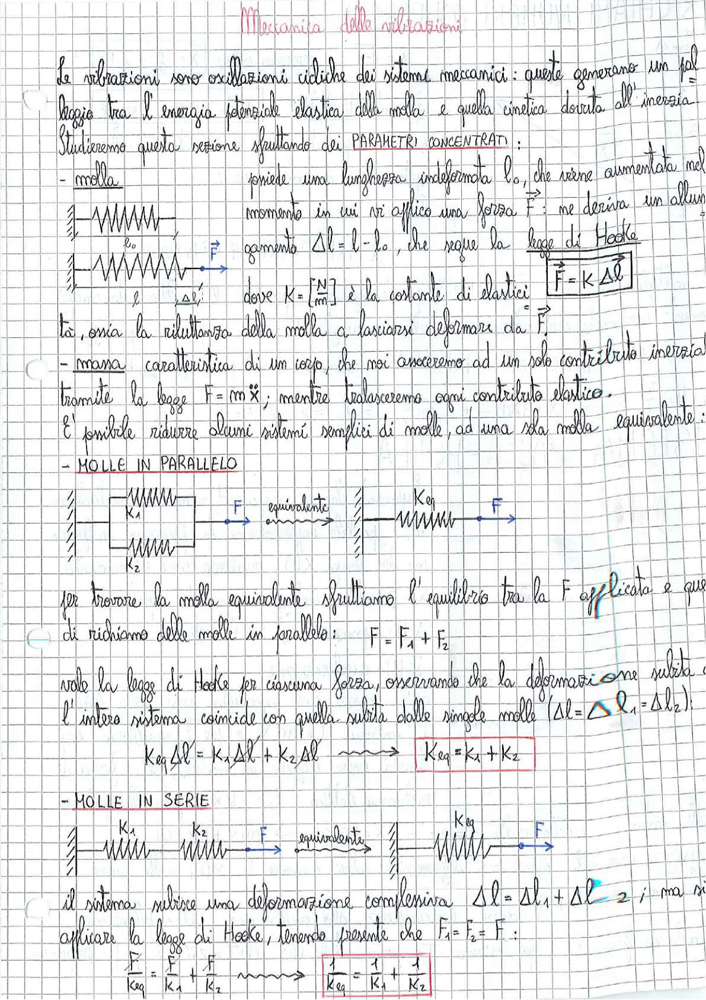

# Page 155 - Meccanica delle Vibrazioni

## Meccanica delle vibrazioni

Le vibrazioni sono oscillazioni cicliche dei sistemi meccanici: queste generano un falso leggio tra l'energia potenziale elastica della molla e quella cinetica dovuta all'inerzia. Studieremo questa sezione sfruttando dei **PARAMETRI CONCENTRATI**:

- **molla** — possiede una lunghezza indeformata $l_0$, che viene aumentata nel momento in cui vi applico una forza $\vec{F}$: ne deriva un allungamento $\Delta l = l - l_0$, che segue la **legge di Hooke**

$$\boxed{\vec{F} = K \, \Delta \vec{l}}$$

> 
> Diagramma: molla a riposo con lunghezza $l_0$ e molla deformata con allungamento $\Delta l$ sotto l'azione della forza $\vec{F}$

dove $K = \left[\frac{N}{m}\right]$ è la costante di elasticità, ossia la riluttanza della molla a lasciarsi deformare da $\vec{F}$.

- **massa** — caratteristica di un corpo, che noi assoceremo ad un solo contributo inerziale tramite la legge $F = m \ddot{x}$; mentre tralasceremo ogni contributo elastico.

È possibile ridurre alcuni sistemi semplici di molle, ad una sola molla equivalente:

## - MOLLE IN PARALLELO

> 
> Diagramma: due molle $K_1$ e $K_2$ in parallelo con forza $F$ applicate, equivalenti ad una singola molla $K_{eq}$ con la stessa forza $F$

Per trovare la molla equivalente sfruttiamo l'equilibrio tra la F applicata e quelle di richiamo delle molle in parallelo:

$$F = F_1 + F_2$$

Vale la legge di Hooke per ciascuna forza, osservando che la deformazione subita dall'intero sistema coincide con quella subita dalle singole molle ($\Delta l = \Delta l_1 = \Delta l_2$):

$$K_{eq} \Delta l = K_1 \Delta l + K_2 \Delta l \quad \Longrightarrow \quad \boxed{K_{eq} = K_1 + K_2}$$

## - MOLLE IN SERIE

> 
> Diagramma: due molle $K_1$ e $K_2$ in serie con forza $F$ applicata, equivalenti ad una singola molla $K_{eq}$ con la stessa forza $F$

Il sistema subisce una deformazione complessiva $\Delta l = \Delta l_1 + \Delta l_2$; ma si può applicare la legge di Hooke, tenendo presente che $F_1 = F_2 = F$:

$$\frac{F}{K_{eq}} = \frac{F}{K_1} + \frac{F}{K_2} \quad \Longrightarrow \quad \boxed{\frac{1}{K_{eq}} = \frac{1}{K_1} + \frac{1}{K_2}}$$
