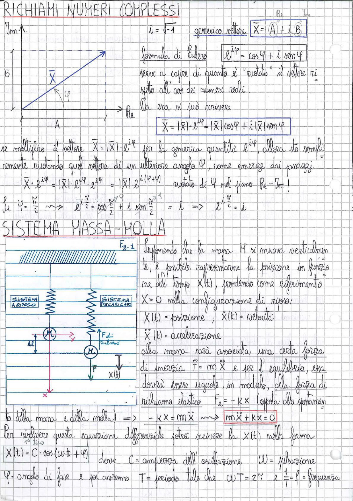

# Page 156 - Richiami Numeri Complessi / Sistema Massa-Molla

## Richiami Numeri Complessi

$$i = \sqrt{-1}$$

Generico vettore:

$$\boxed{\bar{X} = A + i \, B} \quad \underbrace{A}_{\text{Re}} \quad \underbrace{B}_{\text{Im}}$$

> 
> Diagramma: piano complesso con asse reale (Re) orizzontale e asse immaginario (Im) verticale, vettore $\bar{X}$ con componenti A e B e angolo $\varphi$ rispetto all'asse reale.

**Formula di Eulero:**

$$\boxed{e^{i\varphi} = \cos\varphi + i \sin\varphi}$$

Serve a capire di quanto è "ruotato" il vettore rispetto all'asse dei numeri reali.

Da essa si può scrivere:

$$\boxed{\bar{X} = |\bar{X}| \cdot e^{i\varphi} = |\bar{X}| \cos\varphi + i\,|\bar{X}| \sin\varphi}$$

Se moltiplico il vettore $\bar{X} = |\bar{X}| \cdot e^{i\varphi}$ per la generica quantità $e^{i\psi}$, allora sto semplicemente ruotando quel vettore di un ulteriore angolo $\psi$, come emerge dai passaggi:

$$\bar{X} \cdot e^{i\psi} = |\bar{X}| \cdot e^{i\varphi} \cdot e^{i\psi} = |\bar{X}| \cdot e^{i(\varphi + \psi)} \quad \text{ruotato di } \psi \text{ nel piano Re - Im!}$$

Se $\psi = \frac{\pi}{2}$:

$$e^{i\frac{\pi}{2}} = \cos\frac{\pi}{2} + i \sin\frac{\pi}{2} = i \quad \Rightarrow \quad e^{i\frac{\pi}{2}} = i$$

---

## Sistema Massa-Molla

> 
> Diagramma: sistema massa-molla verticale. A sinistra: molla attaccata a parete con massa M in configurazione a riposo e precaricata. A destra: schema con forza di richiamo $F_{el}$ verso l'alto, forza peso $F$ verso il basso, spostamento $x(t)$ e allungamento $\Delta l$.

**Fig. 1**

Supponendo che la massa $M$ si muova verticalmente, è possibile rappresentarne la posizione in funzione del tempo $x(t)$, prendendo come riferimento $x = 0$ nella configurazione di riposo:

- $x(t)$ = posizione
- $\dot{x}(t)$ = velocità
- $\ddot{x}(t)$ = accelerazione

Alla massa sarà associata una certa **forza di inerzia** $F = m\ddot{x}$ e per l'equilibrio, essa dovrà essere uguale, in modulo, alla forza di richiamo elastico:

$$F_{el} = -Kx \quad \text{(opposta allo spostamento della massa e della molla)}$$

$$\Rightarrow \quad -Kx = m\ddot{x} \quad \longrightarrow \quad \boxed{m\ddot{x} + Kx = 0}$$

Per risolvere questa equazione differenziale potrei scrivere la $x(t)$ nella forma:

$$\boxed{x(t) = C \cdot \cos(\omega t + \varphi)}$$

dove:
- $C$ = ampiezza dell'oscillazione
- $\omega$ = pulsazione
- $\varphi$ = angolo di fase

e poi avremo $T$ = periodo tale che $\omega T = 2\pi$ e $\frac{1}{T} = f$ = frequenza
