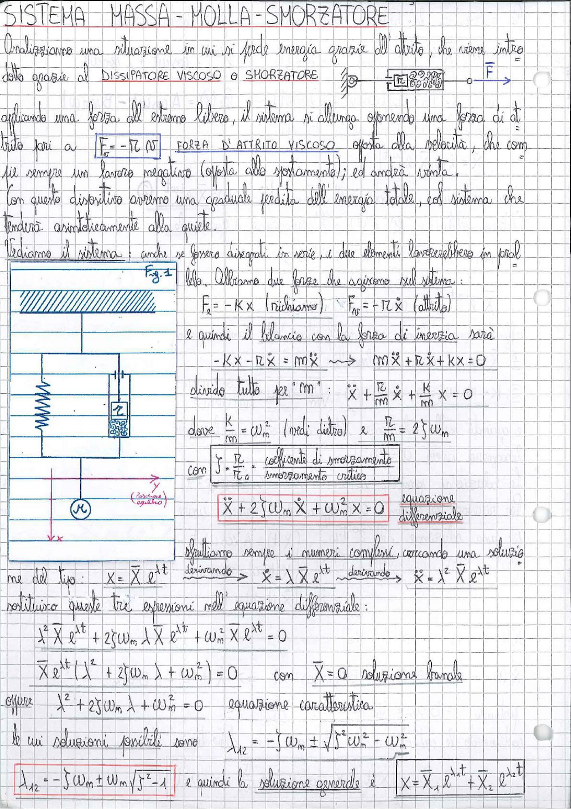

# Page 158 - Sistema Massa-Molla-Smorzatore

## SISTEMA MASSA - MOLLA - SMORZATORE

Analizziamo una situazione in cui si perde energia grazie all'attrito, che viene introdotto grazie al **DISSIPATORE VISCOSO** o **SMORZATORE**.

> 
> Diagramma: Schema di un dissipatore viscoso con costante $n$, collegato tra due punti, con forza $F$ applicata.

Applicando una forza all'estremo libero, il sistema si allunga e sponendo una forza di attrito pari a:

$$\boxed{F_a = -n \dot{x}} \quad \text{FORZA D'ATTRITO VISCOSO}$$

opposta alla velocità, che compie sempre un lavoro negativo (opposta allo spostamento); ed andrà vinta.

Con questo dispositivo avremo una graduale perdita dell'energia totale, col sistema che tenderà asintoticamente alla quiete.

Vediamo il sistema: anche se fossero disegnati in serie, i due elementi lavorerebbero in parallelo.

> 
> Diagramma (Fig. 1): Sistema massa-molla-smorzatore con massa $M$ collegata a molla (costante $K$) e smorzatore (costante $n$) in parallelo, vincolati a parete. La massa è mostrata con la posizione di equilibrio e lo spostamento $x$ verso il basso.

Abbiamo due forze che agiscono sul sistema:

$$F_e = -Kx \quad \text{(richiamo)} \qquad F_N = -n\dot{x} \quad \text{(attrito)}$$

e quindi il bilancio con la forza di inerzia sarà:

$$-Kx - n\dot{x} = m\ddot{x} \quad \longrightarrow \quad m\ddot{x} + n\dot{x} + Kx = 0$$

divido tutto per "$m$":

$$\ddot{x} + \frac{n}{m}\dot{x} + \frac{K}{m}x = 0$$

dove $\frac{K}{m} = \omega_n^2$ (vedi dietro) e $\frac{n}{m} = 2\zeta\omega_n$

con $\boxed{\zeta = \frac{n}{n_c}}$ = coefficiente di smorzamento / smorzamento critico

$$\boxed{\ddot{x} + 2\zeta\omega_n \dot{x} + \omega_n^2 x = 0} \quad \text{equazione differenziale}$$

## Soluzione dell'equazione differenziale

Sfruttiamo sempre i numeri complessi, cercando una soluzione del tipo:

$$x = \bar{X} e^{\lambda t} \xrightarrow{\text{derivando}} \dot{x} = \lambda \bar{X} e^{\lambda t} \xrightarrow{\text{derivando}} \ddot{x} = \lambda^2 \bar{X} e^{\lambda t}$$

Sostituisco queste tre espressioni nell'equazione differenziale:

$$\lambda^2 \bar{X} e^{\lambda t} + 2\zeta\omega_n \lambda \bar{X} e^{\lambda t} + \omega_n^2 \bar{X} e^{\lambda t} = 0$$

$$\bar{X} e^{\lambda t} (\lambda^2 + 2\zeta\omega_n \lambda + \omega_n^2) = 0 \qquad \text{con} \quad \bar{X} = 0 \text{ soluzione banale}$$

oppure:

$$\lambda^2 + 2\zeta\omega_n \lambda + \omega_n^2 = 0 \quad \text{equazione caratteristica}$$

le cui soluzioni possibili sono:

$$\lambda_{1,2} = -\zeta\omega_n \pm \sqrt{\zeta^2\omega_n^2 - \omega_n^2}$$

$$\boxed{\lambda_{1,2} = -\zeta\omega_n \pm \omega_n\sqrt{\zeta^2 - 1}}$$

e quindi la soluzione generale è:

$$\boxed{x = \bar{X}_1 e^{\lambda_1 t} + \bar{X}_2 e^{\lambda_2 t}}$$
