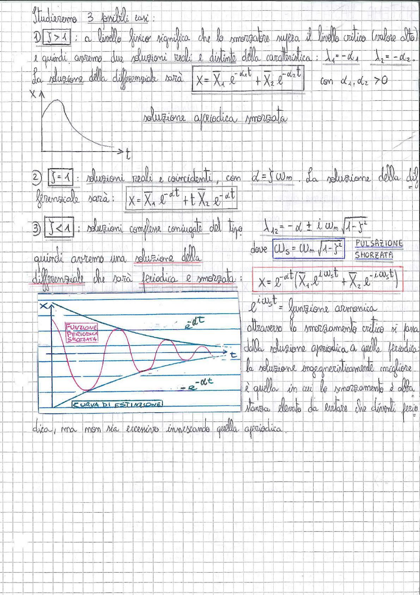

# Page 159 - Vibrazioni libere smorzate: studio dei tre casi

Studieremo 3 possibili casi:

## 1) $\boxed{\beta > 1}$

A livello fisico significa che lo smorzatore supera il livello critico (valore alto) e quindi avremo due soluzioni reali e distinte della caratteristica: $\lambda_1 = -\alpha_1$ , $\lambda_2 = -\alpha_2$.

La soluzione della differenziale sarà:

$$\boxed{x = \bar{X}_1 \, e^{-\alpha_1 t} + \bar{X}_2 \, e^{-\alpha_2 t}} \quad \text{con } \alpha_1, \alpha_2 > 0$$

**Soluzione aperiodica smorzata**

> 
> Diagramma: Andamento aperiodico smorzato della soluzione x(t), curva che decade esponenzialmente verso zero senza oscillare

---

## 2) $\boxed{\beta = 1}$

Soluzioni reali e coincidenti, con $\alpha = \beta \, \omega_n$. La soluzione della differenziale sarà:

$$\boxed{x = \bar{X}_1 \, e^{-\alpha t} + t \, \bar{X}_2 \, e^{-\alpha t}}$$

---

## 3) $\boxed{\beta < 1}$

Soluzioni complesse coniugate del tipo:

$$\lambda_{1,2} = -\alpha \pm i \, \omega_n \sqrt{1 - \beta^2}$$

dove $\boxed{\omega_s = \omega_n \sqrt{1 - \beta^2}}$ — **PULSAZIONE SMORZATA**

Quindi avremo una soluzione della differenziale che sarà periodica e smorzata:

$$\boxed{x = e^{-\alpha t} \left( \bar{X}_1 \, e^{i \omega_s t} + \bar{X}_2 \, e^{-i \omega_s t} \right)}$$

$e^{i\omega_s t}$ = funzione armonica

Attraverso lo smorzamento critico si passa dalla soluzione aperiodica a quella periodica. La soluzione ingegneristicamente migliore è quella in cui lo smorzamento è abbastanza elevato da evitare che diventi periodica, ma non sia eccessivo innescando quella aperiodica.

> 
> Diagramma: Funzione periodica smorzata con inviluppo esponenziale $e^{-\alpha t}$ e $-e^{-\alpha t}$ (curva di estinzione). L'oscillazione decade progressivamente rimanendo contenuta tra le due curve esponenziali.
