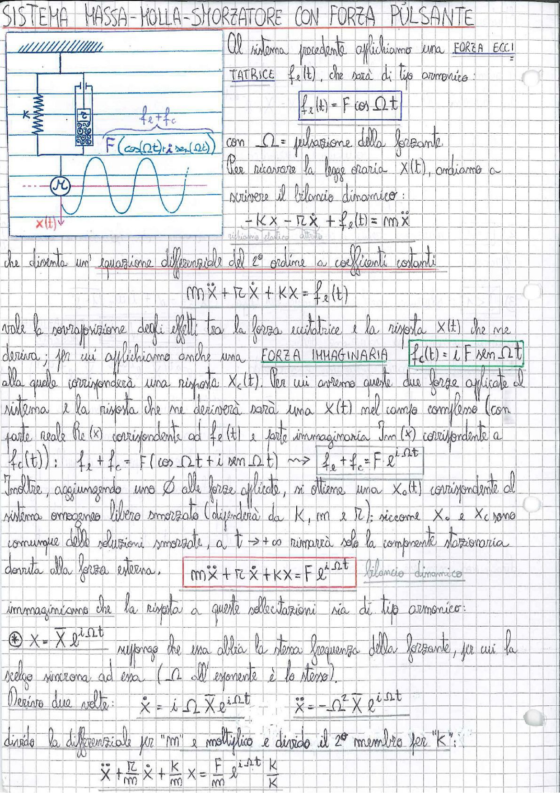

# Page 160 - Sistema Massa-Molla-Smorzatore con Forza Pulsante

## SISTEMA MASSA-MOLLA-SMORZATORE CON FORZA PULSANTE

> 
> Diagramma: Schema del sistema massa-molla-smorzatore con forza eccitatrice pulsante $f_e + f_c = F(\cos\Omega t + i\sin\Omega t)$, molla di rigidezza $K$, smorzatore $r$, massa $m$ con spostamento $x(t)$ verso il basso. A destra un segnale armonico nel tempo.

Al sistema precedente applichiamo una **FORZA ECCITATRICE** $f_e(t)$, che sarà di tipo armonico:

$$\boxed{f_e(t) = F \cos \Omega t}$$

con $\Omega$ = pulsazione della forzante.

Per ricavare la legge oraria $x(t)$, andiamo a scrivere il bilancio dinamico:

$$\underbrace{-Kx}_{\text{richiamo elastico}} - \underbrace{r\dot{x}}_{\text{dissipato}} + f_e(t) = m\ddot{x}$$

che diventa un'equazione differenziale del 2° ordine a coefficienti costanti:

$$\boxed{m\ddot{x} + r\dot{x} + Kx = f_e(t)}$$

Vale la sovrapposizione degli effetti tra la forza eccitatrice e la risposta $x(t)$ che ne deriva; per cui affianchiamo anche una **FORZA IMMAGINARIA**:

$$\boxed{f_c(t) = i \, F \sin \Omega t}$$

alla quale corrisponderà una risposta $X_c(t)$. Per cui avremo queste due forze applicate al sistema e la risposta che ne deriverà sarà una $X(t)$ nel campo complesso (con parte reale $\text{Re}(x)$ corrispondente ad $f_e(t)$ e parte immaginaria $\text{Im}(x)$ corrispondente a $f_c(t)$):

$$f_e + f_c = F(\cos\Omega t + i \sin\Omega t) \quad \Longrightarrow \quad \boxed{f_e + f_c = F \, e^{i\Omega t}}$$

Inoltre, aggiungendo uno $\emptyset$ alle forze applicate, si ottiene una $X_0(t)$ corrispondente al sistema omogeneo libero smorzato (dipenderà da $K$, $m$ e $r$); siccome $X_e$ e $X_c$ sono comunque delle soluzioni smorzate, a $t \to +\infty$ rimarrà solo la componente stazionaria dovuta alla forza esterna.

$$\boxed{m\ddot{x} + r\dot{x} + Kx = F \, e^{i\Omega t}} \quad \text{(bilancio dinamico)}$$

Immaginiamo che la risposta a queste sollecitazioni sia di tipo armonico:

$$\circledast \quad x = \overline{X} \, e^{i\Omega t}$$

risposta che essa abbia la stessa frequenza della forzante, per cui la scelgo sincrona ad essa ($\Omega$ all'esponente è lo stesso).

Derivo due volte:

$$\dot{x} = i\Omega \, \overline{X} \, e^{i\Omega t} \qquad \ddot{x} = -\Omega^2 \, \overline{X} \, e^{i\Omega t}$$

Divido la differenziale per "$m$" e moltiplico e divido il 2° membro per "$K$":

$$\ddot{x} + \frac{r}{m}\dot{x} + \frac{K}{m}x = \frac{F}{m} e^{i\Omega t} \cdot \frac{K}{K}$$
