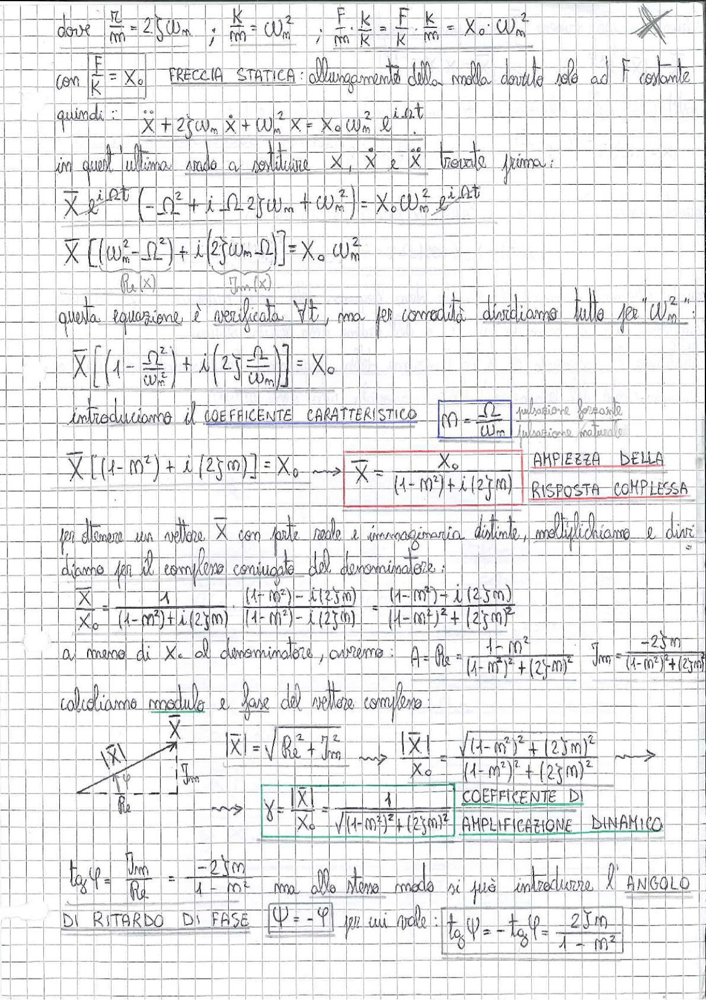

# Page 161 - Coefficiente di amplificazione dinamico e risposta complessa

dove $\frac{r}{m} = 2\zeta\omega_n$ ; $\frac{K}{m} = \omega_n^2$ ; $\frac{F}{m} \cdot \frac{K}{K} = \frac{F}{K} \cdot \frac{K}{m} = X_0 \cdot \omega_n^2$

con $\frac{F}{K} = X_0$ FRECCIA STATICA: allungamento della molla dovuto solo ad F costante

quindi:

$$\ddot{X} + 2\zeta\omega_n \dot{X} + \omega_n^2 X = X_0 \omega_n^2 \, e^{i\Omega t}$$

in quest'ultima moda a sostituire $X$, $\dot{X}$ e $\ddot{X}$ trovate prima:

$$\overline{X} \, e^{i\Omega t} \left( -\Omega^2 + i\Omega \, 2\zeta\omega_n + \omega_n^2 \right) = X_0 \omega_n^2 \, e^{i\Omega t}$$

$$\overline{X} \left[ (\omega_n^2 - \Omega^2) + i(2\zeta\omega_n\Omega) \right] = X_0 \, \omega_n^2$$

$\underbrace{\quad}_{Re(X)}$ $\underbrace{\quad}_{Im(X)}$

questa equazione è verificata $\forall t$, ma per comodità dividiamo tutto per $\omega_n^2$:

$$\overline{X} \left[ \left(1 - \frac{\Omega^2}{\omega_n^2}\right) + i\left(2\zeta\frac{\Omega}{\omega_n}\right) \right] = X_0$$

introduciamo il **COEFFICENTE CARATTERISTICO** $\boxed{m = \frac{\Omega}{\omega_n}}$ $\frac{\text{pulsazione forzante}}{\text{pulsazione naturale}}$

$$\overline{X} \left[ (1 - m^2) + i(2\zeta m) \right] = X_0 \quad \longrightarrow \quad \boxed{\overline{X} = \frac{X_0}{(1-m^2) + i(2\zeta m)}}$$

**AMPIEZZA DELLA RISPOSTA COMPLESSA**

Per ottenere un vettore $\overline{X}$ con parte reale e immaginaria distinte, moltiplichiamo e dividiamo per il complesso coniugato del denominatore:

$$\frac{\overline{X}}{X_0} = \frac{1}{(1-m^2) + i(2\zeta m)} \cdot \frac{(1-m^2) - i(2\zeta m)}{(1-m^2) - i(2\zeta m)} = \frac{(1-m^2) - i(2\zeta m)}{(1-m^2)^2 + (2\zeta m)^2}$$

a meno di $X_0$ al denominatore, avremo: $A = Re = \frac{1-m^2}{(1-m^2)^2 + (2\zeta m)^2}$ $\quad$ $\mathcal{I}_m = \frac{-2\zeta m}{(1-m^2)^2 + (2\zeta m)^2}$

---

Calcoliamo **modulo** e **fase** del vettore complesso:

$$|\overline{X}| = \sqrt{Re^2 + \mathcal{I}_m^2} \quad \longrightarrow \quad \frac{|\overline{X}|}{X_0} = \frac{\sqrt{(1-m^2)^2 + (2\zeta m)^2}}{(1-m^2)^2 + (2\zeta m)^2}$$

> 
> Diagramma: rappresentazione del vettore complesso $\overline{X}$ nel piano Re-Im, con modulo $|\overline{X}|$, parte reale Re, parte immaginaria $\mathcal{I}_m$ e angolo di fase $\varphi$

$$\boxed{\gamma = \frac{|\overline{X}|}{X_0} = \frac{1}{\sqrt{(1-m^2)^2 + (2\zeta m)^2}}}$$ **COEFFICIENTE DI AMPLIFICAZIONE DINAMICO**

$$\tan\varphi = \frac{\mathcal{I}_m}{Re} = \frac{-2\zeta m}{1 - m^2}$$

ma allo stesso modo si può introdurre l'**ANGOLO DI RITARDO DI FASE** $\boxed{\psi = -\varphi}$ per cui vale: $\boxed{\tan\psi = -\tan\varphi = \frac{2\zeta m}{1 - m^2}}$
