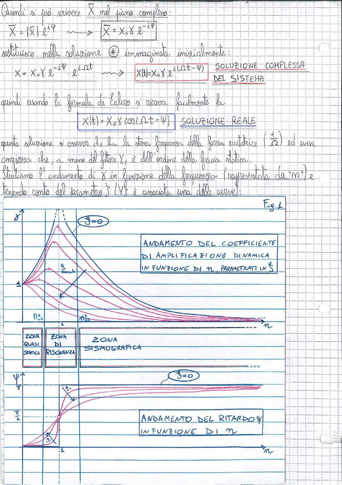

# Page 162 - Soluzione reale e andamento del coefficiente di amplificazione dinamica

Quindi si può riscrivere $\bar{X}$ nel piano complesso:

$$\bar{X} = |\bar{X}| \cdot e^{i\psi} \longrightarrow \boxed{\bar{X} = X_0 \mathscr{Y} \cdot e^{-i\psi}}$$

Sostituisco nella soluzione ⊛ immaginata inizialmente:

$$x = X_0 \mathscr{Y} \cdot e^{-i\psi} \cdot e^{i\Omega t} \longrightarrow \boxed{X(t) = X_0 \mathscr{Y} \cdot e^{i(\Omega t - \psi)}} \quad \text{SOLUZIONE COMPLESSA DEL SISTEMA}$$

Quindi usando la formula di Eulero si ricava facilmente la

$$\boxed{X(t) = X_0 \mathscr{Y} \cos(\Omega t - \psi)} \quad \text{SOLUZIONE REALE}$$

Questa soluzione si osserva che ha la stessa frequenza della forza eccitatrice ($\frac{1}{\Omega}$) ed una ampiezza che, a meno del fattore $\mathscr{Y}$, è dell'ordine della freccia statica.

Studiamo l'andamento di $\mathscr{Y}$ in funzione della frequenza (rappresentata da "n") e tenendo conto del parametro $\xi$ (Vi $\xi$ è associata una delle curve):

---

**Fig. 1**

> 
> Diagramma: Andamento del coefficiente di amplificazione dinamica $\delta$ in funzione di $n$, parametrato in $\xi$. Il grafico superiore mostra le curve di $\delta$ vs $n$ per diversi valori di $\xi$ (da $\xi = 0$ fino a valori crescenti di smorzamento). Si individuano tre zone: **Zona Quasi Statica** (per $n < n_a$), **Zona di Risonanza** (intorno a $n = 1$), e **Zona Sismografica** (per $n > n_b$). Per $\xi = 0$ la curva tende all'infinito in risonanza. Per $\xi$ crescente i picchi si abbassano. Tutte le curve convergono verso $\delta = 1$ per $n \to 0$ e verso $\delta \to 0$ per $n \to \infty$.

---

> 
> Diagramma: Andamento del ritardo $\psi$ in funzione di $n$. Il grafico inferiore mostra l'angolo di fase $\psi$ che varia da $0$ a $\pi$ al crescere di $n$. Per $\xi = 0$ il passaggio è discontinuo a $n = 1$ (da $0$ a $\pi$). Per valori crescenti di $\xi$ la transizione è più graduale. Tutte le curve passano per $\psi = \frac{\pi}{2}$ quando $n = 1$.
