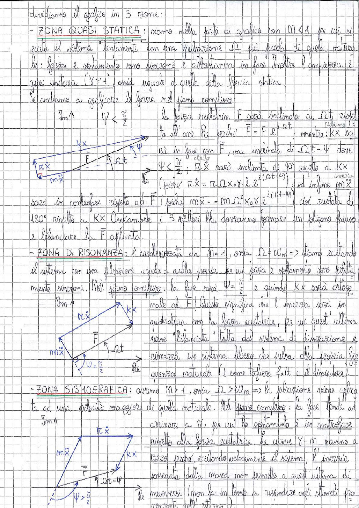

# Page 163 - Analisi delle zone nel piano complesso (Vibrazioni forzate)

Dividiamo il grafico in 3 zone:

## - ZONA QUASI STATICA:

Siamo nella parte di grafico con $M < 1$, per cui si eccita il sistema "lentamente" con una pulsazione $\Omega$ più piccola di quella naturale: forza e spostamento sono sincroni e abbastanza in fase. Inoltre l'ampiezza è quasi unitaria ($Y \simeq 1$), ossia uguale a quella della freccia statica.

Se andiamo a graficare le forze nel piano complesso:

$\Psi < \frac{\pi}{2}$

La forza eccitatrice $\vec{F}$ sarà inclinata di $\Omega t$ rispetto all'asse Re perché $F = F_0 e^{i\Omega t}$, mentre $Kx$ sarà in fase con $\vec{F}$, ma inclinata di $\Omega t - \Psi$ dove $\Psi < \frac{\pi}{2}$; $r\dot{x}$ sarà inclinata di 90° rispetto a $Kx$ (poiché $r\dot{x} = r\Omega x_0 e^{i(\Omega t - \Psi)}$); ed infine $m\ddot{x}$ sarà in controfase rispetto ad $\vec{F}$ (poiché $m\ddot{x} = -m\Omega^2 x_0 e^{i(\Omega t - \Psi)}$) cioè ruotata di 180° rispetto a $Kx$. Ovviamente i 3 vettori blu dovranno formare un poligono chiuso e bilanciare la $\vec{F}$ applicata.

> 
> Diagramma: Piano complesso (Im, Re) per zona quasi statica con vettori $Kx$, $r\dot{x}$, $m\ddot{x}$ e $\vec{F}$ che formano un poligono chiuso. La fase $\Psi < \frac{\pi}{2}$ e l'angolo $\Omega t$ sono indicati.

## - ZONA DI RISONANZA:

È caratterizzata da $M = 1$, ossia $\Omega = \omega_n$ => stiamo eccitando il sistema con una pulsazione uguale a quella propria, per cui forza e spostamento sono perfettamente sincroni. Nel piano complesso: la fase sarà $\Psi = \frac{\pi}{2}$ e quindi $Kx$ sarà ortogonale al $\vec{F}$! Questo significa che l'inerzia sarà in quadratura con la forza eccitatrice, per cui quest'ultima viene "bilanciata" tutta dal sistema di dissipazione e rimarrà un sistema libero che pulsa alla propria frequenza naturale (è come togliere $F_0(t)$ e il dissipatore).

> 
> Diagramma: Piano complesso (Im, Re) per zona di risonanza con $\Psi = \frac{\pi}{2}$, dove $Kx$ è ortogonale a $\vec{F}$, $r\dot{x}$ è in direzione opposta a $\vec{F}$, e $m\ddot{x}$ è opposto a $Kx$.

## - ZONA SISMOGRAFICA:

Avremo $M > 1$, ossia $\Omega > \omega_n$ => la pulsazione viene applicata ad una velocità maggiore di quella naturale. Nel piano complesso: la fase tende ad arrivare a $\pi$, per cui lo spostamento è in controfase rispetto alla forza eccitatrice. Le curve $Y = m$ vanno a zero perché, eccitando velocemente il sistema, l'inerzia posseduta dalla massa non permette a quest'ultima di muoversi (non fa in tempo a rispondere agli stimoli provenienti dall'esterno).

> 
> Diagramma: Piano complesso (Im, Re) per zona sismografica con $\Psi > \frac{\pi}{2}$, dove $m\ddot{x}$ è dominante, $Kx$ è in controfase rispetto a $\vec{F}$, e l'angolo $\Omega t - \Psi$ è indicato.
