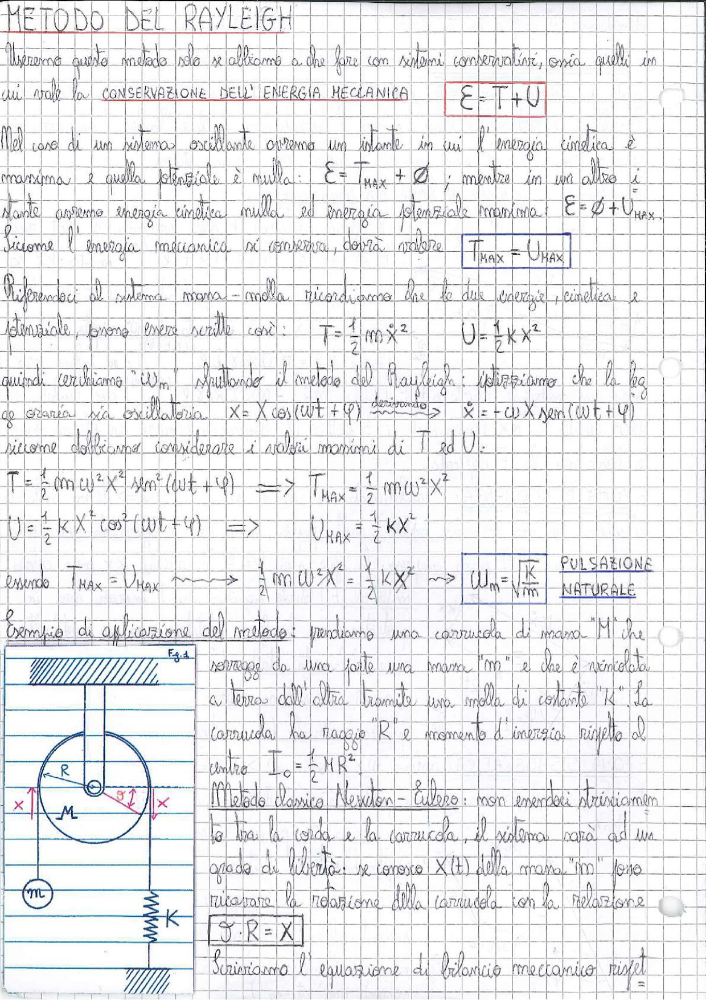

# Page 164 - Metodo del Rayleigh

## METODO DEL RAYLEIGH

Useremo questo metodo solo se abbiamo a che fare con sistemi conservativi, ossia quelli in cui vale la **CONSERVAZIONE DELL'ENERGIA MECCANICA**

$$\boxed{E = T + U}$$

Nel caso di un sistema oscillante avremo un istante in cui l'energia cinetica è massima e quella potenziale è nulla: $E = T_{MAX} + \cancel{0}$ ; mentre in un altro istante avremo energia cinetica nulla ed energia potenziale massima: $E = \cancel{0} + U_{MAX}$.

Siccome l'energia meccanica si conserva, dovrà valere:

$$\boxed{T_{MAX} = U_{MAX}}$$

Riferendoci al sistema massa-molla ricordiamo che le due energie, cinetica e potenziale, possono essere scritte così:

$$T = \frac{1}{2} m \dot{x}^2 \qquad U = \frac{1}{2} k x^2$$

quindi cerchiamo "$\omega_n$" sfruttando il metodo del Rayleigh: ipotizziamo che la legge oraria sia oscillatoria:

$$x = X \cos(\omega t + \varphi) \xrightarrow{\text{derivando}} \dot{x} = -\omega X \sin(\omega t + \varphi)$$

siccome dobbiamo considerare i valori massimi di $T$ ed $U$:

$$T = \frac{1}{2} m \omega^2 X^2 \sin^2(\omega t + \varphi) \implies T_{MAX} = \frac{1}{2} m \omega^2 X^2$$

$$U = \frac{1}{2} k X^2 \cos^2(\omega t + \varphi) \implies U_{MAX} = \frac{1}{2} k X^2$$

essendo $T_{MAX} = U_{MAX} \longrightarrow \frac{1}{2} m \omega^2 X^2 = \frac{1}{2} k X^2 \longrightarrow$

$$\boxed{\omega_n = \sqrt{\frac{k}{m}}} \quad \text{PULSAZIONE NATURALE}$$

---

## Esempio di applicazione del metodo

Prendiamo una carrucola di massa "M" che sorregge da una parte una massa "m" e che è vincolata a terra dall'altra tramite una molla di costante "k". La carrucola ha raggio "R" e momento d'inerzia rispetto al centro $I_o = \frac{1}{2} M R^2$.

> 
> Diagramma: Carrucola di raggio R e massa M con una massa m appesa da un lato tramite una corda e una molla di costante k collegata a terra dall'altro lato (Fig. 1)

**Metodo classico Newton-Eulero:** non essendoci strisciamento tra la corda e la carrucola, il sistema sarà ad un grado di libertà: se conosco $x(t)$ della massa "m" posso ricavare la rotazione della carrucola con la relazione:

$$\boxed{\vartheta \cdot R = x}$$

Scriviamo l'equazione di bilancio meccanico rispetto
