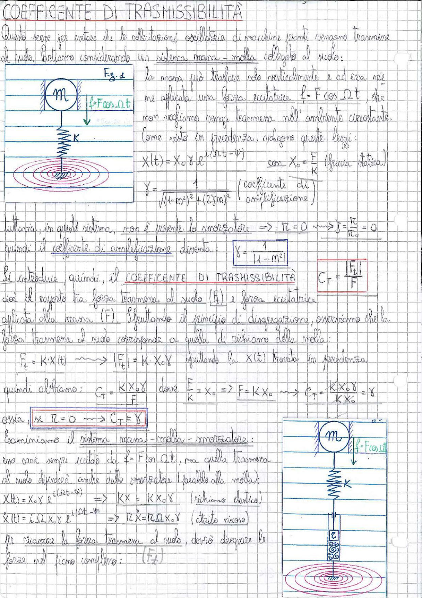

# Page 166 - Coefficiente di Trasmissibilità

## COEFFICENTE DI TRASMISSIBILITÀ

Questo serve per evitare che le sollecitazioni oscillatorie di macchine pesanti vengano trasmesse al suolo. Partiamo considerando un sistema massa-molla collegato al suolo:

> 
> Diagramma: Fig. 1 - Sistema massa-molla con massa M collegata al suolo tramite molla K, soggetta a forza eccitatrice $f = F \cos \Omega t$

La massa può traslare solo verticalmente e ad essa viene applicata una forza eccitatrice $f = F \cos \Omega t$, che non vogliamo venga trasmessa nell'ambiente circostante.

Come visto in precedenza, valgono queste leggi:

$$X(t) = X_0 \gamma \, e^{i(\Omega t - \psi)} \quad \text{con} \quad X_0 = \frac{F}{K} \quad \text{(freccia statica)}$$

$$\boxed{\gamma = \frac{1}{\sqrt{(1 - m^2)^2 + (2\xi m)^2}}} \quad \text{(coefficiente di amplificazione)}$$

---

Tuttavia, in questo sistema, non è presente lo smorzatore $\Rightarrow r = 0 \leadsto \xi = \frac{r}{r_c} = 0$

quindi il **coefficiente di amplificazione** diventa:

$$\boxed{\gamma = \frac{1}{|1 - m^2|}}$$

Si introduce quindi, il **COEFFICENTE DI TRASMISSIBILITÀ**:

$$\boxed{C_T = \frac{|F_t|}{F}}$$

cioè il rapporto tra forza trasmessa al suolo ($F_t$) e forza eccitatrice applicata alla massa ($F$). Sfruttando il principio di disgregazione, osserviamo che la forza trasmessa al suolo corrisponde a quella di richiamo della molla:

$$F_t = K \cdot X(t) \leadsto |F_t| = K \cdot X_0 \gamma \quad \text{sfruttando la } X(t) \text{ trovata in precedenza}$$

quindi otteniamo:

$$C_T = \frac{K X_0 \gamma}{F} \quad \text{dove} \quad \frac{F}{K} = X_0 \Rightarrow F = K X_0 \leadsto \boxed{C_T = \frac{K X_0 \gamma}{K X_0} = \gamma}$$

ossia, $\boxed{\text{se } r = 0 \leadsto C_T = \gamma}$

---

## Sistema massa-molla-smorzatore

> 
> Diagramma: Sistema massa-molla-smorzatore con massa M, molla K e smorzatore r in parallelo, collegati al suolo, soggetto a forza eccitatrice $f = F \cos \Omega t$

Esaminiamo il sistema massa-molla-smorzatore: esso sarà sempre eccitato da $f = F \cos \Omega t$, ma quella trasmessa al suolo dipenderà anche dallo smorzatore (parallelo alla molla):

$$X(t) = X_0 \gamma \, e^{i(\Omega t - \psi)} \Rightarrow KX = K X_0 \gamma \quad \text{(richiamo elastico)}$$

$$\dot{X}(t) = i\Omega X \, e^{i(\Omega t - \psi)} \Rightarrow rX = r \Omega X_0 \gamma \quad \text{(attrito viscoso)}$$

Per ricavare la forza trasmessa al suolo, devo disegnare le forze nel piano complesso: $(F_t)$
