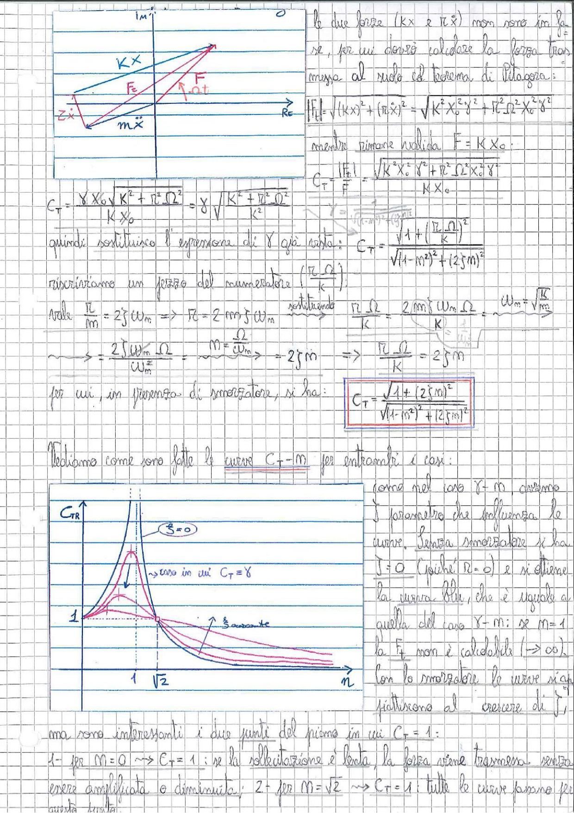

# Page 167 - Coefficiente di trasmissibilità con smorzatore

> 
> Diagramma: Diagramma vettoriale delle forze nel piano immaginario-reale, con le componenti $Kx$, $r\dot{x}$, $F_E$, $F_{aT}$, $m\ddot{x}$ e la reazione $R_C$

Le due forze ($Kx$ e $r\dot{x}$) non sono in fase, per cui dovrò calcolare la forza trasmessa al nodo col teorema di Pitagora:

$$|F_{tr}| = \sqrt{(Kx)^2 + (r\dot{x})^2} = \sqrt{K^2 X_0^2 \gamma^2 + r^2 \Omega^2 X_0^2 \gamma^2}$$

mentre rimane valida $F = K X_0$:

$$C_T = \frac{|F_{tr}|}{F} = \frac{\sqrt{K^2 X_0^2 \gamma^2 + r^2 \Omega^2 X_0^2 \gamma^2}}{K X_0}$$

$$C_T = \frac{\cancel{\gamma} X_0 \sqrt{K^2 + r^2 \Omega^2}}{K X_0} = \gamma \sqrt{\frac{K^2 + r^2 \Omega^2}{K^2}}$$

quindi sostituisco l'espressione di $\gamma$ già vista:

$$C_T = \frac{\sqrt{1 + \left(\frac{r\,\Omega}{K}\right)^2}}{\sqrt{(1 - m^2)^2 + (2\zeta m)^2}}$$

riscriviamo un pezzo del numeratore $\left(\frac{r\,\Omega}{K}\right)$:

Vale $\frac{r}{m} = 2\zeta\omega_n \Rightarrow r = 2m\zeta\omega_n$ , sostituendo $\frac{r\,\Omega}{K} = \frac{2m\zeta\omega_n\Omega}{K}$ , $\omega_n = \sqrt{\frac{K}{m}}$

$$\sim = \frac{2\zeta\omega_n\Omega}{\omega_n^2} , \quad m = \frac{\Omega}{\omega_n} \Rightarrow = 2\zeta m \qquad \Rightarrow \quad \frac{r\,\Omega}{K} = 2\zeta m$$

per cui, in presenza di smorzatore, si ha:

$$\boxed{C_T = \frac{\sqrt{1 + (2\zeta m)^2}}{\sqrt{(1 - m^2)^2 + (2\zeta m)^2}}}$$

---

## Analisi delle curve $C_T - m$

Vediamo come sono fatte le curve $C_T - m$ per entrambi i casi:

> 
> Diagramma: Grafico delle curve $C_{TR}$ in funzione di $m$ per diversi valori di $\zeta$. La curva blu ($\zeta = 0$) presenta un asintoto verticale in $m = 1$. Le curve con $\zeta$ crescente si appiattiscono. Tutte le curve passano per il punto $(m = \sqrt{2},\, C_T = 1)$. Il valore $C_T = 1$ è indicato sull'asse verticale.

Come nel caso $\gamma - m$, avremo il parametro che influenza le curve. Senza smorzatore si ha $\zeta = 0$ (poiché $r = 0$) e si ottiene la curva blu, che è uguale a quella del caso $\gamma - m$: se $m = 1$ la $F_t$ non è calcolabile ($\to \infty$).

Con lo smorzatore le curve si appiattiscono al crescere di $\zeta$.

Ma sono interessanti i due punti del piano in cui $C_T = 1$:

1- per $m = 0 \Rightarrow C_T = 1$: se la sollecitazione è lenta, la forza viene trasmessa senza essere amplificata o diminuita; 2- per $m = \sqrt{2} \Rightarrow C_T = 1$: tutte le curve passano per questo punto.
