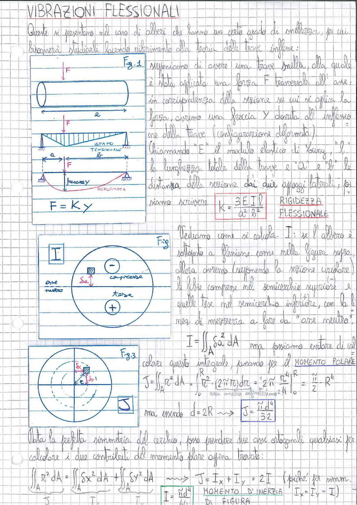

# Page 169 - Vibrazioni Flessionali

## VIBRAZIONI FLESSIONALI

Queste si presentano nel caso di alberi che hanno un certo grado di snellezza, per cui bisognerà studiarli facendo riferimento alla teoria delle travi inflesse:

> 
> Diagramma: Fig.1 - Albero (trave snella) con sezione circolare soggetto a forza F trasversale all'asse, con appoggi laterali. Viene mostrata la configurazione deformata con freccia y e lo stato tensionale con diagramma della deformata.

Supponiamo di avere una trave snella, alla quale è stata applicata una forza $F$ trasversale all'asse; in corrispondenza della sezione su cui si applica la forza, avremo una freccia $y$ dovuta all'inflessione della trave (configurazione deformata).

Chiamando "$E$" il modulo elastico di Young, "$l$" la lunghezza totale della trave e "$a$" e "$b$" le distanza della sezione dai due appoggi laterali, possiamo scrivere:

$$F = Ky$$

$$\boxed{K = \frac{3EIl}{a^2 b^2}} \quad \text{RIGIDEZZA FLESSIONALE}$$

---

## Calcolo del momento d'inerzia I

> 
> Diagramma: Fig.2 - Sezione circolare dell'albero soggetta a flessione, con indicazione dell'asse neutro, zona compressa (semicerchio superiore, segno −) e zona tesa (semicerchio inferiore, segno +). La distanza dall'asse neutro è indicata con $\delta_a$.

Vediamo come si calcola $I$; se l'albero è soggetto a flessione come nella figura sopra, allora avremo (supponendo la sezione circolare) le fibre compresse nel semicerchio superiore $(-)$ e quelle tese nel semicerchio inferiore $(+)$, con la linea di mezzeria a fare da "asse neutro".

$$I = \iint_A \delta_a^2 \, dA$$

ma possiamo evitare di calcolare questo integrale, passiamo per il **MOMENTO POLARE**:

> 
> Diagramma: Fig.3 - Sezione circolare con sistema di coordinate, raggio R, elemento infinitesimo in coordinate polari con $\delta_x$, $\delta_y$ e $r$, per il calcolo del momento polare d'inerzia J.

$$J = \iint_A r^2 \, dA = \int_0^R r^2 \cdot (2\pi r) \, dr = 2\pi \left. \frac{r^4}{4} \right|_0^R = \frac{\pi}{2} R^4$$

ma intendo $d = 2R$ $\longrightarrow$

$$\boxed{J = \frac{\pi d^4}{32}}$$

---

## Relazione tra J e I

Data la perfetta simmetria del cerchio, posso prendere due assi ortogonali qualsiasi per calcolare i due contributi del momentoolare oppure trovare:

$$\iint_A r^2 \, dA = \iint_A \delta x^2 \, dA + \iint_A \delta y^2 \, dA \quad \longrightarrow \quad J = I_x + I_y = 2I \quad \text{(poiché per simm. } I_x = I_y = I\text{)}$$

$$\boxed{I = \frac{\pi d^4}{64}} \quad \text{MOMENTO D'INERZIA DI FIGURA}$$
