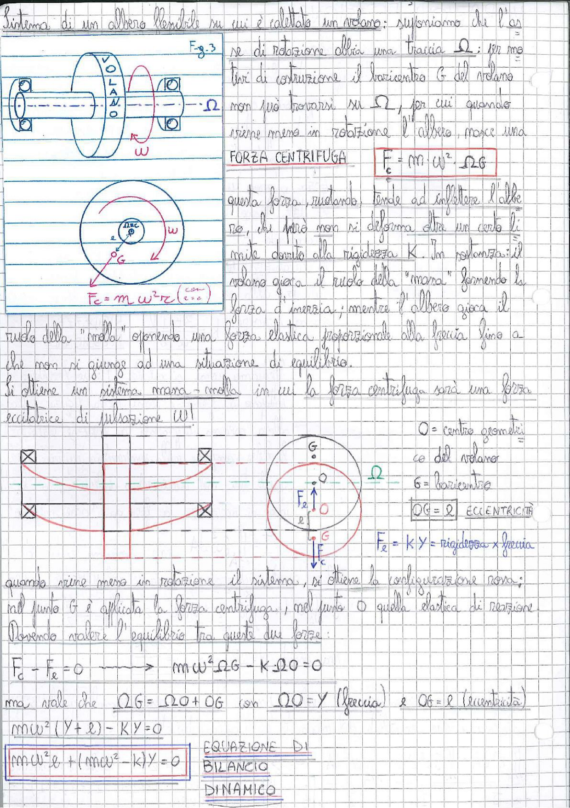

# Page 170 - Albero flessibile con volano: equilibrio dinamico

## Sistema di un albero flessibile su cui è calettato un volano

Supponiamo che l'asse di rotazione abbia una traccia $\Omega$; per motivi di costruzione il baricentro $G$ del volano non può trovarsi su $\Omega$, per cui quando viene messo in rotazione l'albero, nasce una

**FORZA CENTRIFUGA**

$$\boxed{F_c = m \cdot \omega^2 \cdot \overline{\Omega G}}$$

> 
> Diagramma: Fig. 3 - Schema di albero flessibile con volano calettato, supportato da cuscinetti. Vista laterale con asse di rotazione $\Omega$ e velocità angolare $\omega$. Vista frontale con cerchio del volano, centro geometrico $O$, baricentro $G$ ed eccentricità $e$.

Questa forza, ruotando, tende ad inflettere l'albero, che però non si deforma oltre un certo limite dovuto alla rigidezza $K$. In rotazione: il volano gioca il ruolo della "massa" fornendo la forza d'inerzia; mentre l'albero gioca il ruolo della "molla" opponendo una forza elastica proporzionale alla freccia fino a che non si giunge ad una situazione di equilibrio.

Si ottiene un sistema massa-molla in cui la forza centrifuga sarà una forza eccitatrice di pulsazione $\omega$!

$$F_c = m \cdot \omega^2 \cdot r_c \quad (r_c = e)$$

## Configurazione in rotazione

> 
> Diagramma: Schema dell'albero in rotazione con cuscinetti (vista laterale) e vista frontale con centro geometrico $O$, baricentro $G$, forza centrifuga $F_c$ e forza elastica $F_e$. Indicazione del punto $\Omega$ sull'asse.

- $O$ = centro geometrico del volano
- $G$ = baricentro
- $\overline{OG} = e$ → **ECCENTRICITÀ**
- $F_e = K \cdot Y$ = rigidezza × freccia

Quando viene messo in rotazione il sistema, si ottiene la configurazione rossa; nel punto $G$ è applicata la forza centrifuga, nel punto $O$ quella elastica di reazione.

Dovendo valere l'equilibrio tra queste due forze:

$$F_c - F_e = 0 \quad \longrightarrow \quad m\omega^2 \cdot \overline{\Omega G} - K \cdot \overline{\Omega O} = 0$$

ma vale che $\overline{\Omega G} = \overline{\Omega O} + \overline{OG}$ con $\overline{\Omega O} = Y$ (freccia) e $\overline{OG} = e$ (eccentricità)

$$m\omega^2(Y + e) - KY = 0$$

$$\boxed{m\omega^2 e + (m\omega^2 - K)Y = 0}$$

**EQUAZIONE DI BILANCIO DINAMICO**
