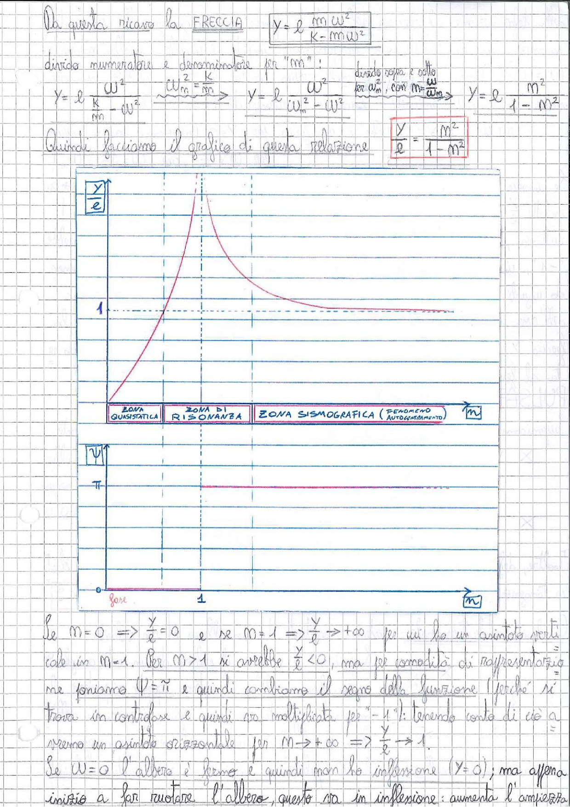

# Page 171 - Freccia e diagramma di risonanza (albero rotante)

Da questa ricavo la **FRECCIA**:

$$\boxed{y = e \frac{m\omega^2}{K - m\omega^2}}$$

Divido numeratore e denominatore per "$m$":

$$y = e \frac{\omega^2}{\underbrace{\frac{K}{m}}_{\omega_n^2} - \omega^2} \quad \Rightarrow \quad y = e \frac{\omega^2}{\omega_n^2 - \omega^2}$$

Divido sopra e sotto per $\omega_n^2$, con $n = \frac{\omega}{\omega_n}$:

$$\boxed{\frac{y}{e} = \frac{n^2}{1 - n^2}}$$

Quindi facciamo il grafico di questa relazione:

> 
> Diagramma: Grafico del rapporto $\frac{y}{e}$ in funzione di $n$. La curva parte da zero, cresce fino ad un asintoto verticale in $n=1$ (risonanza), poi riprende dal basso avvicinandosi asintoticamente al valore 1 per $n \to +\infty$. L'asse orizzontale è diviso in tre zone: **Zona Quasistatica** ($n < 1$), **Zona di Risonanza** ($n \approx 1$), **Zona Sismografica** (fenomeno di autocentramento, $n > 1$). Sotto è riportato il diagramma della fase $\psi$: vale $0$ per $n < 1$ e $\pi$ per $n > 1$.

---

Se $n = 0 \Rightarrow \frac{y}{e} = 0$ e se $n = 1 \Rightarrow \frac{y}{e} \to +\infty$ per cui ho un asintoto verticale in $n = 1$. Per $n > 1$ si avrebbe $\frac{y}{e} < 0$, ma per comodità di rappresentazione poniamo $\psi = \pi$ e quindi cambiamo il segno della funzione (perché si trova in controfase e quindi va moltiplicata per "$-1$"); tenendo conto di ciò avremo un asintoto orizzontale per $n \to +\infty \Rightarrow \frac{y}{e} \to 1$.

Se $\omega = 0$ l'albero è fermo e quindi non ha inflessione ($y = 0$); ma appena inizia a far ruotare l'albero, questo va in inflessione: aumenta l'ampiezza.
