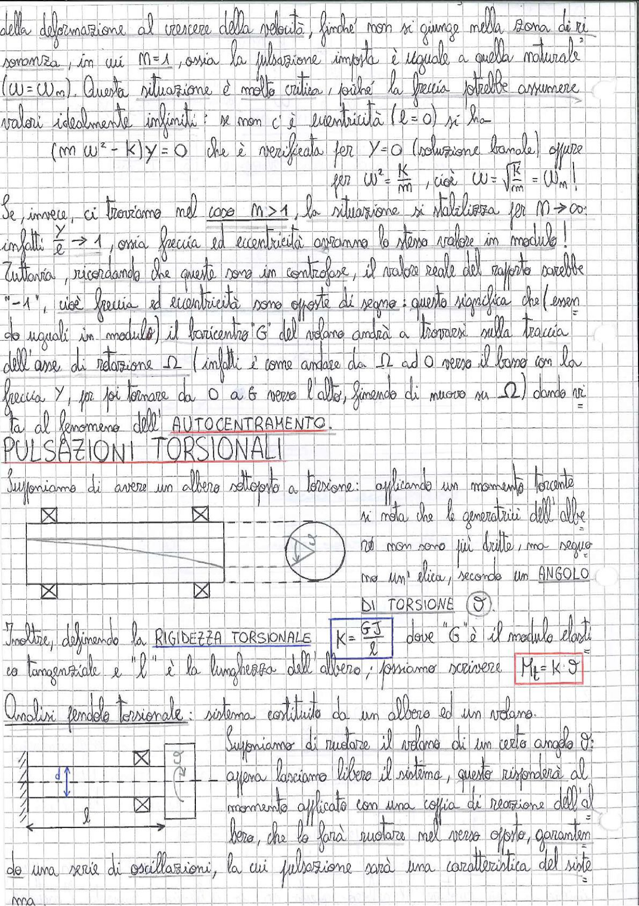

# Page 172 - Autocentramento e Pulsazioni Torsionali

della deformazione al crescere della velocità, finché non si giunge nella zona di risonanza, in cui $M = 1$, ossia la pulsazione imposta è uguale a quella naturale ($\omega = \omega_n$). Questa situazione è molto critica, poiché la freccia potrebbe assumere valori idealmente infiniti: se non c'è eccentricità ($e = 0$) si ha

$$(m\omega^2 - K)y = 0$$

che è verificata per $y = 0$ (soluzione banale) oppure per $\omega^2 = \frac{K}{m}$, cioè $\omega = \sqrt{\frac{K}{m}} = \omega_n$!

Se, invece, ci troviamo nel caso $M > 1$, la situazione si stabilizza per $M \rightarrow \infty$: infatti $\frac{y}{e} \rightarrow 1$, ossia freccia ed eccentricità avranno lo stesso valore in modulo! Tuttavia, ricordando che queste sono in controfase, il valore reale del rapporto sarebbe "$-1$", cioè freccia ed eccentricità sono opposte di segno: questo significa che (essendo uguali in modulo) il baricentro G del volano andrà a trovarsi sulla traccia dell'asse di rotazione $\Omega$ (infatti è come andare da $\Omega$ ad O verso il basso con la freccia y, per poi tornare da O a G verso l'alto, finendo di nuovo su $\Omega$) dando vita al fenomeno dell'**AUTOCENTRAMENTO**.

## PULSAZIONI TORSIONALI

Supponiamo di avere un albero sottoposto a torsione: applicando un momento torcente si nota che le generatrici dell'albero non sono più dritte, ma seguono un'elica, secondo un **ANGOLO DI TORSIONE** $\vartheta$.

> 
> Diagramma: albero cilindrico vincolato alle estremità con cuscinetti (rappresentati con simboli ⊠), sottoposto a torsione. Si mostra come le generatrici rettilinee diventano eliche e si evidenzia l'angolo di torsione.

Inoltre, definendo la **RIGIDEZZA TORSIONALE**:

$$\boxed{K = \frac{GJ}{l}}$$

dove "G" è il modulo elastico tangenziale e "l" è la lunghezza dell'albero; possiamo scrivere:

$$\boxed{M_t = K \cdot \vartheta}$$

### Analisi pendolo torsionale

Analisi pendolo torsionale: sistema costituito da un albero ed un volano.

> 
> Diagramma: schema di un pendolo torsionale con albero di lunghezza $l$ e diametro $d$, vincolato a sinistra e con volano (disco) a destra. L'albero è supportato da cuscinetti (⊠).

Supponiamo di ruotare il volano di un certo angolo $\vartheta$: appena lasciamo libero il sistema, questo risponderà al momento applicato con una coppia di reazione dell'albero, che lo farà ruotare nel verso opposto, garantendo una serie di oscillazioni, la cui pulsazione sarà una caratteristica del sistema.
