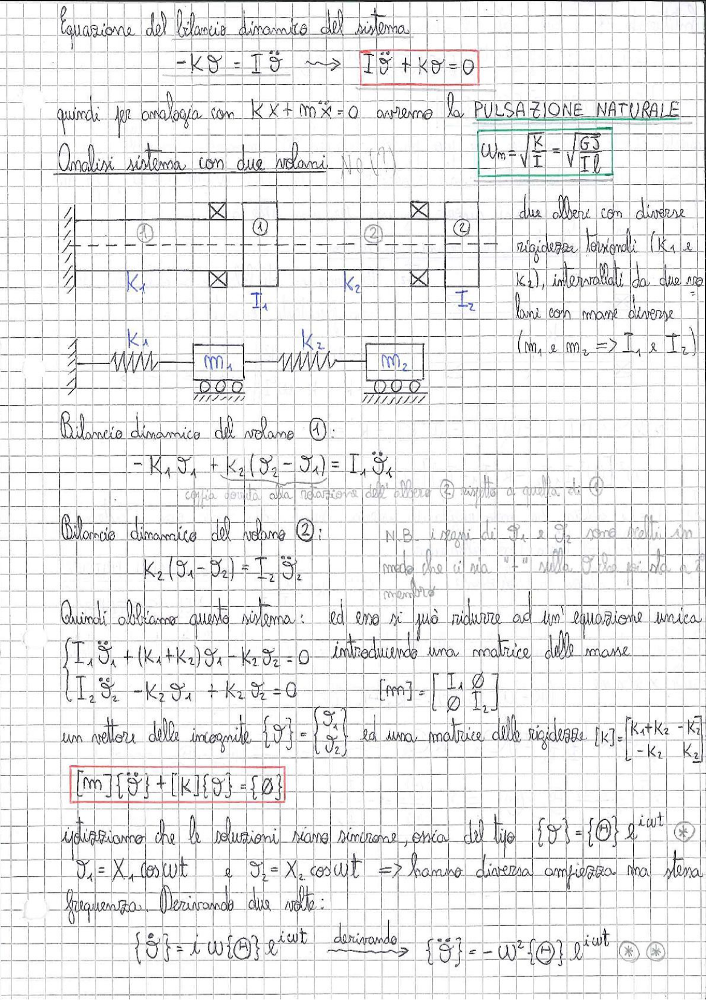

# Page 173 - Bilancio dinamico del sistema a due volani

## Equazione del bilancio dinamico del sistema

$$-K\vartheta = I\ddot{\vartheta} \quad \Longrightarrow \quad \boxed{I\ddot{\vartheta} + K\vartheta = 0}$$

quindi per analogia con $Kx + m\ddot{x} = 0$ avremo la **PULSAZIONE NATURALE**

$$\boxed{\omega_n = \sqrt{\frac{K}{I}} = \sqrt{\frac{GJ}{Il}}}$$

## Analisi sistema con due volani

> 
> Diagramma: Schema di un sistema torsionale con due volani (①, ②) collegati da due alberi con diverse rigidezze torsionali ($K_1$ e $K_2$), intervallati da due volani con masse diverse ($m_1$ e $m_2 \Rightarrow I_1$ e $I_2$). Sotto è riportato il modello equivalente massa-molla con due masse $m_1$ e $m_2$ collegate a terra tramite molle $K_1$ e $K_2$.

Due alberi con diverse rigidezze torsionali ($K_1$ e $K_2$), intervallati da due volani con masse diverse ($m_1$ e $m_2 \Rightarrow I_1$ e $I_2$).

## Bilancio dinamico del volano ①:

$$-K_1 \vartheta_1 + K_2(\vartheta_2 - \vartheta_1) = I_1 \ddot{\vartheta}_1$$

*coppia dovuta alla rotazione dell'albero ② rispetto a quella di ①*

## Bilancio dinamico del volano ②:

$$K_2(\vartheta_1 - \vartheta_2) = I_2 \ddot{\vartheta}_2$$

N.B. i segni di $\vartheta_1$ e $\vartheta_2$ sono scelti in modo che ci sia "+" sulle $\vartheta$ al secondo membro.

## Sistema di equazioni

Quindi abbiamo questo sistema:

$$\begin{cases} I_1 \ddot{\vartheta}_1 + (K_1 + K_2)\vartheta_1 - K_2 \vartheta_2 = 0 \\ I_2 \ddot{\vartheta}_2 - K_2 \vartheta_1 + K_2 \vartheta_2 = 0 \end{cases}$$

ed esso si può ridurre ad un'equazione unica introducendo una matrice delle masse:

$$[m] = \begin{bmatrix} I_1 & 0 \\ 0 & I_2 \end{bmatrix}$$

un vettore delle incognite $\{\vartheta\} = \begin{Bmatrix} \vartheta_1 \\ \vartheta_2 \end{Bmatrix}$ ed una matrice delle rigidezze $[K] = \begin{bmatrix} K_1 + K_2 & -K_2 \\ -K_2 & K_2 \end{bmatrix}$

$$\boxed{[m]\{\ddot{\vartheta}\} + [K]\{\vartheta\} = \{0\}}$$

## Soluzione armonica

Ipotizziamo che le soluzioni siano sinusoidi, ossia del tipo $\{\vartheta\} = \{\Theta\} e^{i\omega t}$ *

$$\vartheta_1 = X_1 \cos\omega t \quad \text{e} \quad \vartheta_2 = X_2 \cos\omega t \quad \Rightarrow \text{hanno diversa ampiezza ma stessa frequenza.}$$

Derivando due volte:

$$\{\dot{\vartheta}\} = i\omega\{\Theta\} e^{i\omega t} \quad \xrightarrow{\text{derivando}} \quad \{\ddot{\vartheta}\} = -\omega^2\{\Theta\} e^{i\omega t} \quad \text{*  *}$$
