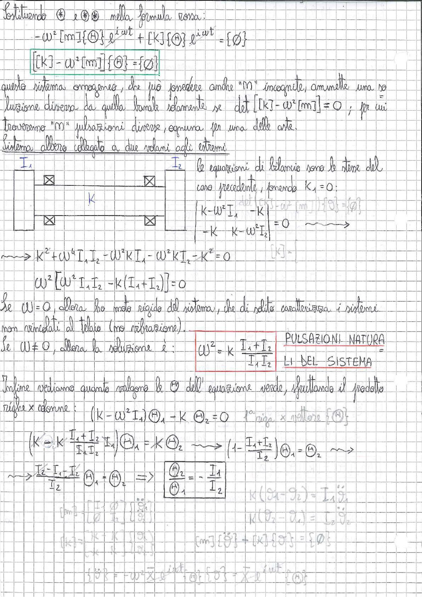

# Page 174 - Pulsazioni naturali di un sistema a due volani

Sostituendo ① e ②① nella formula rosa:

$$-\omega^2 [m]\{\Theta\} e^{i\omega t} + [K]\{\Theta\} e^{i\omega t} = \{\phi\}$$

$$\boxed{[K] - \omega^2 [m]} \{\Theta\} = \{\phi\}$$

Questo sistema omogeneo, che può possedere anche "M" incognite, ammette una soluzione diversa da quella banale solamente se $\det [K] - \omega^2 [m]] = 0$, per cui troveremo "M" pulsazioni diverse, ognuna per una delle arte.

## Sistema albero collegato a due volani agli estremi

> 
> Diagramma: Schema di un sistema torsionale con due volani $I_1$ e $I_2$ collegati da un albero di rigidezza $K$, rappresentato con sezioni trasversali e cuscinetti

Le equazioni di bilancio sono le stesse del caso precedente, ponendo $K_1 = 0$:

$$\begin{cases} K - \omega^2 I_1 & -K \\ -K & K - \omega^2 I_2 \end{cases} = 0 \quad \longrightarrow$$

$$\longrightarrow K^2 + \omega^4 I_1 I_2 - \omega^2 K I_1 - \omega^2 K I_2 - K^2 = 0$$

$$\omega^2 \left[\omega^2 I_1 I_2 - K(I_1 + I_2)\right] = 0$$

Se $\omega = 0$, allora ho moto rigido del sistema, che di solito caratterizza i sistemi non vincolati al telaio (no vibrazione).

Se $\omega \neq 0$, allora la soluzione è:

$$\boxed{\omega^2 = K \frac{I_1 + I_2}{I_1 I_2}}$$

**PULSAZIONI NATURALI DEL SISTEMA**

---

Infine vediamo quanto valgono le $\Theta$ dell'equazione verde, sfruttando il prodotto righe × colonne:

$$(K - \omega^2 I_1)\Theta_1 - K \Theta_2 = 0 \qquad \text{1ª riga × vettore } \{\Theta\}$$

$$\left(K - K \frac{I_1 + I_2}{I_1 I_2} I_1\right)\Theta_1 = K \Theta_2 \quad \longrightarrow \quad \left(1 - \frac{I_1 + I_2}{I_2}\right)\Theta_1 = \Theta_2 \quad \longrightarrow$$

$$\longrightarrow \frac{I_2 - I_1 - I_2}{I_2} \Theta_1 = \Theta_2 \quad \Longrightarrow \quad \boxed{\frac{\Theta_2}{\Theta_1} = -\frac{I_1}{I_2}}$$
