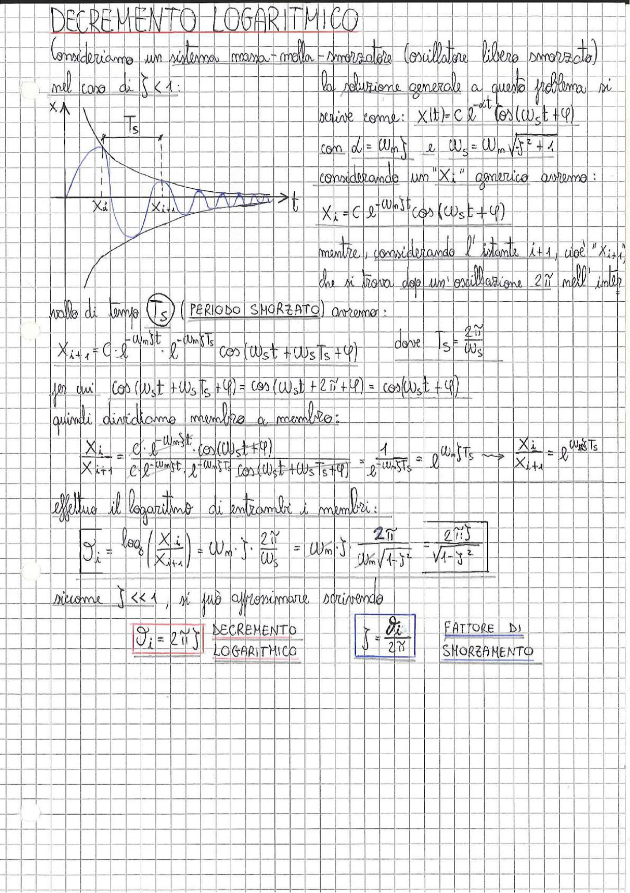

# Page 175 - Decremento Logaritmico

## DECREMENTO LOGARITMICO

Consideriamo un sistema massa-molla-smorzatore (oscillatore libero smorzato) nel caso di $\zeta < 1$:

> 
> Diagramma: Risposta libera smorzata $x(t)$ con inviluppo esponenziale decrescente, che mostra i picchi successivi $X_i$ e $X_{i+1}$ separati dal periodo smorzato $T_s$

La soluzione generale a questo problema si scrive come:

$$x(t) = C \, e^{-\alpha t} \cos(\omega_s t + \varphi)$$

con $\alpha = \omega_n \zeta$ e $\omega_s = \omega_n \sqrt{\zeta^2 + 1}$

Considerando un "$X_i$" generico avremo:

$$X_i = C \, e^{-\omega_n \zeta t} \cos(\omega_s t + \varphi)$$

mentre, considerando l'istante $i+1$, cioè "$X_{i+1}$", che si trova dopo un'oscillazione $2\pi$ nell'intervallo di tempo $T_s$ (**PERIODO SMORZATO**) avremo:

$$X_{i+1} = C \, e^{-\omega_n \zeta t} \cdot e^{-\omega_n \zeta T_s} \cos(\omega_s t + \omega_s T_s + \varphi)$$

dove $T_s = \dfrac{2\pi}{\omega_s}$

per cui $\cos(\omega_s t + \omega_s T_s + \varphi) = \cos(\omega_s t + 2\pi + \varphi) = \cos(\omega_s t + \varphi)$

quindi dividiamo membro a membro:

$$\frac{X_i}{X_{i+1}} = \frac{C \, e^{-\omega_n \zeta t} \cdot \cos(\omega_s t + \varphi)}{C \, e^{-\omega_n \zeta t} \cdot e^{-\omega_n \zeta T_s} \cos(\omega_s t + \omega_s T_s + \varphi)} = \frac{1}{e^{-\omega_n \zeta T_s}} = e^{\omega_n \zeta T_s} \implies \frac{X_i}{X_{i+1}} = e^{\omega_n \zeta T_s}$$

Effettuo il logaritmo di entrambi i membri:

$$\vartheta_i = \log\left(\frac{X_i}{X_{i+1}}\right) = \omega_n \cdot \zeta \cdot \frac{2\pi}{\omega_s} = \omega_n \cdot \zeta \cdot \frac{2\pi}{\omega_n \sqrt{1 - \zeta^2}} = \boxed{\frac{2\pi \zeta}{\sqrt{1 - \zeta^2}}}$$

siccome $\zeta \ll 1$, si può approssimare scrivendo

$$\boxed{\vartheta_i = 2\pi \zeta} \quad \text{DECREMENTO LOGARITMICO}$$

$$\boxed{\zeta = \frac{\vartheta_i}{2\pi}} \quad \text{FATTORE DI SMORZAMENTO}$$
