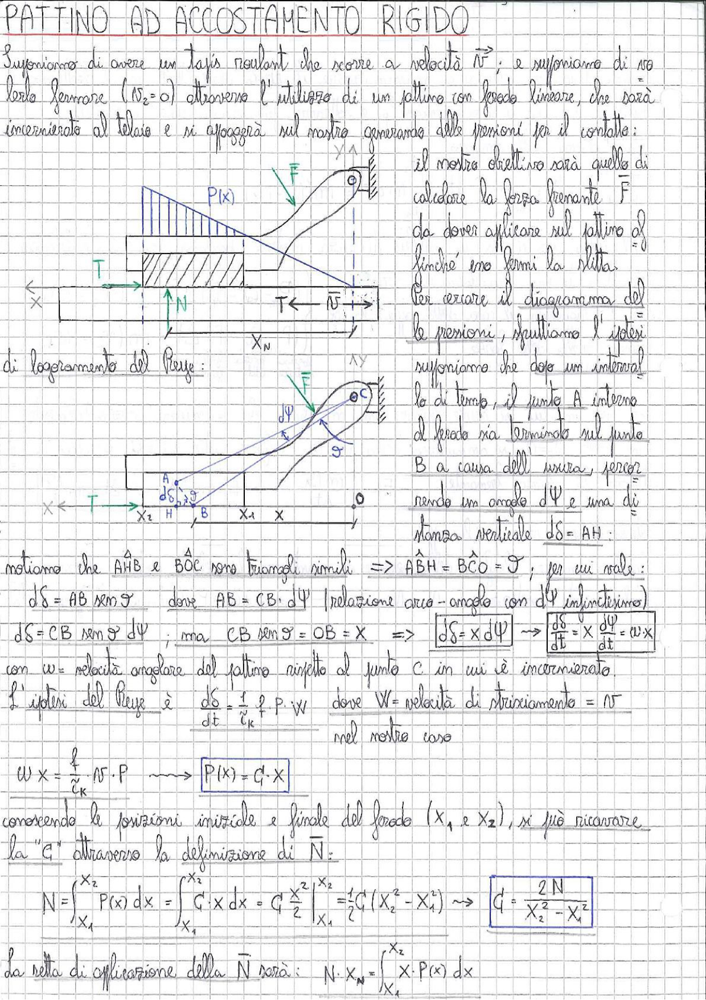

# Page 178 - Pattino ad Accostamento Rigido

## PATTINO AD ACCOSTAMENTO RIGIDO

Supponiamo di avere un tapis roulant che scorre a velocità $\bar{v}$; e supponiamo di volerlo fermare ($v_2 = 0$) attraverso l'utilizzo di un pattino con feodo lineare, che sarà incernierato al telaio e si appoggerà sul nastro generando delle pressioni per il contatto:

> 
> Diagramma: Schema del pattino con distribuzione di pressione P(x) triangolare sul nastro, con forza F applicata e sistema di riferimento x-y. Sotto: diagramma di corpo libero con forza T, reazione normale N e punto di applicazione $x_N$.

Il nostro obiettivo sarà quello di calcolare la forza frenante $\vec{F}$ da dover applicare sul pattino affinché esso fermi la slitta.

Per cercare il diagramma delle pressioni, sfruttiamo l'ipotesi di logoriamento del Reye:

> 
> Diagramma: Schema tridimensionale del pattino incernierato nel punto C (cerniera O in alto), con angolo $d\psi$, punti A e B sul feodo, e rappresentazione geometrica dello spostamento $d\delta$. Sistema di riferimento con asse x orizzontale, punti $x_2$, H, B, $x_1$ indicati.

Supponiamo che dopo un intervallo di tempo, il punto A interno al feodo sia terminato sul punto B a causa dell'usura, percorrendo un angolo $d\psi$ e una distanza verticale $d\delta = AH$:

Notiamo che $A\hat{H}B$ e $B\hat{O}C$ sono triangoli simili $\Rightarrow$ $A\hat{B}H = B\hat{C}O = \vartheta$; per cui vale:

$$d\delta = AB \sin\vartheta \quad \text{dove} \quad AB = CB \cdot d\psi \quad \text{(relazione arco-angolo con } d\psi \text{ infinitesimo)}$$

$$d\delta = CB \sin\vartheta \cdot d\psi \; ; \quad \text{ma} \quad CB \sin\vartheta = OB = x \quad \Rightarrow \quad \boxed{d\delta = x \cdot d\psi} \quad \rightarrow \quad \boxed{\frac{d\delta}{dt} = x \cdot \frac{d\psi}{dt} = \omega \cdot x}$$

con $\omega$ = velocità angolare del pattino rispetto al punto C in cui è incernierato.

L'ipotesi del Reye è: $\quad \dfrac{d\delta}{dt} = \dfrac{f}{c_k} \cdot P \cdot W \quad$ dove $W$ = velocità di strisciamento = $v$

nel nostro caso:

$$\omega \cdot x = \frac{f}{c_k} \cdot v \cdot P \quad \longrightarrow \quad \boxed{P(x) = C \cdot x}$$

Conoscendo le posizioni iniziale e finale del feodo ($x_1$ e $x_2$), si può ricavare la "$C$" attraverso la definizione di $\bar{N}$:

$$N = \int_{x_1}^{x_2} P(x) \, dx = \int_{x_1}^{x_2} C \cdot x \, dx = C \cdot \frac{x^2}{2} \bigg|_{x_1}^{x_2} = \frac{1}{2} C (x_2^2 - x_1^2) \quad \longrightarrow \quad \boxed{C = \frac{2N}{x_2^2 - x_1^2}}$$

La retta di applicazione della $\bar{N}$ sarà: $\quad N \cdot x_N = \int_{x_1}^{x_2} x \cdot P(x) \, dx$
