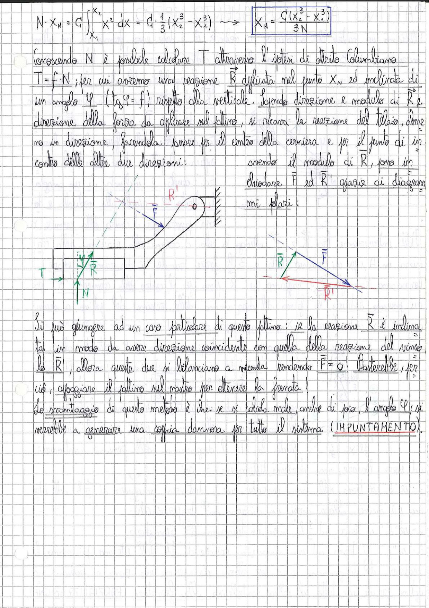

# Page 179 - Pattino: Equilibrio e Impuntamento

$$N \cdot x_N = C \int_{x_1}^{x_2} x^2 \, dx = C \cdot \frac{1}{3}(x_2^3 - x_1^3) \quad \longrightarrow \quad \boxed{x_N = \frac{C(x_2^3 - x_1^3)}{3N}}$$

Conoscendo $N$ è possibile calcolare $T$ attraverso l'ipotesi di attrito Coulombiano $T = f \cdot N$; per cui avremo una reazione $\vec{R}$ applicata nel punto $x_N$ ed inclinata di un angolo $\varphi$ ($\tan \varphi = f$) rispetto alla verticale. Sapendo direzione e modulo di $\vec{R}$ e direzione della forza da applicare sul pattino, si ricava la reazione del telaio, almeno in direzione, facendola passare per il centro della cerniera e per il punto di incontro delle altre due direzioni; avendo il modulo di $\vec{R}$, posso in chiudere $\vec{F}$ ed $\vec{R}'$ grazie ai diagrammi polari:

> 
> Diagramma: Schema del pattino con cerniera e guide. A sinistra il diagramma delle forze con $\vec{T}$, $\vec{R}$ e $\vec{N}$ sul pattino. A destra il triangolo delle forze (diagramma polare) con $\vec{R}$, $\vec{F}$ e $\vec{R}'$ che si chiudono in un poligono.

Si può giungere ad un caso particolare di questo pattino: se la reazione $\vec{R}$ è inclinata in modo da avere direzione coincidente con quella della reazione del vincolo la $\vec{R}'$, allora queste due si bilanciano a vicenda rendendo $\vec{F} = 0$! Basterebbe, per ciò, appoggiare il pattino sul nastro per ottenere la frenata!

Lo svantaggio di questo metodo è che: se si calcola male, anche di poco, l'angolo $\varphi$, si verrebbe a generare una coppia dannosa per tutto il sistema (**IMPUNTAMENTO**).
