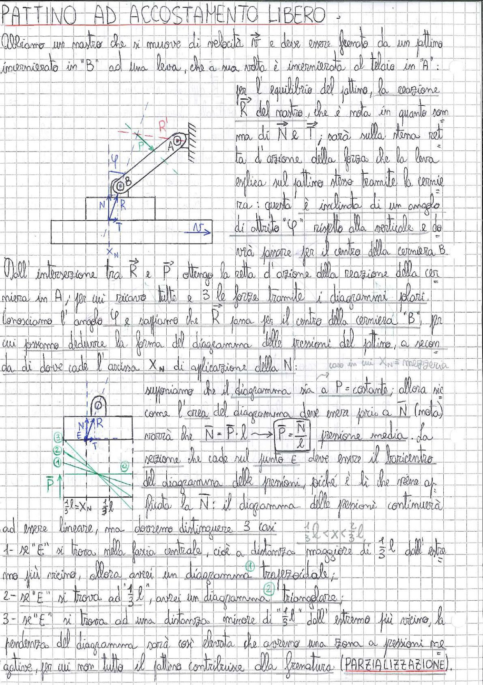

# Page 180 - Pattino ad Accostamento Libero

## PATTINO AD ACCOSTAMENTO LIBERO

Abbiamo un nastro che si muove di velocità $\vec{v}$ e deve essere frenato da un pattino incernierato in "B" ad una leva, che a sua volta è incernierata al telaio in "A":

> 
> Diagramma: Schema del pattino ad accostamento libero con leva incernierata in A al telaio e in B al pattino, con indicazione delle forze R, P, N, T e angolo di attrito φ

Per l'equilibrio del pattino, la reazione $\vec{R}$ del nastro, che è nota in quanto somma di $\vec{N}$ e $\vec{T}$, sarà sulla stessa retta d'azione della forza che la leva esplica sul pattino stesso tramite la cerniera; questa è inclinata di un angolo di attrito "$\varphi$" rispetto alla verticale e dovrà passare per il centro della cerniera B.

Dall'intersezione tra $\vec{R}$ e $\vec{P}$, ottengo la retta d'azione della reazione della cerniera in A, per cui ricavo tutte e 3 le forze tramite i diagrammi polari. Conosciamo l'angolo $\varphi$ e sappiamo che $\vec{R}$ passa per il centro della cerniera "B", per cui possiamo dedurre la forma del diagramma delle pressioni del pattino, a seconda di dove cade l'ascissa $X_N$ di applicazione della $N$:

> 
> Diagramma: Schema del pattino con indicazione del punto E (baricentro del diagramma delle pressioni), forze N, R, T, P e quote $\frac{2}{3}l = X_N$ e $\frac{1}{3}l$

Supponiamo che il diagramma sia a $P = \text{costante}$; allora siccome l'area del diagramma deve essere pari a $\bar{N}$ (media), vorrà che:

$$\bar{N} = P \cdot l \longrightarrow \boxed{P = \frac{\bar{N}}{l}} \quad \text{pressione media}$$

La reazione che cade sul punto E deve essere il baricentro del diagramma delle pressioni, poiché è lì che viene applicata la $\bar{N}$: il diagramma delle pressioni continuerà ad essere lineare, ma dovremo distinguere 3 casi:

**Caso in cui $X_N$ = mezzeria**

$$\frac{1}{3}l < x \leq \frac{2}{3}l$$

1. Se "E" si trova nella fascia centrale, cioè a distanza maggiore di $\frac{1}{3}l$ dall'estremo più vicino, allora avrei un diagramma **trapezoidale**; ①

2. Se "E" si trova ad $\frac{1}{3}l$, avrei un diagramma **triangolare**; ②

3. Se "E" si trova ad una distanza minore di "$\frac{1}{3}l$" dall'estremo più vicino, la pendenza del diagramma sarà così elevata che avremo una zona a pressioni negative, per cui non tutto il pattino contribuisce alla frenatura (**PARZIALIZZAZIONE**).
