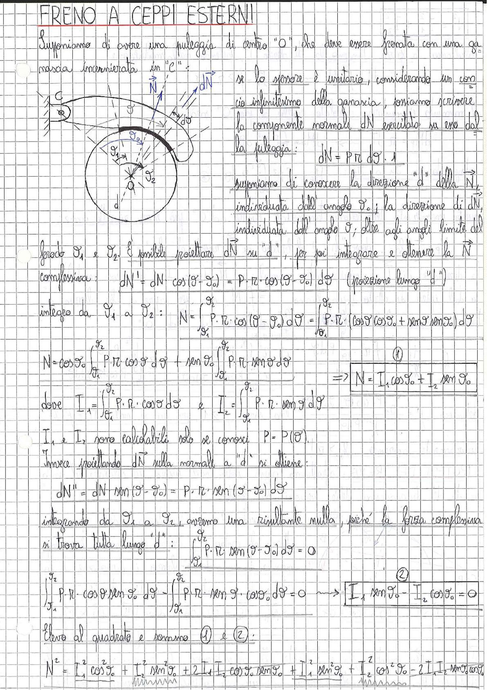

# Page 181 - Freno a Ceppi Esterni

## FRENO A CEPPI ESTERNI

Supponiamo di avere una puleggia di centro "O", che deve essere frenata con una ganascia incernierata in "C":

> 
> Diagramma: Schema di un freno a ceppi esterni con puleggia di centro O, ganascia incernierata in C, con indicazione della forza risultante $\vec{N}$, della forza elementare $d\vec{N}$, degli angoli $\vartheta_0$, $\vartheta_1$, $\vartheta_2$ e della direzione "d"

Se lo spessore è unitario, considerando un concio infinitesimo della ganascia, possiamo scrivere la componente normale $d\vec{N}$ esercitata su un arco della puleggia:

$$dN = P \cdot r \cdot d\vartheta \cdot 1$$

Supponiamo di conoscere la direzione "d" della $\vec{N}$, individuata dall'angolo $\vartheta_0$; la direzione di $d\vec{N}$, individuata dall'angolo $\vartheta$; oltre agli angoli limite del grado $\vartheta_1$ e $\vartheta_2$. È possibile proiettare $d\vec{N}$ su "d", per poi integrare e ottenere la $\vec{N}$ complessiva:

$$dN' = dN \cdot \cos(\vartheta - \vartheta_0) = P \cdot r \cdot \cos(\vartheta - \vartheta_0) \, d\vartheta \quad \text{(proiezione lungo "d")}$$

Integro da $\vartheta_1$ a $\vartheta_2$:

$$N = \int_{\vartheta_1}^{\vartheta_2} P \cdot r \cdot \cos(\vartheta - \vartheta_0) \, d\vartheta = \int_{\vartheta_1}^{\vartheta_2} P \cdot r \cdot (\cos\vartheta \cos\vartheta_0 + \sin\vartheta \sin\vartheta_0) \, d\vartheta$$

$$N = \cos\vartheta_0 \int_{\vartheta_1}^{\vartheta_2} P \cdot r \cdot \cos\vartheta \, d\vartheta + \sin\vartheta_0 \int_{\vartheta_1}^{\vartheta_2} P \cdot r \cdot \sin\vartheta \, d\vartheta$$

$$\boxed{N = I_1 \cos\vartheta_0 + I_2 \sin\vartheta_0} \tag{1}$$

dove:

$$I_1 = \int_{\vartheta_1}^{\vartheta_2} P \cdot r \cdot \cos\vartheta \, d\vartheta \qquad \text{e} \qquad I_2 = \int_{\vartheta_1}^{\vartheta_2} P \cdot r \cdot \sin\vartheta \, d\vartheta$$

$I_1$ e $I_2$ sono calcolabili solo se conosci $P = P(\vartheta)$.

Invece proiettando $d\vec{N}$ sulla normale a "d" si ottiene:

$$dN'' = dN \cdot \sin(\vartheta - \vartheta_0) = P \cdot r \cdot \sin(\vartheta - \vartheta_0) \, d\vartheta$$

Integrando da $\vartheta_1$ a $\vartheta_2$, avremo una risultante nulla, poiché la forza complessiva si trova tutta lungo "d":

$$\int_{\vartheta_1}^{\vartheta_2} P \cdot r \cdot \sin(\vartheta - \vartheta_0) \, d\vartheta = 0$$

$$\int_{\vartheta_1}^{\vartheta_2} P \cdot r \cdot \cos\vartheta \sin\vartheta_0 \, d\vartheta - \int_{\vartheta_1}^{\vartheta_2} P \cdot r \cdot \sin\vartheta \cdot \cos\vartheta_0 \, d\vartheta = 0$$

$$\boxed{I_1 \sin\vartheta_0 - I_2 \cos\vartheta_0 = 0} \tag{2}$$

Elevo al quadrato e sommo (1) e (2):

$$N^2 = I_1^2 \cos^2\vartheta_0 + I_2^2 \sin^2\vartheta_0 + 2 I_1 I_2 \cos\vartheta_0 \sin\vartheta_0 + I_1^2 \sin^2\vartheta_0 + I_2^2 \cos^2\vartheta_0 - 2 I_1 I_2 \sin\vartheta_0 \cos\vartheta_0$$
